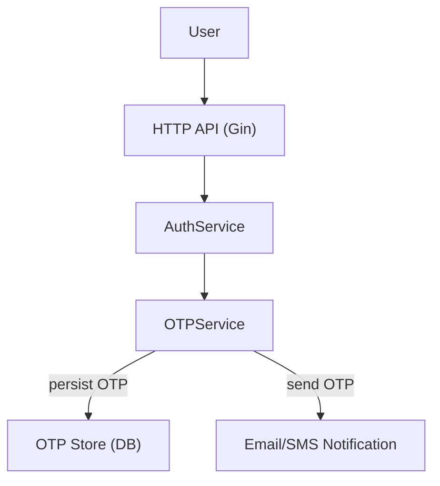
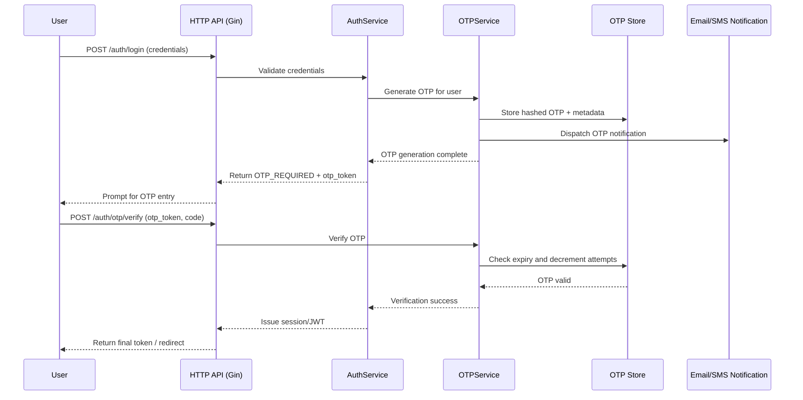

# Two-Factor Authentication (2FA) - High-Level Design

## 1. Overview
Two-Factor Authentication introduces a second verification step after a correct username and password are submitted. The backend issues a time-bound one-time passcode (OTP) to the user's registered email address or phone number, and grants access only when the OTP is validated. This feature hardens account security by mitigating credential stuffing, password reuse, and brute-force attacks.

## 2. Goals & Success Criteria
- Increase assurance that the authenticated party is the legitimate account owner.
- Limit the blast radius of leaked or weak passwords by requiring a second factor.
- Maintain a sign-in experience that completes < 10 seconds in the p95 path (password + OTP).
- Provide an auditable trail of OTP issuance and verification attempts.

## 3. Scope
- Applies to every interactive login that succeeds password validation for end-user accounts.
- Excludes service-to-service authentication and password reset flows (handled separately).
- Covers backend changes (API, services, persistence, mail/SMS integrations) and frontend adjustments needed to prompt for OTP entry and resend.

## 4. Assumptions & Dependencies
- User identities already include a verified email address and/or phone number stored in the profile.
- SMTP (existing password reset mailer) is available; optional SMS support can reuse provider integration when configured.
- Redis or an equivalent low-latency store is available for OTP storage; fallback is relational DB with TTL cleanup job.
- Existing JWT/session issuance logic (`internal/service/auth_service.go`) can be extended to require OTP success before final token issuance.
- Frontend/UI will supply OTP entry forms and call the new API endpoints.

## 5. Actors, Preconditions, and Triggers
- **Actors**: End User, Authentication Service (backend), Email/SMS provider, Optional Redis/DB store.
- **Preconditions**: User account exists with reachable contact channel; messaging provider credentials and secrets configured; clock synchronization within acceptable drift (<30s).
- **Trigger**: Backend validates username/password and marks the session as pending OTP verification.

## 6. User Journeys
### 6.1 Main Flow - Password Success + OTP Verification
1. User submits `POST /api/v1/auth/login` with username/email and password.
2. `AuthService` validates credentials and flags the session as `OTP_REQUIRED`.
3. `OTPService` generates a cryptographically secure random 6-digit value (valid 5 minutes).
4. Hashed OTP + metadata (user ID, channel, expires_at, remaining_attempts, resend_count) is persisted.
5. Notification component sends OTP via email or SMS based on user preference.
6. Backend responds 200 with `otp_token` (non-sensitive reference identifier) and client is redirected to the OTP entry screen.
7. User submits `POST /api/v1/auth/otp/verify` with `otp_token` and the 6-digit code.
8. Backend validates OTP (expiry, attempts, hash match). On success it issues final session/JWT.
9. Response returns final auth token and client navigates to the dashboard.

### 6.2 Alternative & Error Flows
- **Invalid credentials**: Login stops before OTP; existing "Invalid username or password" response.
- **Expired OTP**: Verification endpoint returns 400 `OTP_EXPIRED`; UI prompts "OTP expired" and offers resend.
- **Incorrect OTP**: Decrements remaining attempts; after 3 failures returns 423 `ACCOUNT_VERIFICATION_LOCKED` for 15 minutes.
- **Resend OTP**: `POST /api/v1/auth/otp/resend` issues new code if resend_count < 3 within rolling 15 minutes.
- **Notification failure**: If email/SMS send fails, respond 500 and notify monitoring; user can retry login.

## 7. Architecture Overview

- The HTTP layer (`internal/transport/http/auth_handler.go`) exposes login, OTP verify, and resend endpoints.
- `AuthService` orchestrates credential validation, OTP lifecycle, and session issuance.
- `OTPService` (new module) encapsulates generation, hashing, storage, and validation logic and reuses `internal/util/otp.go` helpers.
- Persistence uses Redis for TTL and atomic counters; fallback to relational DB table with background cleanup via cron job.
- Notification path leverages existing mailer (`internal/transport/mail/password_reset_mailer.go`) with provider abstraction to support SMS.

### 7.1 Sequence Summary
1. User login request hits `AuthHandler.Login`.
2. `AuthService` validates password, issues intermediate `otp_token`, calls `OTPService.Generate`.
3. `OTPService` persists hashed code + metadata, publishes send request.
4. Notification worker sends email/SMS; records send result.
5. User submits code; `AuthHandler.VerifyOTP` calls `OTPService.Verify`.
6. On success, `AuthService` issues final JWT (`jwt.go`) and clears OTP state.

### 7.2 Data Model & Storage
| Field | Description | Store | Notes |
| --- | --- | --- | --- |
| `otp_token` | Random UUID returned to client to reference OTP transaction | Redis key / DB column | Never expose hashed OTP.
| `hashed_otp` | SHA256 hash of OTP digits with user-specific salt | Redis value / DB column | Prevent OTP leakage.
| `user_id` | Authenticated account identifier | Redis value / DB column | Indexed for cleanup.
| `expires_at` | Expiration timestamp (UTC) | Redis TTL / DB column | TTL set to 5 minutes.
| `attempts_left` | Starts at 3, decremented on failure | Redis atomic int / DB column | Lock when reaches 0.
| `resend_count` | Tracks resend usage window | Redis atomic int / DB column | Reset after success or expiry.

## 8. API & UX Touchpoints
- `POST /api/v1/auth/login` -> returns `otp_token` when password succeeds.
- `POST /api/v1/auth/otp/verify` -> accepts `otp_token`, `otp_code`.
- `POST /api/v1/auth/otp/resend` -> same `otp_token`.
- UI updates: login form flows to OTP entry screen; resend button disabled past quota; error messaging for expired/locked states.

## 9. Security & Compliance
- OTP digits generated via `crypto/rand` (NFR-2FA-01). No reused codes.
- Hash OTP with per-user salt (user ID + secret pepper) before storage.
- Enforce TLS for all transport; never log raw OTP values.
- Clean-up job deletes expired OTP records within 10 minutes to minimize PII retention (GDPR/PDPA compliance).
- Rate limit OTP endpoints per IP/user to reduce brute force and resource abuse.
- Future hardening: device trust tokens, WebAuthn support for phishing-resistant second factor.

## 10. Failure Handling & Rate Limits
- Lock OTP verification for 15 minutes after 3 failed attempts (FR-2FA-07).
- Resend limited to 3 within 15 minutes with exponential back-off on send errors.
- Alerting triggers on repeated notification failures or anomalous OTP failure spikes.
- Return structured errors (`internal/util/response.go`) with codes for UI handling.

## 11. Observability
- Log OTP events with correlation ID: generation, send result, verification success/failure, lockouts (FR-2FA-09).
- Emit metrics: OTP sends, resend counts, verification latency, failure rate, lockouts, provider response time.
- Add tracing spans around login -> OTP -> session issuance for p95 analysis.

## 12. Configuration & Deployment
- New env vars in `internal/config/config.go`: `OTP_EXPIRY_MINUTES`, `OTP_LENGTH`, `OTP_MAX_ATTEMPTS`, `OTP_RESEND_LIMIT`, `OTP_RESEND_WINDOW_MINUTES`, `OTP_CHANNEL_PRIORITY`.
- Update `infra/env/api.local.env` with defaults and secrets placeholders.
- Ensure Redis (or chosen store) defined in `infra/compose.local.yml` with persistence.
- Feature flag `ENABLE_2FA` to gate rollout by environment or cohort.

## 13. Functional Requirements (SRS Snippet)
| ID | Requirement Name | Description | Priority |
| --- | --- | --- | --- |
| FR-2FA-01 | Trigger 2FA | Initiate 2FA when user passes credential validation. | High |
| FR-2FA-02 | OTP Generation | Generate random 6-digit numeric OTP valid for 5 minutes. | High |
| FR-2FA-03 | OTP Delivery | Send generated OTP to registered email or phone number. | High |
| FR-2FA-04 | OTP Storage | Store hashed OTP with timestamp in DB/cache. | High |
| FR-2FA-05 | OTP Verification | Verify OTP within validity period before granting access. | High |
| FR-2FA-06 | Resend OTP | Allow resends up to 3 times within 15 minutes. | Medium |
| FR-2FA-07 | Failed Attempt Limit | Lock verification for 15 minutes after 3 incorrect OTP entries. | Medium |
| FR-2FA-08 | OTP Expiration Handling | Show "OTP expired" and prompt resend on expiry. | Medium |
| FR-2FA-09 | Logging | Log OTP-related events (user ID, IP, timestamp, result). | Medium |
| FR-2FA-10 | Session Creation | After OTP success, issue session/token and redirect to dashboard. | High |

## 14. Non-Functional Requirements
| ID | Requirement Name | Description |
| --- | --- | --- |
| NFR-2FA-01 | Security | OTP generated via cryptographically secure RNG. |
| NFR-2FA-02 | Performance | OTP verification completes < 2 seconds under normal load. |
| NFR-2FA-03 | Reliability | OTP delivery success rate >= 95%. |
| NFR-2FA-04 | Usability | UI clearly indicates OTP entry and resend affordances. |
| NFR-2FA-05 | Compliance | GDPR/PDPA-compliant OTP storage and deletion policy. |

## 15. Testing Strategy
- **Unit Tests**: OTP generation, hashing, expiry, attempt counters (`internal/util/otp.go`, new store adapters).
- **Integration Tests**: End-to-end login -> OTP -> verification using in-memory Redis/mail stubs.
- **Contract Tests**: Ensure email/SMS templates render expected content and providers receive required payloads.
- **Load Tests**: Simulate bursts of OTP generation/verification to validate latency, rate limiting, and store scalability.
- **Manual QA**: Validate UX copy, resend behavior, lockout messaging across browsers/devices.

## 16. Rollout & Monitoring Plan
- Phase 1: Enable for internal test accounts; confirm metrics and alert thresholds.
- Phase 2: Gradual rollout (10%, 50%, 100%) using feature flag `ENABLE_2FA`.
- Rollback strategy: disable feature flag; invalidate outstanding OTP sessions.
- Post-launch: Monitor OTP failure rate, notification errors, login completion rate, and user support tickets.

## 17. Risks & Open Questions
- **SMS vs Email Priority**: Do we require SMS day-one, or launch email-only?
- **Fallback Contact Methods**: Handling users without verified contact channels.
- **Concurrency Edge Cases**: Multiple logins requesting OTP simultaneously-ensure latest OTP invalidates older ones.
- **Device Remember Me**: Future requirement for trusted devices to bypass OTP for a grace period?
- **Provider Failover**: Strategy if primary email/SMS provider is down.

## 18. Next Steps
1. Finalize storage decision (Redis vs DB) and provision infrastructure.
2. Extend `AuthService` contract to surface `OTP_REQUIRED` state to HTTP layer.
3. Implement OTP model, store repository, and notification adapter abstractions.
4. Update configuration files and add migration/cron if DB-backed.
5. Deliver frontend changes for OTP entry, resend, and error handling.
