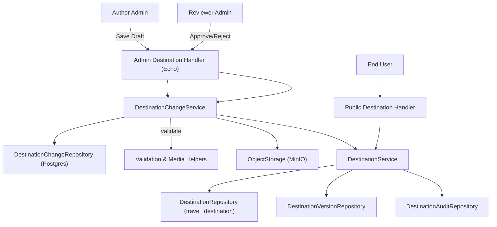
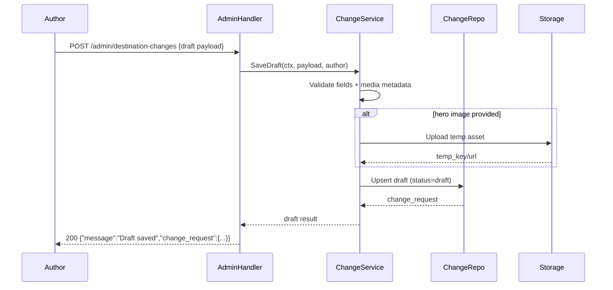
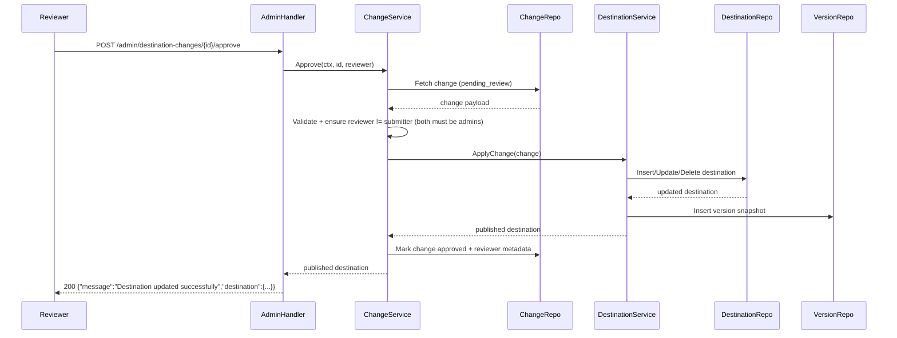

# Admin Destination Management – High-Level Design

## 1. Overview
Admin Destination Management introduces a governed content workflow that lets authorized administrators stage, review, and publish destination changes without disrupting what end users currently see. Instead of directly mutating the `travel_destination` table, every create, update, or delete is captured as a change request inside a new Destination Change Handler module. A second eligible admin must approve the pending change before it is promoted to the live destination catalog and versioned for rollback. This design satisfies the product directive in the Week7 Double-C SRS to validate inputs before saving, support draft states, record published version numbers, and surface clear confirmation messaging after successful updates.

## 2. Goals & Success Criteria
- Allow privileged admins to compose new destination content (metadata, hero imagery, geo coordinates) with server-side validation at every save point.
- Enable draft and “submit for review” behavior so authors can stage work while reviewers control publication.
- Ensure no single admin can unilaterally alter the live destination list—an approval step is required to publish or delete content.
- Persist versioned snapshots of published destinations (`version` numbers + change metadata) to enable rollback and auditability.
- Provide read APIs that return stable published data to end users while exposing administrative views for pending requests.
- Emit a confirmation payload (e.g., `{ "message": "Destination updated successfully" }`) when approvals complete and changes are applied.
- Maintain structured audit trails and metrics covering submissions, approvals, rejections, and publication outcomes.

## 3. Scope
**In scope**
- Backend-only changes: HTTP admin endpoints, service layer orchestration, repository/database updates, MinIO media storage, and change-handler staging tables.
- Data model extensions for destinations, change requests, version history, and audits.
- Validation/business rule enforcement, concurrency management, and instrumentation.
- Feature flags, configuration, and infrastructure scripts needed to run the change workflow.
- Public read endpoints for published destinations and admin endpoints for draft/pending views.

**Out of scope**
- Admin UI front-end pages (assumed to consume the new APIs).
- Bulk import/export tooling, automated moderation, or multi-language localization (future iterations).
- Notification channels beyond optional email/slack hooks—initial confirmation is returned in API response only.
- Real-time collaboration on drafts (single-owner editing per request).

## 4. Assumptions & Dependencies
- Admin accounts already exist and carry the `admin` role (`domain.User.HasRole`). Any admin may author drafts or approve requests; no additional permission flags are required, but approvers must be different admins than the submitter.
- Postgres remains the system of record; new tables will be added via migrations.
- MinIO (or S3-compatible storage) is available; `MINIO_BUCKET_DESTINATIONS` is provisioned for hero assets.
- All draft saves and submissions undergo the same validation pipeline (no empty name, valid media format), per SRS.
- The current public API (`/api/v1/destinations`) should only expose `published` content; draft/pending changes must not leak until approved.
- No caching layer is in place; once a change is published, consumers will observe it immediately.

## 5. Actors, Preconditions, Triggers
- **Actors**  
  - Author Admin (any admin user): creates and edits drafts, submits for approval.  
  - Reviewer Admin (another admin user): reviews pending changes, approves or rejects, triggering publication.  
  - Destination Change Handler (new module): manages change lifecycle and validation.  
  - Destination Service: applies approved changes to the live table and handles versioning.  
  - Destination Repository (Postgres), Destination Change Repository, Destination Version Repository.  
  - Object Storage (MinIO) for hero imagery.
- **Preconditions**  
  - Admin JWT/session is valid.  
  - Required infrastructure (new tables, MinIO bucket) deployed.  
  - At least one other admin is available to approve; submitter cannot approve their own change.
- **Triggers**  
  - Draft Save: author saves partial or complete destination data (`status=draft`).  
  - Submit for Review: author promotes draft to `pending_review`.  
  - Approve/Publish: reviewer approves pending change -> live destination updated & version recorded.  
  - Reject: reviewer rejects with feedback; draft remains editable.  
  - Delete Request: author proposes soft or hard delete; reviewer approval required.  
  - Public View: end user requests published destination list/detail.

## 6. User Journeys

### 6.1 Author Saves Draft (Create/Update)
1. Author opens admin editor, fills destination fields (name, city, hero image, etc.).
2. Frontend issues `POST /api/v1/admin/destination-changes` (new change) or `PUT /api/v1/admin/destination-changes/{id}` (update draft) with payload and temporary hero image reference.
3. `DestinationChangeHandler.SaveDraft` validates fields (non-empty name, coordinate ranges, allowed file type). On failure returns 400 with field errors.
4. Valid draft persists to `destination_change_request` table with status `draft`, storing payload diff, hero image temp key, author metadata, and incremental draft version.
5. API responds `200 { "change_request": ..., "message": "Draft saved" }`.

### 6.2 Submit Draft for Review
1. Author clicks “Submit for review”.
2. Frontend calls `POST /api/v1/admin/destination-changes/{id}/submit`.
3. Handler ensures draft exists, author matches, and validations rerun.
4. Status transitions to `pending_review`, `submitted_at` timestamp recorded, and reviewer notification (future integration) triggered.
5. Response: `202 { "message": "Destination submitted for review" }`.

### 6.3 Reviewer Approves & Publishes
1. Reviewer lists pending items via `GET /api/v1/admin/destination-changes?status=pending_review`.
2. Reviewer examines payload (including hero image preview) via `GET /api/v1/admin/destination-changes/{id}`.
3. Reviewer calls `POST /api/v1/admin/destination-changes/{id}/approve`.
4. `DestinationChangeHandler.Approve` checks reviewer ≠ submitter, ensures status `pending_review`, and opens transaction:
   - For **create**: inserts new row into `travel_destination`, sets `status` (draft/published) as per payload, assigns `version=1`.
   - For **update**: applies diff to existing destination via `DestinationService.ApplyUpdate`, increments `version`, updates `updated_at`, `updated_by`.
   - For **delete**: sets `status=archived` (soft) or removes row (hard) per request; hero image removed if flagged.
   - Records snapshot in `destination_version` table for rollback (version number, payload, reviewer).
   - Marks change request `approved`, `reviewed_by`, `reviewed_at`, `published_version`.
5. Transaction commits; system returns `200 { "message": "Destination updated successfully", "destination": { ... } }`.

### 6.4 Reviewer Rejects
1. Reviewer calls `POST /api/v1/admin/destination-changes/{id}/reject` with reason.
2. Status becomes `rejected`, reviewer info recorded, change remains editable.
3. Response: `200 { "message": "Destination change rejected", "reason": "..." }`.

### 6.5 Delete Flow
1. Author selects delete, creating change request type `delete` (soft by default).
2. Reviewer approval triggers `DestinationService.ArchiveDestination` or `PermanentDelete`.
3. Version history captures pre-delete snapshot; `destination_versions` keeps record for rollback.

### 6.6 Public Destination View
1. Public user (or admin preview) calls `GET /api/v1/destinations` or `/api/v1/destinations/{slug}`.
2. `DestinationService.ListPublished` fetches only `status='published'` rows.
3. Response includes sanitized fields, hero image URL, and version number for client caching.

### 6.7 Alternate & Error Flows
- Duplicate slug/name -> 409 conflict (applied when submitting or approving).
- Attempt to approve already approved or rejected change -> 409.
- Submitter attempting self-approval -> 403.
- Missing reviewer -> 503 until policy satisfied.
- Stale draft update -> 409 with latest draft version metadata.

## 7. Architecture Overview



### 7.1 Sequence – Draft Save


### 7.2 Sequence – Approve & Publish


## 8. Data Model & Storage Updates

### 8.1 `travel_destination`
- Add/Update columns:
  - `slug TEXT UNIQUE`
  - `status TEXT NOT NULL DEFAULT 'draft'` (`draft|published|archived`)
  - `version BIGINT NOT NULL DEFAULT 1`
  - `updated_at TIMESTAMPTZ NOT NULL DEFAULT NOW()`
  - `updated_by UUID NULL REFERENCES users(id)`
  - `deleted_at TIMESTAMPTZ NULL`

### 8.2 `destination_change_request`
| Column | Type | Notes |
| --- | --- | --- |
| `id` | UUID | Primary key (`uuid_generate_v4`) |
| `destination_id` | UUID | NULL for create, populated for update/delete |
| `action` | TEXT | `create`, `update`, `delete` |
| `payload` | JSONB | Proposed destination fields (same schema as API) |
| `hero_image_temp_key` | TEXT | Object storage key for staged asset |
| `status` | TEXT | `draft`, `pending_review`, `approved`, `rejected` |
| `draft_version` | INT | Incremented on every save to prevent lost updates |
| `submitted_by` | UUID | Author admin |
| `reviewed_by` | UUID | Reviewer admin |
| `submitted_at` | TIMESTAMPTZ | Null while draft |
| `reviewed_at` | TIMESTAMPTZ | Null until approval/rejection |
| `published_version` | BIGINT | `travel_destination.version` after approval |
| `created_at` / `updated_at` | TIMESTAMPTZ | Audit timestamps |
| `rejection_reason` | TEXT | Optional reviewer feedback |

### 8.3 `destination_version`
| Column | Type | Notes |
| --- | --- | --- |
| `id` | BIGSERIAL | PK |
| `destination_id` | UUID | Nullable for create drafts (becomes non-null post-approval) |
| `version` | BIGINT | Monotonic per destination |
| `action` | TEXT | `create`, `update`, `delete` |
| `payload` | JSONB | Snapshot of published destination |
| `approved_by` | UUID | Reviewer admin |
| `change_request_id` | UUID | Link to request |
| `created_at` | TIMESTAMPTZ | Publication timestamp |

### 8.4 Domain Models
- `domain.DestinationChange` and `domain.DestinationVersion` structs introduced.
- Update `domain.Destination` to include `Slug`, `Status`, `Version`, `DeletedAt`, `HeroImageTempKey` (optional for staging).

## 9. API Design

### 9.1 Change Request (Admin) Endpoints

| Endpoint | Method | Description |
| --- | --- | --- |
| `/api/v1/admin/destination-changes` | `POST` | Create draft change request (create/update/delete). |
| `/api/v1/admin/destination-changes/{id}` | `GET` | View draft/pending change (used by edit page). |
| `/api/v1/admin/destination-changes/{id}` | `PUT` | Update draft data. |
| `/api/v1/admin/destination-changes/{id}/submit` | `POST` | Submit draft for review. |
| `/api/v1/admin/destination-changes/{id}/approve` | `POST` | Reviewer approval and publication. |
| `/api/v1/admin/destination-changes/{id}/reject` | `POST` | Reviewer rejection with reason. |
| `/api/v1/admin/destination-changes` | `GET` | List drafts/pending/approved, filter by status, author, destination. |

**Draft Payload Example**
```json
{
  "action": "update",
  "destination_id": "1da5f07d-7dcf-4aea-b948-7c9daa0a5db7",
  "fields": {
    "name": "Central Park",
    "city": "New York",
    "country": "USA",
    "description": "Iconic urban park...",
    "category": "Nature",
    "latitude": 40.785091,
    "longitude": -73.968285,
    "status": "draft",
    "hero_image_upload_id": "temporary-upload-uuid"
  }
}
```

**Change View Response (used for edit page)**
```json
{
  "change_request": {
    "id": "a9f4...",
    "action": "update",
    "status": "draft",
    "destination_id": "1da5f07d-7dcf-4aea-b948-7c9daa0a5db7",
    "draft_version": 3,
    "fields": {
      "name": "Central Park",
      "city": "New York",
      "country": "USA",
      "description": "Iconic urban park...",
      "category": "Nature",
      "latitude": 40.785091,
      "longitude": -73.968285,
      "status": "draft",
      "hero_image_upload_id": "temporary-upload-uuid"
    },
    "submitted_by": {
      "id": "author-uuid",
      "name": "Jamie Admin"
    }
  }
}
```

**Approve Response**
```json
{
  "message": "Destination updated successfully",
  "destination": {
    "id": "1da5f07d-7dcf-4aea-b948-7c9daa0a5db7",
    "name": "Central Park",
    "city": "New York",
    "country": "USA",
    "description": "Iconic urban park...",
    "category": "Nature",
    "latitude": 40.785091,
    "longitude": -73.968285,
    "status": "published",
    "hero_image_url": "https://cdn.fitcity/destinations/central-park.jpg",
    "version": 6,
    "updated_at": "2024-06-23T10:14:05Z",
    "updated_by": "reviewer-uuid"
  }
}
```

### 9.2 Hero Image Upload
- `POST /api/v1/admin/destination-changes/{id}/hero-image`
  - Multipart upload; stored in staging path `destinations/drafts/{id}/...`.
  - On approval, asset moved/renamed to `destinations/published/{destination_id}/...`.

### 9.3 Public Endpoints
- `GET /api/v1/destinations?status=published` – unchanged, but filter ensures only published versions.
- `GET /api/v1/destinations/{destination_id}` – returns the published destination payload used by both public view and admin preview:
```json
{
  "destination": {
    "name": "Central Park",
    "city": "New York",
    "country": "USA",
    "description": "Iconic urban park...",
    "category": "Nature",
    "latitude": 40.785091,
    "longitude": -73.968285,
    "status": "draft",
    "hero_image_upload_id": "temporary-upload-uuid"
  }
}
```
- UI may render the same schema for edit mode (draft + upload id) or published mode (with `status="published"` and `hero_image_url` instead of `hero_image_upload_id` when present).

### 9.4 Error Contract
- `400 validation_failed`: field-level errors (`{"fields":{"name":"required"}}`).
- `401 unauthorized`: missing/invalid JWT.
- `403 forbidden`: insufficient role, submitter trying to approve own request.
- `404 not_found`: change or destination absent.
- `409 conflict`: draft version mismatch, duplicate slug, action already processed.
- `422 invalid_state`: attempting to submit/approve incorrect status.
- `502 media_error`: storage failure.

## 10. Business Rules & Validation
- Validate required fields (name, status, coordinates) **before** saving drafts and submissions.
- Enforce hero image MIME types and size limits; store sanitized metadata.
- Maintain `status` transitions: drafts -> pending_review -> approved/rejected; only approved requests alter live table.
- All create, update, and delete operations are staged as change requests and require approval before updating the live destination table.
- Submitter cannot approve their own change; approval requires a different admin account.
- Allow authors to “Save Draft” multiple times; each save increments `draft_version`.
- Publication increments `destination.version` and appends to `destination_version`.
- Soft delete is default; hard delete requires feature flag and additional confirmation comment.
- Approval triggers success confirmation message returned in API.
- Rejection must include `rejection_reason` (min length 10 characters) to guide author revisions.

## 11. Authorization & Security
- All admin endpoints reuse the existing `requireAdmin` middleware; any authenticated admin can create, update, or delete drafts and any other admin can approve.
- Submit endpoints enforce author ownership; approval endpoints ensure reviewer ≠ submitter to provide dual control.
- Feature flags:  
  - `ENABLE_DESTINATION_VIEW`, `ENABLE_DESTINATION_DRAFT`, `ENABLE_DESTINATION_APPROVAL`, `ENABLE_DESTINATION_DELETE`.
- Audit logs capture actor, request id, action, status, timestamps, version numbers.
- Consider adding webhooks/notifications (future) after approval.

## 12. Error Handling & Response Strategy
- Validation errors return `validation_failed` with field map.
- Concurrency conflicts (stale drafts) return `409 conflict` with latest `draft_version` and `updated_at`.
- Storage/DB failures return `service_unavailable` and log correlation ID.
- Approval success always returns human-readable message plus destination snapshot.
- Rejection responses include reviewer message for UI display.

## 13. Configuration & Deployment
- New environment variables:
  - `MINIO_BUCKET_DESTINATIONS`
  - `DESTINATION_IMAGE_MAX_BYTES` (default 5MB)
  - `DESTINATION_ALLOWED_CATEGORIES`
  - `ENABLE_DESTINATION_VIEW`, `ENABLE_DESTINATION_DRAFT`, `ENABLE_DESTINATION_APPROVAL`, `ENABLE_DESTINATION_DELETE`
  - `DESTINATION_HARD_DELETE_ALLOWED`
  - `DESTINATION_APPROVAL_REQUIRED` (default true; controls whether approval step is enforced in non-prod)
- Migrations:
  - `0006_destination_updates.sql` adding new columns, `destination_change_request`, `destination_version`.
  - Seed script to backfill `version=1` for existing destinations.
- Infra updates:
  - Update `infra/env/api.*.env` with new variables.
  - Ensure MinIO bucket/folder structure aligns with staging/published paths.

## 14. Non-Functional Requirements
| ID | Requirement | Description |
| --- | --- | --- |
| NFR-DEST-01 | Performance | Draft save and submit ≤ 500 ms p95; approval ≤ 750 ms p95. |
| NFR-DEST-02 | Availability | Admin workflow endpoints ≥ 99.5% uptime. |
| NFR-DEST-03 | Auditability | Every change request, approval, rejection, and publication captured with actor metadata. |
| NFR-DEST-04 | Security | Strict RBAC, secure media uploads, and sanitized payloads. |
| NFR-DEST-05 | Usability | API responses include clear confirmation/error messages to power UI alerts. |

## 15. Testing Strategy
- **Unit Tests**
  - Draft validation, save, submit, approve, reject logic in `DestinationChangeService`.
  - DestinationService apply operations (create/update/delete) with version increments.
  - Permission checks (author vs reviewer).
- **Integration Tests**
  - End-to-end draft->submit->approve pipeline with Postgres & MinIO test fixtures.
  - Conflict scenarios (stale drafts, self-approval).
  - Version history creation and rollback readiness.
- **Contract/API Tests**
  - Schema validation for admin and public endpoints.
  - Error responses (validation, conflict, forbidden).
- **Manual QA**
  - Admin UI workflows: save draft, submit, edit draft after rejection, approve, confirm public view updates.
  - Verify confirmation messages display as expected.
- **Performance Tests**
  - Simulate concurrent draft saves and approvals to ensure locking/transactions hold.

## 16. Monitoring & Observability
- Metrics:
  - `destination_changes_total{action, status, result}`
  - `destination_change_latency_ms{step=save|submit|approve}`
  - `destination_approvals_total{result=success|rejected}`
  - `destination_versions_total`
- Logs:
  - Structured entries for each state transition (draft saved, submitted, approved, rejected) containing actor IDs, destination IDs, version numbers.
- Alerts:
  - Approval error rate >5% over 5 minutes.
  - Draft queue backlog (pending_review > threshold).
  - Media upload failures from MinIO.

## 17. Rollout Plan
1. Ship migrations adding new columns and tables; backfill `version=1`.
2. Deploy backend with feature flags disabled; run smoke tests (draft save, list).
3. Enable `ENABLE_DESTINATION_DRAFT` in staging; exercise draft→submit→approve flows.
4. Enable approval flag with reviewer accounts; verify role permutations and confirmation messaging.
5. Gradually enable in production (view first, then draft, then approval). Monitor metrics/logs.
6. Coordinate with frontend to roll out new admin UI; ensure user guidance for draft and approval states.

## 18. Risks & Open Questions
- **Reviewer Availability**: Need policy when only one admin on duty; feature flag may bypass approval in emergencies.
- **Hero Image Lifecycle**: Process for deleting staged assets on rejection or abandoned drafts.
- **Rollback UX**: How will admins trigger rollback using `destination_version` history (future UI/endpoint).
- **Permissions Granularity**: Do we need separate roles for delete approvals?
- **Notification Needs**: Should approvals notify authors via email/slack immediately?

## 19. Next Steps
1. Finalize migration script `0006_destination_updates.sql` with new tables and indexes.
2. Implement `DestinationChangeService` (staging, submit, approve, reject) and repositories.
3. Update domain structs and repositories for new fields and versioning.
4. Build admin HTTP handlers and middleware for new endpoints & permissions.
5. Update configuration structs/env files, plus hook up feature flags.
6. Implement unit/integration tests; document API usage for frontend team.
7. Plan notifications (future) and rollback endpoints based on product feedback.

This staged approval workflow satisfies the SRS requirements by validating inputs prior to persistence, supporting drafts, numbering published versions, and confirming successful updates—all while protecting end-user data from unreviewed changes.
