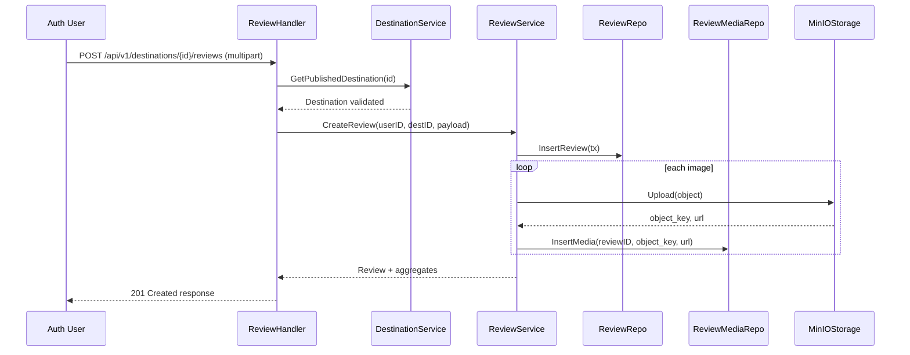
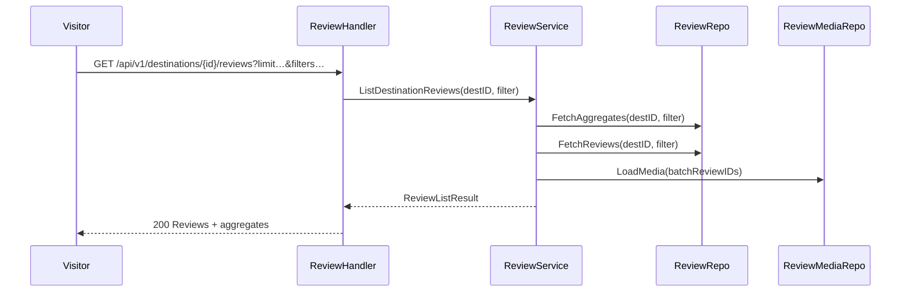
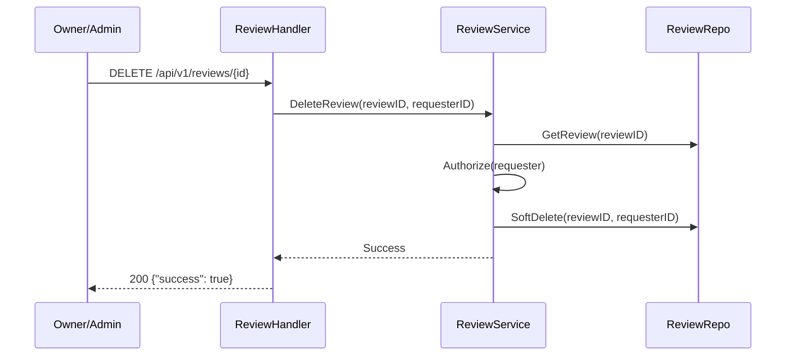

# Reviews & Ratings Feature – High-Level Design

## 1. Overview
The reviews & ratings feature lets authenticated users submit qualitative feedback and star ratings for travel destinations, attach multiple photos to support their review, and provides public read endpoints that return individual reviews alongside aggregate rating insights. Review owners and administrators can delete reviews (including their media) to keep content accurate and policy-compliant. Uploaded review media is stored in a dedicated MinIO bucket so the assets can be served publicly.

## 2. Goals
- Enable signed-in users to publish one review per destination containing a numeric rating (0–5), optional title, optional content (content requires a title), and up to N supporting images.
- Expose a public read API that lists reviews for a destination with pagination, rating/time filters, title/content, reviewer display name, and uploaded media URLs, while returning aggregate metrics such as average rating, total review count, and per-rating distribution.
- Allow review owners and admins to delete a review, including the associated media objects and metadata.

## 3. Non-Goals
- Editing reviews in-place (future work; only create/delete covered here).
- Moderation workflow (flagging, approval queues).
- Client-side upload helpers (pre-signed URLs); server handles uploads directly.
- Frontend UI work.

## 4. Assumptions
- The `review` table from migration `0003_init_reviews_favorites.sql` is present; we can extend it and add supporting tables/migrations.
- MinIO is already configured; adding an extra bucket only requires configuration updates.
- Authentication system provides `RequireAuth` and `RequireAdmin` middleware (already available in `internal/transport/http`).
- Review images should be publically accessible via the MinIO public base URL.
- Maximum image size and supported MIME types should align with existing image handling (e.g., JPEG/PNG, 5 MB cap); exact values will be enforced at service level.

## 5. Data Model

### 5.1 `review` Table Updates
- Alter `rating` constraint to allow zero: `CHECK (rating BETWEEN 0 AND 5)`.
- Ensure `updated_at` is maintained on insert/update triggers (service layer will set).
- Preserve unique index `review_unique_user_destination_idx` (still one review per user per destination).
- Add soft-delete metadata: `deleted_at TIMESTAMPTZ NULL`, `deleted_by UUID NULL REFERENCES user_account(id)`. Queries must filter on `deleted_at IS NULL` for public data.

### 5.2 New `review_media` Table
```
CREATE TABLE review_media (
    id UUID PRIMARY KEY DEFAULT uuid_generate_v4(),
    review_id UUID NOT NULL REFERENCES review(id) ON DELETE CASCADE,
    object_key TEXT NOT NULL,
    url TEXT NOT NULL,
    ordering INT NOT NULL DEFAULT 0,
    created_at TIMESTAMPTZ NOT NULL DEFAULT NOW()
);

CREATE INDEX review_media_review_id_idx ON review_media(review_id);
```
- `object_key` stores the MinIO key; `url` stores the public URL returned by the storage adapter.
- `ordering` preserves the chosen sequence from the client.

### 5.3 Domain Layer
- Extend `domain.Review` with:
  - `AverageRating float64` (for aggregated responses only; nullable in DB layer).
  - Embed reviewer display info (`ReviewerName`, `ReviewerUsername`, `ReviewerAvatar`) for read models.
- Introduce `domain.ReviewMedia` struct with `ID`, `ReviewID`, `URL`, `Ordering`.
- Add aggregate result struct (`domain.ReviewListResult`) containing metrics + slice of reviews.
- Extend `domain.Review` with `DeletedAt *time.Time` and `DeletedBy *uuid.UUID` so services and handlers can omit soft-deleted records.

## 6. Object Storage
- Introduce new config entry/env var `MINIO_BUCKET_REVIEWS` (default `fitcity-reviews`).
- `internal/config.Config` gains `MinIOBucketReviews string`.
- `service.ReviewService` accepts an `ObjectStorage` dependency along with the bucket name.
- Review image object key format: `reviews/{destinationID}/{reviewID}/{timestamp}_{rand}.{ext}`.
- Enforce allowed MIME types (`image/jpeg`, `image/png`, `image/webp`) and max size (e.g., 5 MB).
- On soft delete, retain media objects in MinIO (no delete) but stop exposing their URLs once the parent review is flagged.

## 7. API Design

### 7.1 Create Review
- **Route**: `POST /api/v1/destinations/:destination_id/reviews`
- **Auth**: Required (`RequireAuth`).
- **Request**: `multipart/form-data`
  - `rating` (int, required, 0–5 inclusive).
  - `title` (string, optional; trimmed).
  - `content` (string, optional; if provided, `title` must also be provided).
  - `images[]` (0–N files; each validated as allowed MIME/size).
  - Future extension: `images[][ordering]` hidden form field if UI can send ordering, otherwise infer by upload order.
- **Validation Rules**:
  - Destination must exist and be published.
  - User cannot submit more than one review for the same destination (enforced via unique index; return 409 on conflict).
  - At least one of title/content required? Requirement: title optional, content optional but requires title. Implementation: allow standalone rating or rating+title, rating+title+content, but reject content without title, and forbid empty strings.
- **Processing**:
  1. Create DB row in `review` with `rating`, trimmed title/content, `user_id`, `destination_id`.
  2. Upload each image to MinIO bucket `fitcity-reviews`, collecting `object_key` + public `url`.
  3. Insert `review_media` rows referencing the review.
  4. Return created review with media URLs.
- **Response (201)**:
  ```
  {
    "review": {
      "id": "uuid",
      "destination_id": "...",
      "user": {
        "id": "...",
        "display_name": "Full Name or Username",
        "avatar_url": "..."
      },
      "rating": 4,
      "title": "...",
      "content": "...",
      "created_at": "2024-05-13T12:00:00Z",
      "media": [
        {"id":"...", "url":"https://...", "ordering":0}
      ]
    },
    "average_rating": 4.3,
    "total_reviews": 12
  }
  ```
  - Optionally include updated aggregate metrics so clients can refresh without another GET.

### 7.2 List Reviews
- **Route**: `GET /api/v1/destinations/:destination_id/reviews`
- **Auth**: Public.
- **Query Parameters**:
  - `limit` (int, default 20, max 100).
  - `offset` (int, default 0).
  - `rating` (int, optional exact match).
  - `min_rating` / `max_rating` (ints 0–5).
  - `posted_after`, `posted_before` (RFC3339 timestamps).
  - `sort` (`created_at` default, `rating`).
  - `order` (`desc` default, `asc`).
- **Response (200)**:
  ```
  {
    "destination_id": "...",
    "average_rating": 4.3,
    "total_reviews": 27,
    "rating_counts": {
      "5": 12,
      "4": 8,
      "3": 4,
      "2": 2,
      "1": 1,
      "0": 0
    },
    "reviews": [
      {
        "id": "...",
        "rating": 5,
        "title": "...",
        "content": "...",
        "created_at": "...",
        "updated_at": "...",
        "reviewer": {
          "id": "...",
          "display_name": "Jane Doe",
          "username": "janed",
          "avatar_url": "..."
        },
        "media": [
          {"id":"...", "url":"https://...", "ordering":0}
        ]
      }
    ],
    "limit": 20,
    "offset": 0
  }
  ```
- **Repository Behaviour**:
  - Join `user_account` to fetch display name: prefer `full_name`, fallback to `username`, else use obfuscated email local part.
  - Join `review_media` to fetch media (ordered by `ordering`, `created_at`).
  - Aggregate average/counts using window functions or separate query; return as part of `ReviewListResult`.
  - Exclude soft-deleted reviews (`deleted_at IS NULL`) from both the paginated list and aggregates.

### 7.3 Delete Review
- **Route**: `DELETE /api/v1/reviews/:id`
- **Auth**: Required.
- **Permissions**:
  - Requester must own the review OR have admin role (`RequireAdmin` check inside handler).
- **Processing**:
  - Fetch review (must not already be soft deleted) and associated ownership metadata.
  - Authorize requester (owner or admin); record `deleted_by`.
  - Soft delete by setting `deleted_at = now()` and `deleted_by = requesterID` inside the review table. Keep `review_media` rows untouched so restoration is possible later.
- **Postconditions**:
  - Soft-deleted reviews are excluded from read APIs and aggregates.
  - Media objects remain in MinIO for potential future restoration; they are no longer referenced in responses.
- **Response (200)**:
  ```
  {"success": true}
  ```
- **Error Cases**:
  - 404 if review not found or already soft deleted.
  - 403 if requester lacks permission.

## 8. Authorization & Roles
- Creation: `RequireAuth`.
- Listing: public, no auth.
- Deletion: `RequireAuth`; if requester is owner, allow; otherwise require admin role using existing `AuthService.IsAdmin`.

## 9. Validation Rules
- `rating` integer; enforce range in handler/service and DB constraint.
- `title`/`content` trimmed; reject if both empty and no rating? (Rating always provided).
- If `content` provided but `title` missing, return 400 with message.
- `images[]`:
  - Limit number of images (e.g., max 5) to control storage.
  - Check MIME from multipart header and file signature (if feasible).
  - Reject zero-byte files.
- Destination must exist and be published; fetch via `DestinationService`.

## 10. Service Layer
- Implement `ReviewService` with methods:
  - `CreateReview(ctx, userID, destinationID, input ReviewCreateInput) (*domain.Review, *domain.ReviewAggregate, error)`
  - `ListDestinationReviews(ctx, destinationID uuid.UUID, filter ReviewListFilter) (*domain.ReviewListResult, error)`
  - `DeleteReview(ctx, reviewID, requesterID uuid.UUID) error`
- `ReviewCreateInput` includes rating/title/content and slice of `ReviewImageUpload` (struct holds reader, filename, size, content type, ordering).
- `ReviewAggregate` returns counts/average (used by POST + GET response).
- Service handles transaction boundaries: create review row, upload media, insert `review_media`. On failure, roll back and best-effort delete uploaded objects.
- Delete path performs soft delete (set `deleted_at`, `deleted_by`), skips MinIO removal, and refreshes aggregates accordingly.
- Utilize existing `AuthService.IsAdmin` for permission checks during delete (service consumes `AuthService` or a narrower `RoleChecker` interface).

## 11. Repository Layer
- Extend `internal/repository/ports.ReviewRepository`:
  - Add `ListByDestination(ctx, destinationID uuid.UUID, filter domain.ReviewListFilter) ([]domain.Review, error)` to handle filters + ordering.
  - Add `AggregateByDestination(ctx, destinationID uuid.UUID, filter domain.ReviewAggregateFilter) (domain.ReviewAggregate, error)`.
- Add `SoftDelete(ctx, reviewID uuid.UUID, deletedBy uuid.UUID) error` to set soft-delete metadata.
- Create `ReviewMediaRepository` interface with `CreateMany` and `ListByReviewIDs` (deletions retained for now).
- Implement Postgres adapters in `internal/repository/postgres/review_repo_pg.go` and new `review_media_repo_pg.go` using SQLx.
- Ensure list queries join `user_account` (for reviewer info) and optionally `review_media`.

## 12. HTTP Transport
- Flesh out `internal/transport/http/review_handler.go`:
  - `RegisterReviews(e *echo.Echo, auth *service.AuthService, reviews *service.ReviewService, destService *service.DestinationService, bucketCfg ReviewFeatures)` to wire routes.
  - Use `RequireAuth` for POST/DELETE; GET is public.
  - Parse multipart in POST; map to service inputs.
  - Build response envelopes consistent with existing helpers (`util.Envelope`).
- Update router registration in `cmd/api/main.go` to initialize repositories/services/handlers, similar to `RegisterDestinations`.

## 13. Sequences

### 13.1 Create Review Flow
1. Client sends multipart POST with rating, optional title/content, and images.
2. Handler authenticates user, parses payload, validates destination.
3. Service starts transaction, inserts review, uploads images to MinIO bucket `fitcity-reviews`, inserts `review_media`, commits.
4. Service retrieves aggregate stats (either via the same transaction or after commit), returns result.
5. Handler responds with created review + aggregates.



### 13.2 List Reviews Flow
1. Client sends GET with filters.
2. Handler parses query params into filter struct.
3. Service executes aggregated query (count, average, rating distribution) and fetches paginated reviews + media.
4. Handler assembles response, ensuring reviewer name preference order (full name -> username -> masked email).



### 13.3 Delete Review Flow
1. Authenticated client calls DELETE with review ID.
2. Handler fetches review via service; service verifies ownership or admin status.
3. Service marks the review as soft deleted (`deleted_at`, `deleted_by`), excluding it from future listings.
4. Respond with success; data (and media) remains stored for potential restoration.



## 14. Implementation Checklist
1. Add new config field/env var for `MINIO_BUCKET_REVIEWS`; propagate through `cmd/api/main.go`.
2. Create SQL migration to adjust `review.rating` constraint and add `review_media` table.
3. Update domain models (`domain.Review`, add `domain.ReviewMedia`, aggregate structs).
4. Implement repository interfaces and Postgres adapters for reviews & media, including aggregation helpers and soft-delete support.
5. Build `ReviewService` with create/list/delete (soft delete) logic and storage integration.
6. Implement HTTP handler with routing, request parsing, validation, and response marshaling.
7. Wire new handler in router initialization.
8. Add unit tests for service logic (create/list/delete) and repository SQL (using pgx test harness if available).
9. Document new environment variable in `docs`/`README`.
10. Update Swagger spec if maintained.
