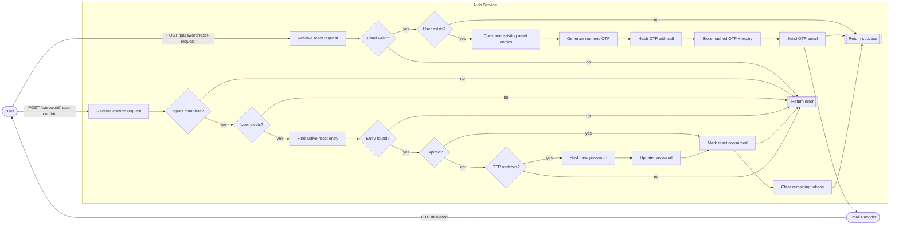
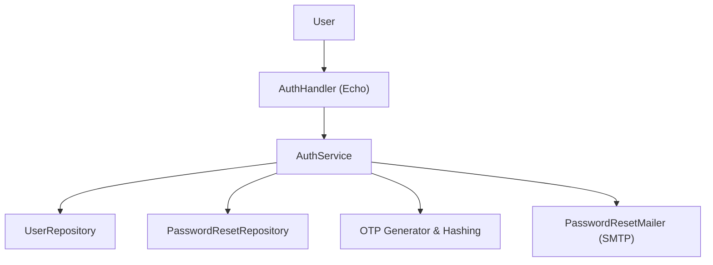
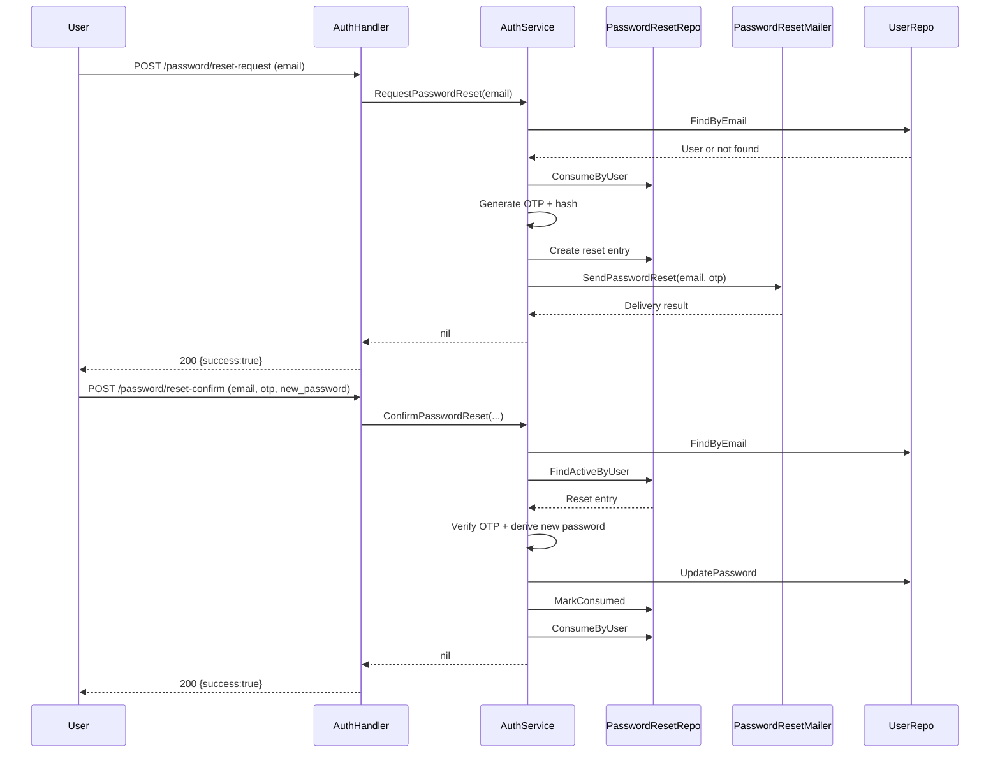

# Self-Service Password Reset - High-Level Design

## 1. Overview
The self-service password reset feature allows a user to re-establish access when they forget an account password. After the user requests a reset, the backend generates a time-bound one-time passcode (OTP), persists a hashed version, and delivers the code via email. The user redeems the OTP alongside a new password to finalize the reset. This design leverages existing authentication components in `internal/service/auth_service.go`, the password reset repository in `internal/repository/postgres/password_reset_repo_pg.go`, and the mailer adapter in `internal/transport/mail/password_reset_mailer.go`.

## 2. Goals and Success Criteria
- Users can request and complete a password reset without staff intervention.
- OTP codes expire automatically to reduce replay risk.
- The system invalidates older reset attempts and removes OTPs after successful completion.
- Reset requests complete end-to-end (user request, mail send) in under a few seconds under nominal load.
- No plaintext OTP or password material is stored or logged.

## 3. Scope
- Applies to human users authenticating via email/password.
- Communicates via email using SMTP credentials configured for the deployment.
- Does not cover administrators resetting passwords on behalf of users (handled elsewhere).
- Does not include multi-factor enrollment; OTP is single channel email.

## 4. Actors, Preconditions, Triggers
- **Actors**: End user, Auth API (`internal/transport/http/auth_handler.go`), AuthService, PasswordResetRepository, PasswordResetMailer.
- **Preconditions**: User has a verified email on file; SMTP configuration (`SMTP_*`) present; reset TTL (`PASSWORD_RESET_TTL`) and OTP length configured.
- **Trigger**: User submits a reset request with an email address to `/api/v1/auth/password/reset-request`.

## 5. Use Case Diagram

## 6. Flows
### 6.1 Reset Request Path
1. User calls `POST /api/v1/auth/password/reset-request` with email.
2. `AuthHandler.resetPasswordRequest` validates payload and delegates to `AuthService.RequestPasswordReset`.
3. AuthService normalizes email, ensures password reset repository exists.
4. `UserRepository.FindByEmail` retrieves account; missing accounts short-circuit silently to avoid disclosure.
5. `PasswordResetRepository.ConsumeByUser` invalidates existing pending tokens for the user.
6. `util.GenerateNumericOTP` creates a numeric code of length `PASSWORD_RESET_OTP_LENGTH`.
7. `util.DerivePassword` hashes OTP with a random salt.
8. `PasswordResetRepository.Create` persists hashed OTP, salt, and `expires_at = now + PASSWORD_RESET_TTL`.
9. The mailer sends the OTP email. If sending fails, the new reset entry is marked consumed to prevent orphaned tokens.
10. Handler returns HTTP 200 with `{ "success": true }` regardless of user existence.

### 6.2 Reset Confirmation Path
1. User calls `POST /api/v1/auth/password/reset-confirm` with email, OTP, new password.
2. Handler validates all fields and calls `AuthService.ConfirmPasswordReset`.
3. Service verifies password complexity via `util.ValidatePassword`.
4. Fetches user via `FindByEmail`; missing user returns `ErrResetOTPInvalid`.
5. `PasswordResetRepository.FindActiveByUser` loads most recent, unconsumed reset whose `expires_at` >= now.
6. Expired entries are marked consumed and return `ErrResetOTPExpired`.
7. `util.VerifyPassword` compares provided OTP with stored hash/salt.
8. On match, new password hash/salt derived with `util.DerivePassword`.
9. `UserRepository.UpdatePassword` persists the new password.
10. Reset record is marked consumed and `ConsumeByUser` is called again to guarantee no leftover active tokens.
11. Handler returns HTTP 200 with `{ "success": true }`.

### 6.3 Exceptional Flows
- Invalid email or OTP formats -> 400 from handler.
- Mail delivery failure -> 500 response with reset entry consumed.
- Repository or mailer misconfiguration -> 500 response.
- OTP mismatch -> `ErrResetOTPInvalid` -> 400 with generic message.

## 7. Architecture Overview

### 7.1 Sequence (Request + Confirm)

## 8. Data Model
| Field | Type | Description |
| --- | --- | --- |
| `id` | bigint | Primary key for the reset record. |
| `user_id` | UUID | References the user requesting the reset. |
| `otp_hash` | bytea | Hashed OTP value using salt for verification. |
| `otp_salt` | bytea | Random salt stored alongside the hash. |
| `expires_at` | timestamptz | Expiration timestamp computed from `PASSWORD_RESET_TTL`. |
| `consumed` | boolean | Indicates whether the reset token has been used or invalidated. |
| `created_at` | timestamptz | Creation audit timestamp. |
| `updated_at` | timestamptz | Updated when tokens are consumed or invalidated. |

All lookups order by `created_at DESC` and return the latest active row.

## 9. API Surface
- `POST /api/v1/auth/password/reset-request`  
  Payload: `{ "email": "user@example.com" }`  
  Success: `{ "success": true }`  
  Errors: 400 invalid input, 500 infrastructure failure.
- `POST /api/v1/auth/password/reset-confirm`  
  Payload: `{ "email": "...", "otp": "123456", "new_password": "..." }`  
  Success: `{ "success": true }`  
  Errors: 400 invalid input/OTP/weak password, 500 persistence issues.

## 10. Functional Requirements
| ID | Requirement Name | Description | Priority |
| --- | --- | --- | --- |
| FR-PR-01 | Initiate Reset | System shall accept a reset request when a valid email is submitted. | High |
| FR-PR-02 | Generate OTP | System shall create a numeric OTP of configurable length for each request. | High |
| FR-PR-03 | Persist OTP Securely | System shall store OTP values hashed with salt and an expiration timestamp. | High |
| FR-PR-04 | Deliver OTP | System shall send the OTP to the user's registered email address. | High |
| FR-PR-05 | Confirm Reset | System shall validate OTP and new password input before updating the user credential. | High |
| FR-PR-06 | Invalidate Prior Tokens | System shall consume any existing reset tokens once a new one is issued or used. | Medium |

## 11. Non-Functional Requirements
| ID | Requirement Name | Description |
| --- | --- | --- |
| NFR-PR-01 | Security | OTPs must be generated with a cryptographically secure random source and stored only in hashed form. |
| NFR-PR-02 | Performance | Reset request and confirmation endpoints should respond within 2 seconds under normal load. |
| NFR-PR-03 | Reliability | Email delivery attempts should be retried or surfaced as failures so users are not left without guidance. |
| NFR-PR-04 | Auditability | System should log reset issuance and confirmation outcomes with user and timestamp metadata (excluding OTP). |
| NFR-PR-05 | Privacy | Responses must not reveal whether an email exists to prevent account enumeration. |

## 12. Configuration
- `PASSWORD_RESET_TTL` (default 15m): expires OTP tokens. Parsed via `time.ParseDuration`.
- `PASSWORD_RESET_OTP_LENGTH` (default 6): digits generated by `util.GenerateNumericOTP`.
- SMTP variables (`SMTP_HOST`, `SMTP_PORT`, `SMTP_USERNAME`, `SMTP_PASSWORD`, `SMTP_FROM`, `SMTP_USE_TLS`) enable mail delivery.
- Feature depends on `PasswordResetRepository` and `PasswordResetMailer` injection in `cmd/api/main.go`.

## 13. Security Considerations
- OTP stored hashed with salt using `util.DerivePassword`; plaintext never persisted.
- OTPs are single-use; `ConsumeByUser` voids prior tokens on request and after confirmation.
- Responses conceal whether an email exists to prevent account enumeration.
- Logger should not capture OTP values; mailer can include masked tokens in logs if necessary.
- Rate limiting should be applied at the API gateway or middleware layer to prevent brute-force attempts.

## 14. Observability
- Errors propagate to Echo middleware logging.
- Mailer can wrap SMTP client with instrumentation for delivery tracking.
- Future improvement: add structured event logs for issuance, verification, and failures.

## 15. Testing Strategy
- **Unit tests** in `internal/service/auth_service_test.go` cover request and confirm happy paths, invalid OTP, expired OTP, weak passwords, and mailer failures.
- **Repository tests** should validate SQL behavior (not included yet).
- **Integration tests** can use fake SMTP server (MailHog) configured in `infra/compose.local.yml`.
- **Manual QA** verifies email templates and ensures OTP expiration matches config.

## 16. Future Enhancements
- Add secondary channels (SMS, push) for OTP delivery.
- Introduce rate limits and captcha for reset request endpoint.
- Provide localized email templates.
- Implement background job to purge consumed/expired reset entries to reduce table size.
