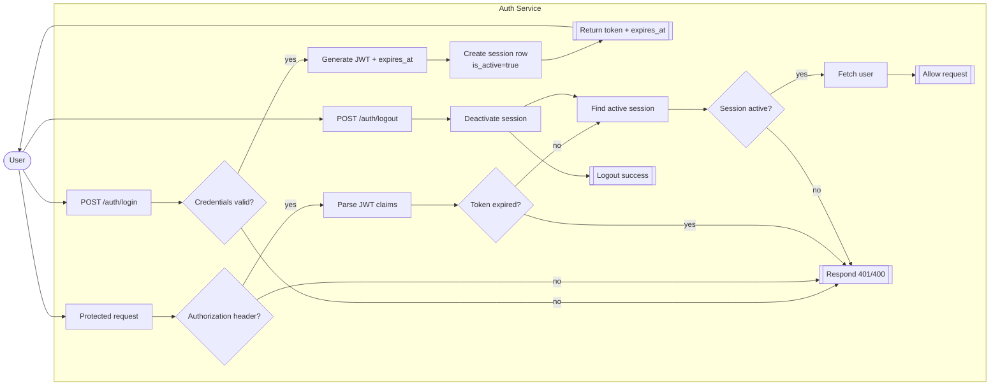
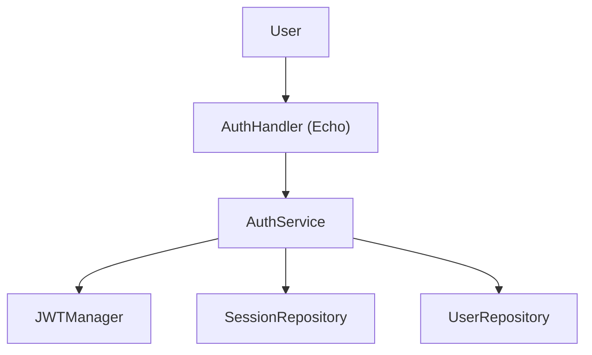
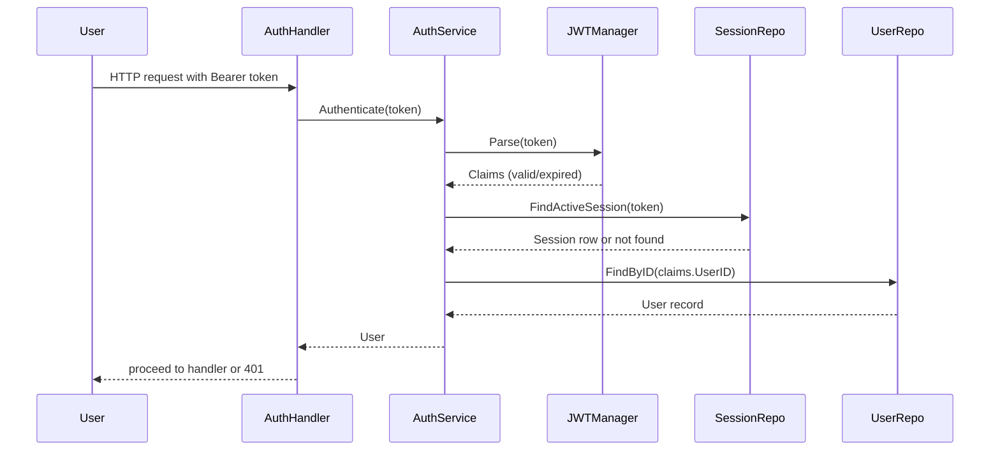

# Session Timeout - High-Level Design

## 1. Overview
The session timeout feature enforces automatic logout after a configurable duration. When users authenticate, the system issues a JWT access token and persists a backing session record with an expiration timestamp. Each subsequent request validates both the JWT signature and the session state, ensuring that tokens cannot be reused after the timeout or manual logout. Implementation spans `cmd/api/main.go`, `internal/service/auth_service.go`, `internal/util/jwt.go`, and `internal/repository/postgres/session_repo_pg.go`.

## 2. Goals and Success Criteria
- Limit exposure of stolen tokens by automatically expiring sessions (`SESSION_TTL` default 24h).
- Keep JWT expiry and database session expiry aligned so either mechanism invalidates stale sessions.
- Provide deterministic logout by flipping `is_active` flag while also expiring `expires_at`.
- Return session expiry to clients (`expires_at` field) so they can refresh proactively.
- Ensure validation path is performant and resilient.

## 3. Scope
- Applied to all user-authenticated endpoints under `/api/v1/auth` protected by `requireAuth`.
- Does not include refresh-token rotation or remember-me functionality (future scope).
- Session records persist in the `sessions` table; no in-memory cache dependency.

## 4. Actors, Preconditions, Triggers
- **Actors**: User, AuthHandler (Echo), AuthService, JWTManager, SessionRepository, UserRepository.
- **Preconditions**: `SESSION_TTL` configured and parseable; JWT secret configured (`JWT_SECRET`); database accessible.
- **Triggers**: Login or registration success, Google login, or any action that calls `AuthService.Logger`? (should be login). For validations, any API call using Bearer token.

## 5. Use Case Diagram

## 6. Core Flows
### 6.1 Session Issuance (Login/Register)
1. User submits credentials (password or Google token).
2. `AuthHandler` delegates to the relevant AuthService method (`LoginWithEmail`, `RegisterWithEmail`, `LoginWithGoogle`).
3. On success, `AuthService.issueSession` calls `JWTManager.Generate`, producing a signed token and `expiresAt = now + SESSION_TTL`.
4. `SessionRepository.CreateSession` inserts `{user_id, token, expires_at}` with `is_active = true`.
5. Handler responds with `{ token, expires_at, user }`.

### 6.2 Authenticated Request Validation
1. Client calls protected endpoint with `Authorization: Bearer <token>`.
2. `requireAuth` middleware parses header and calls `AuthService.Authenticate`.
3. JWT signature and expiry validated via `JWTManager.Parse`.
4. `SessionRepository.FindActiveSession` ensures a matching, active row where `expires_at > NOW()`.
5. Middleware fetches user via `UserRepository.FindByID` and stashes it in context for handlers.
6. If any step fails, middleware returns 401.

### 6.3 Logout
1. Client calls `POST /api/v1/auth/logout`.
2. Middleware authenticates token; handler calls `AuthService.Logout`.
3. `SessionRepository.DeactivateSession` sets `is_active = false` and `expires_at = NOW()` for the token.
4. Future requests with same token fail at validation step.

### 6.4 Automatic Expiration
- Database session expiry leverages `expires_at > NOW()` checks during `FindActiveSession`.
- JWT parsing rejects tokens past their embedded expiry.
- No background job is required; expired rows simply fail validation. Optional cleanup can purge stale records later.

## 7. Architecture Overview

### 7.1 Sequence (Authenticated Request)

## 8. Data Model
| Field | Type | Description |
| --- | --- | --- |
| `id` | bigint | Primary key for the session row. |
| `user_id` | UUID | Foreign key referencing the authenticated user. |
| `token` | text | Persisted JWT string associated with the session. |
| `created_at` | timestamptz | Timestamp when the session was created. |
| `expires_at` | timestamptz | Expiration timestamp derived from `SESSION_TTL`. |
| `is_active` | boolean | Flag indicating whether the session is currently valid. |

Queries ensure `is_active = true` and `expires_at > NOW()` to accept a session.

## 9. Functional Requirements
| ID | Requirement Name | Description | Priority |
| --- | --- | --- | --- |
| FR-ST-01 | Issue Session | System shall generate a JWT and session record upon successful authentication. | High |
| FR-ST-02 | Validate Token | System shall verify JWT signature and expiry on every protected request. | High |
| FR-ST-03 | Check Session State | System shall ensure an active session row exists with a future expiry before allowing access. | High |
| FR-ST-04 | Logout | System shall deactivate the session token when the user logs out. | High |
| FR-ST-05 | Return Expiry | System shall expose the session expiration time to clients in authentication responses. | Medium |

## 10. Non-Functional Requirements
| ID | Requirement Name | Description |
| --- | --- | --- |
| NFR-ST-01 | Security | Session and JWT secrets must be stored securely; tokens should be invalidated immediately when logout occurs. |
| NFR-ST-02 | Performance | Token validation and session lookup should complete within 100 ms under normal load to avoid latency spikes. |
| NFR-ST-03 | Reliability | Session creation and validation must tolerate transient database errors with retries or clear failures. |
| NFR-ST-04 | Observability | System should log login, logout, and authentication failures with trace IDs for auditing. |
| NFR-ST-05 | Scalability | Session repository queries must use indexed lookups to support concurrent access as user count grows. |

## 11. Configuration
- `SESSION_TTL`: parsed in `cmd/api/main.go`; defaults to 24h if invalid. Drives both JWT expiry and database `expires_at`.
- `JWT_SECRET`: used for HMAC signing and verification.
- `ALLOW_ORIGINS`: influences CORS but not timeout semantics.

## 12. Security Considerations
- Tokens are opaque JWTs; storing raw tokens in the database enables targeted revocation but means DB compromise reveals them. Consider hashing tokens if threat model requires.
- Synchronizing JWT expiry and DB expiry avoids split-brain scenarios where one accepts and other rejects.
- Middleware rejects missing or malformed Bearer headers.
- Logout forcibly expires session record and ensures subsequent JWT parsing fails due to `expires_at` change.
- Rate limiting and anomaly detection (not yet implemented) should watch for repeated 401 responses.

## 13. Observability
- Echo logger captures authentication failures and error responses.
- Session creation and deactivation can be instrumented via repository wrappers to emit metrics (counts, expirations).
- Future enhancement: add audit logging for login and logout events with user ID and IP.

## 14. Testing Strategy
- `internal/service/auth_service_test.go` covers session creation during login, token generation, logout deactivation, invalid tokens, and user lookup failures.
- Additional integration tests should verify that expired `expires_at` causes authentication failure and that logout revokes sessions.
- Load testing should confirm `FindActiveSession` performs under concurrency (consider index on `token` and `is_active`).

## 15. Future Work
- Introduce refresh tokens and sliding expiration.
- Hash stored JWT tokens to reduce exposure.
- Add scheduled cleanup for expired sessions to keep table small.
- Implement idle timeout (last activity) tracking if required.
