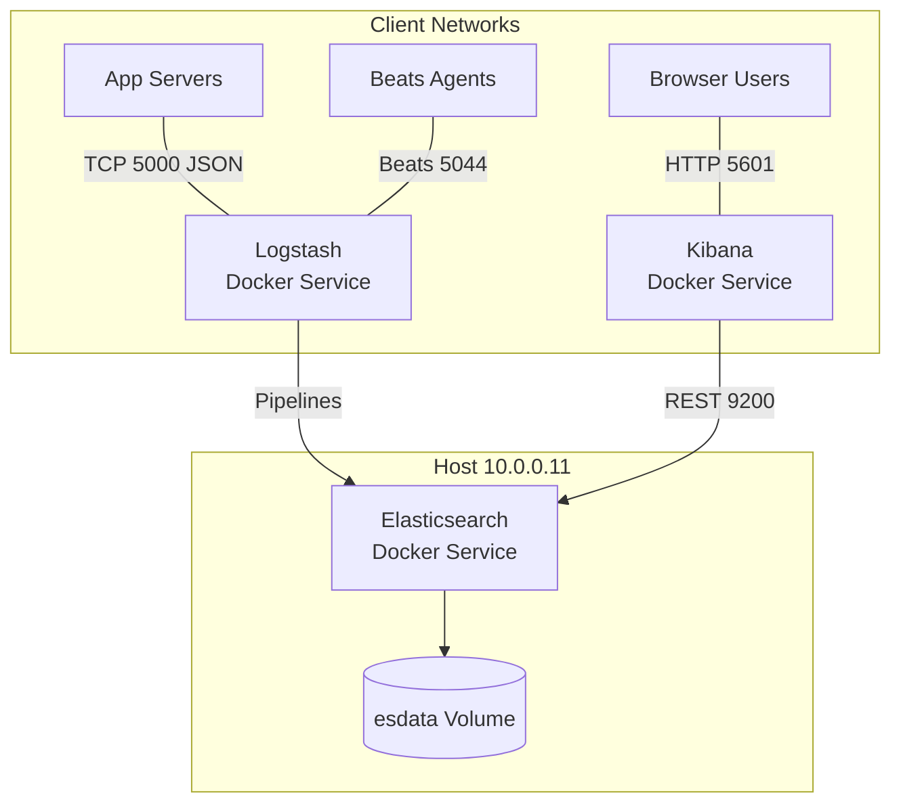
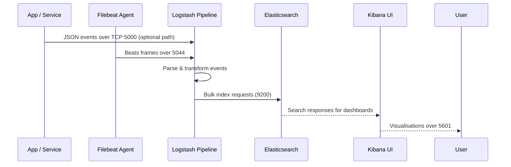

# Elasticsearch Stack Connectivity Design

## Overview
- ELK stack nodes run on host `10.0.0.11` in single-node mode (no clustering).
- Stack components (Elasticsearch, Logstash, Kibana) are Docker-managed services exposed to LAN clients.
- Primary use cases: shipping application logs into Logstash, querying/storing data in Elasticsearch, and visualising in Kibana.

## Network Layout
- **Host placement:** `10.0.0.11` must be reachable over TCP from client networks; ensure routing/firewall rules allow access to ports `9200`, `5000`, `5044`, and `5601`.
- **Container DNS:** Docker service names (`elasticsearch`, `logstash`, `kibana`) are internal to the host; remote clients must use the host IP `10.0.0.11`.
- **Persistence:** Elasticsearch data volume `esdata` is bound locally; no shared storage is exposed externally.

## Topology Diagram

## Service Endpoints
- **Elasticsearch API (`9200/tcp`):**
  - REST interface for index management, querying, and cluster health checks.
  - Example health check: `curl http://10.0.0.11:9200/_cluster/health`.
  - Security is disabled (`xpack.security.enabled=false`); endpoints are open to any reachable host. Enforce network-level restrictions.
- **Logstash Inputs (`5000/tcp` JSON, `5044/tcp` Beats):**
  - `5000/tcp`: accept JSON events via TCP; configure application log shippers to send newline-delimited JSON.
  - `5044/tcp`: Beats protocol endpoint suited for Filebeat/Metricbeat; point Beats `hosts` setting to `["10.0.0.11:5044"]`.
  - Logstash pipelines reside in `./logstash/pipeline` on host; update to match expected event formats.
- **Kibana UI (`5601/tcp`):**
  - Access via browser: `http://10.0.0.11:5601`.
  - Default configuration points Kibana to Elasticsearch at `http://elasticsearch:9200`; this resolves inside Docker network. No external authentication layer exists.

## Client Integration Guidance
- **Application logging:**
  - For direct JSON TCP shipping, use libraries supporting framed TCP (e.g., Logback TCP appender, Winston TCP transport) targeting `10.0.0.11:5000`.
  - For Beats-based workflows, install Filebeat on each source host, set `output.logstash.hosts: ["10.0.0.11:5044"]`, and map log paths through Filebeat inputs.
  - For Go services in this repo, set `LOGSTASH_TCP_ADDR=10.0.0.11:5000` to enable the built-in async Logstash writer that mirrors console logs to the stack.
- **Index lifecycle:**
  - Before pushing structured data, create index templates/mappings through Elasticsearch API to ensure mapping stability.
- **Discoverability:**
  - After data arrival, configure Kibana index patterns and dashboards by navigating to Stack Management → Index patterns.

## Log Flow Diagram

## Operational Considerations
- **Firewall:** Restrict access to trusted networks while security is disabled; consider SSH tunnelling or VPN for remote access.
- **TLS & Auth (future):** Enable Elasticsearch/Kibana security (`xpack.security.enabled=true`) when ready; update clients to use HTTPS and credentials.
- **Resource Monitoring:** Track JVM heap usage (`ES_JAVA_OPTS` set to 1 GB); adjust if heap pressure occurs.
- **Reliability:** `restart: unless-stopped` ensures containers restart on host reboot; monitor disk usage in `esdata` to avoid write failures.

## Validation Checklist
- Ping/trace route to `10.0.0.11` from client host.
- `curl http://10.0.0.11:9200` returns cluster info JSON.
- Beats/Filebeat `test output` succeeds against Logstash endpoint.
- Kibana UI loads in browser and lists expected index patterns.
