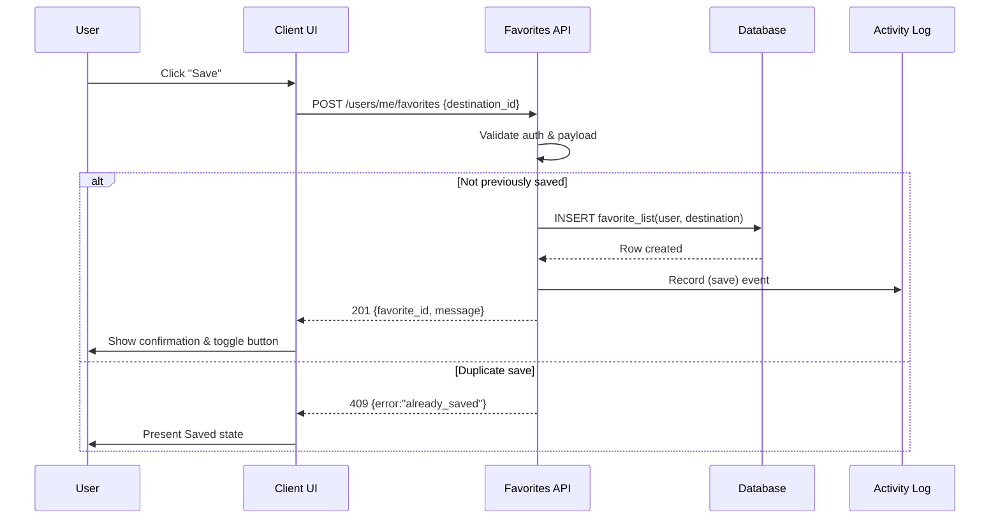
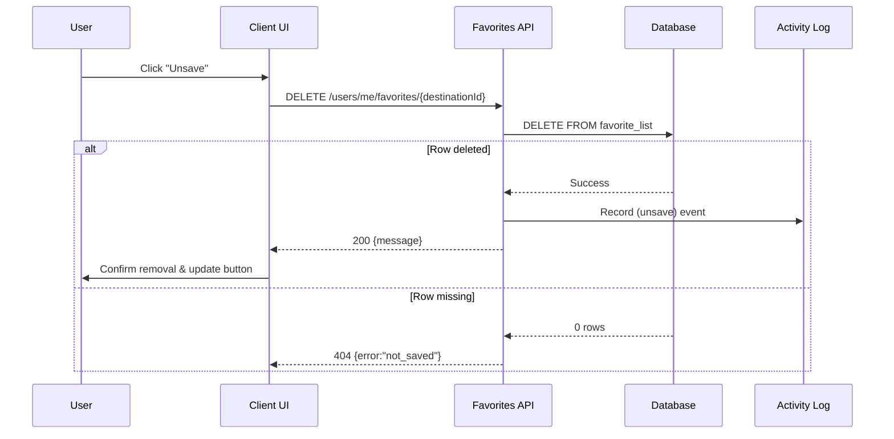

# Favorites API Design

This document describes the REST endpoints and expected client behaviour required to support saving and unsaving destinations as user favorites. All endpoints are versioned under `api/v1` and require an authenticated user session.

## Authentication & Authorization
- Requests must include `Authorization: Bearer <token>` (or an equivalent session cookie) mapped to a `user_account`.
- Anonymous requests receive `401 Unauthorized` and clients must redirect to the login flow before retrying.
- Each action operates on the caller's own favorites; `403 Forbidden` is returned if a user attempts to mutate another account.

## Data Model
- Table `favorite_list` stores one row per `(user_account_id, destination_id)` pair; a unique index on these columns prevents duplicates.
- `created_at` represents the time the user saved the destination and is used for ordering within the Favorites list.
- Activity logging records every save/unsave with `user_account_id`, `destination_id`, `action` (`saved`, `unsaved`), and the event timestamp.

## Endpoints

### Save Destination
- **Method & Path:** `POST /api/v1/users/me/favorites`
- **Purpose:** Persist a destination in the caller's favorites and immediately reflect the Saved state across detail, search, recommendation, and favorites views.
- **Request Body:**
  ```json
  {
    "destination_id": "5b7a8702-b2c5-4de4-93c9-99322bd49ee2"
  }
  ```
- **Success (201 Created):**
  ```json
  {
    "favorite_id": "11edaf11-0c18-43fd-b42d-0cd36b7c178b",
    "destination_id": "5b7a8702-b2c5-4de4-93c9-99322bd49ee2",
    "message": "Destination saved to Favorites",
    "saved_at": "2024-06-23T10:12:07Z"
  }
  ```
- **Business Rules:**
  - Duplicate saves return `409 Conflict` with `{ "error": "already_saved" }` and the front-end must switch the button to the Saved/Unsave state without inserting a new row.
  - A background job or inline call records the action in the Activity Log.
  - The API returns the canonical Saved state so clients can keep search results, destination detail, and favorites list in sync.
- **Failure Handling:** Roll back any database changes; respond with `503 Service Unavailable` or `500 Internal Server Error` and `{ "message": "Could not update Favorites. Please try again." }`.



### Unsave Destination
- **Method & Path:** `DELETE /api/v1/users/me/favorites/{destinationId}`
- **Purpose:** Remove a destination from the caller's favorites while keeping UI surfaces consistent.
- **Success (200 OK):**
  ```json
  {
    "destination_id": "5b7a8702-b2c5-4de4-93c9-99322bd49ee2",
    "message": "Destination removed from Favorites"
  }
  ```
- **Business Rules:**
  - Missing rows produce `404 Not Found` with `{ "error": "not_saved" }` so clients can reconcile their state.
  - After a successful delete the API emits an Activity Log entry with action `unsaved`.
  - The response confirms the new state; the UI must immediately toggle the button and refresh any in-memory favorites.
- **Failure Handling:** If the delete fails, restart state by leaving the record untouched and respond with `{ "message": "Could not update Favorites. Please try again." }`.



### List Favorites
- **Method & Path:** `GET /api/v1/users/me/favorites`
- **Purpose:** Provide the caller's saved destinations for display in the Favorites list, ordered by `created_at DESC`.
- **Query Parameters:**
  - `limit` (default 20, max 100) and `offset` for pagination.
  - `include` optional expansions such as `destination_summary` or `images` to avoid N+1 lookups.
- **Success (200 OK):**
  ```json
  {
    "items": [
      {
        "favorite_id": "11edaf11-0c18-43fd-b42d-0cd36b7c178b",
        "destination_id": "5b7a8702-b2c5-4de4-93c9-99322bd49ee2",
        "destination_name": "Mount Bromo",
        "city": "Probolinggo",
        "country": "Indonesia",
        "thumbnail_url": "https://cdn.fitcity.app/destinations/5b7a.../thumb.jpg",
        "saved_at": "2024-06-23T10:12:07Z"
      }
    ],
    "pagination": {
      "limit": 20,
      "offset": 0,
      "total": 57
    }
  }
  ```
- **Business Rules:**
  - The API must return fully enriched metadata needed for list cards to avoid extra client calls.
  - Clicking a row navigates to `/destinations/{destinationId}`, so include the identifier in every item.
  - Changes from save/unsave operations should be reflected immediately; clients may refresh the list after receiving save/unsave responses or subscribe to websocket updates if available.

### Count Destination Favorites
- **Method & Path:** `GET /api/v1/destinations/{destinationId}/favorites/count`
- **Purpose:** Let clients display the aggregate number of users who saved a destination (e.g., badges on detail or search cards).
- **Success (200 OK):**
  ```json
  {
    "destination_id": "5b7a8702-b2c5-4de4-93c9-99322bd49ee2",
    "favorites_count": 1342,
    "last_updated": "2024-06-23T10:12:07Z"
  }
  ```
- **Implementation Notes:**
  - Retrieve counts with `SELECT COUNT(*) FROM favorite_list WHERE destination_id = $1;`.
  - Optionally maintain a cached projection or materialized view if counts are requested frequently.
  - Anonymous access is allowed if counts are public; otherwise require authentication.

## Error Handling Strategy
- Return consistent JSON error envelopes:
  ```json
  {
    "error": "not_saved",
    "message": "Destination is not in your Favorites."
  }
  ```
- Retryable server issues respond with HTTP 5xx and the UI must revert the button to its last known state with an error toast.
- Validation misses return `422 Unprocessable Entity` (e.g., malformed UUID).
- All failures should be logged (including request ID, user ID, destination ID, endpoint, and error code) for observability.

## Activity Logging & Auditing
- Every successful save/unsave triggers an `activity_log` insert or event:
  ```json
  {
    "user_id": "815dd4d9-3a3c-4b76-9a29-86cf35e96f7e",
    "destination_id": "5b7a8702-b2c5-4de4-93c9-99322bd49ee2",
    "action": "saved",
    "occurred_at": "2024-06-23T10:12:07Z",
    "source": "favorites_api"
  }
  ```
- Logs support audit trails, analytics (e.g., most saved destinations), and troubleshooting.

