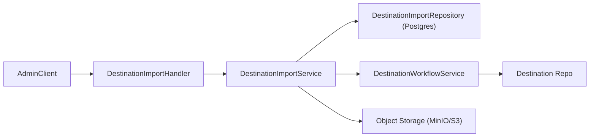
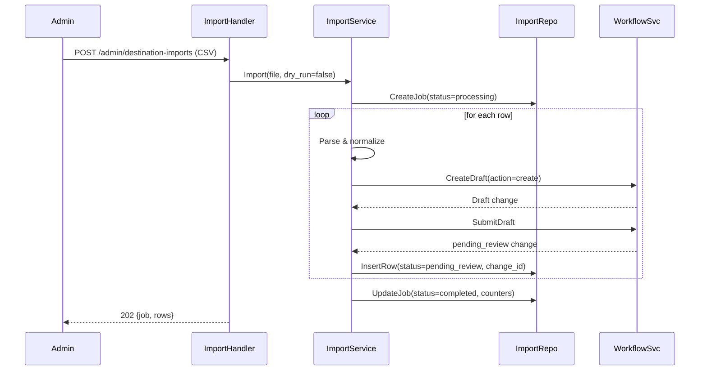
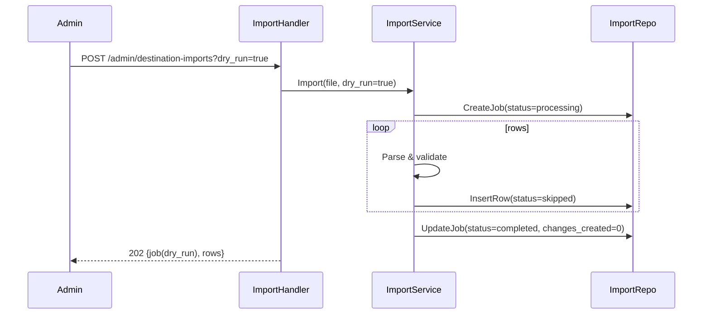

# Destination Bulk Import – API Design

## 1. Overview
Admin teams occasionally need to onboard dozens of destinations sourced from partner spreadsheets. The current workflow forces each record to be entered manually as a draft, submitted, and later reviewed. This document introduces a CSV-driven bulk import pipeline that reuses the existing Destination Change Handler but automates draft creation/submission so every row lands in `pending_review` without an author touching the UI. Reviewers continue using the standard approve/reject endpoints, ensuring governance rules remain intact.

## 2. Goals & Non-Goals
- **Goals**
  - Accept a UTF-8 CSV containing destination metadata aligned with `DestinationChangeFields`.
  - Validate each row with the same business rules enforced during manual draft creation (name, coordinates, contact channel, hero image/gallery limits, opening/closing time format, etc.).
  - Create a change request per valid row, immediately mark it `pending_review`, and associate it with the uploading admin.
  - Provide feedback for every failed row plus a job-level summary so admins can fix issues offline.
  - Focus solely on create operations; every row describes a new destination seeded directly into the review queue.
  - Flatten gallery media (max three images) into single-row columns per the requirement.
- **Non-Goals**
  - No automatic approval/publishing.
  - No binary/media uploads through CSV (all media must already exist at a reachable URL).

## 3. Actors & Flow
1. **Importing Admin** obtains a template, fills it with destinations, and hits the new `POST /api/v1/admin/destination-imports`.
2. **Destination Import Service** stores the raw CSV, registers a job (`queued`), and enqueues processing.
3. **Import Worker** streams the file, validates each row, and for valid rows calls the workflow service to:
   - Create a draft (`DestinationWorkflowService.CreateDraft`).
   - Immediately call `SubmitDraft` so the change becomes `pending_review` with `submitted_at` timestamped to the job time.
4. **Reviewer Admins** approve/reject via existing `/admin/destination-changes` endpoints.
5. Admins poll `GET /api/v1/admin/destination-imports/:id` or download the error report to fix rejected rows and re-upload.

## 4. CSV Contract
- Encoding: UTF-8, comma-delimited, header row required.
- Max rows: 500 per file (configurable).
- Empty rows are skipped; comments are not allowed.
- Gallery flattened into six columns (URL + caption per slot) to satisfy the “single-row gallery” requirement.

| Column | Required? | Description |
| --- | --- | --- |
| `name` | Required | Public name (same validation as drafts). |
| `slug` | Optional | Must be unique for creates. |
| `status` | Optional | Desired publication status for the destination (`draft`, `published`, `archived`). Defaults to `published` when omitted. |
| `category` | Required | Free-form label; validated against `DESTINATION_ALLOWED_CATEGORIES` when configured. |
| `city`| Required | Location metadata. |
| `country` | Required | Location metadata. |
| `description` | Required | Marketing copy. |
| `latitude` | Required | Decimal degrees; validated within ±90/±180. |
| `longitude` | Required | Decimal degrees; validated within ±90/±180. |
| `contact` | Required | Free-form contact string (phone/email/book URL); must contain at least one reachable channel per existing rule. |
| `opening_time` | Optional | `HH:MM` 24h strings; closing must be >= opening unless 
| `closing_time` | Optional | `HH:MM` 24h strings; closing must be >= opening unless overnight flag toggled. |
| `hero_image_url` | Required | Publicly accessible hero image. CSV importer cannot upload binaries, so `hero_image_upload_id` is ignored. |
| `gallery_1_url`..`gallery_3_url` | Optional | Up to three gallery image URLs; blank columns trimmed. Ordering derives from suffix number (starting at 1 but stored as zero-based). |
| `gallery_1_caption`..`gallery_3_caption` | Optional | Captions paired with the URL column; empty strings removed. |
| `hero_image_upload_id` / `published_hero_image` | Optional | Included for schema parity with manual drafts; both columns are ignored during import. |

### 4.1 Gallery flattening
- Each `gallery_n_url` is mapped to `DestinationMedia{url, ordering=n-1}`.
- Missing intermediate slots are skipped.
- More than three populated URLs triggers a row-level validation error.

### 4.2 Sample row
```csv
slug,name,status,category,city,country,description,latitude,longitude,contact,opening_time,closing_time,hero_image_url,gallery_1_url,gallery_1_caption,gallery_2_url,gallery_2_caption,gallery_3_url,gallery_3_caption,hero_image_upload_id,published_hero_image
central-park,Central Park,published,Nature,New York,USA,"Iconic urban park with year-round programming.",40.785091,-73.968285,"+1 212-310-6600",06:00,22:00,https://cdn.fitcity/destinations/central-park/hero.jpg,https://cdn.fitcity/destinations/central-park/gallery-1.jpg,"Bethesda Fountain",https://cdn.fitcity/destinations/central-park/gallery-2.jpg,"Bow Bridge",,,
```

## 5. API Surface

| Endpoint | Method | Description |
| --- | --- | --- |
| `/api/v1/admin/destination-imports/template` | GET | Returns the latest CSV header and a single sample row. |
| `/api/v1/admin/destination-imports` | POST (multipart) | Upload a CSV. Optional query params: `dry_run=true` (validate only), `submit=true` (default) to control auto-submission. Returns a job record. |
| `/api/v1/admin/destination-imports/:id` | GET | Job status, counts, timestamps, and per-row summary (first N errors inline). |
| `/api/v1/admin/destination-imports/:id/errors` | GET | Streams a CSV of rows that failed validation with `row_number` + `errors[]`. |

### 5.1 POST `/api/v1/admin/destination-imports`
- **Auth**: `RequireAdmin`.
- **Body**: multipart with `file` (CSV) and optional `notes`.
- **Responses**:
  - `202 Accepted` with `{ "job": { "id", "status":"queued", "total_rows": null, "dry_run": false } }`.
  - `400` for malformed CSV or missing file.
  - `413` if row/file limits exceeded.
  - `422` when CSV headers are invalid/missing required columns.

### 5.2 GET `/api/v1/admin/destination-imports/:id`
- Returns job metadata plus derived stats:
```json
{
  "job": {
    "id": "c5f3...",
    "status": "completed",
    "dry_run": false,
    "total_rows": 125,
    "processed_rows": 125,
    "changes_created": 110,
    "rows_failed": 15,
    "pending_review_change_ids": ["..."],
    "submitted_at": "2024-07-03T12:05:00Z",
    "completed_at": "2024-07-03T12:05:12Z",
    "uploaded_by": "admin-uuid"
  }
}
```

## 6. Architecture Overview
Bulk import extends the existing destination workflow stack with one new handler/service path:

- `DestinationImportHandler` (HTTP) provides the `/admin/destination-imports` routes, enforces feature flags, and streams uploads into bounded memory buffers before invoking the service.
- `DestinationImportService` orchestrates CSV parsing, validation, job persistence, and draft submission. It reuses `DestinationWorkflowService` to guarantee the same business rules and approval lifecycle as manual drafts.
- `DestinationImportRepository` (Postgres) stores job metadata and row-level results, enabling admins to poll status or download error CSVs.
- `DestinationWorkflowService`, `DestinationRepository`, and object storage (MinIO/S3) remain unchanged but are reused for hero/gallery verification, draft creation, and CSV/error archival.



### 6.1 Sequence – Successful Import (submit=true)


### 6.2 Sequence – Dry-Run Import


## 7. Import Processing
1. **Persist job** in `destination_import_jobs` with `status=queued`, `uploaded_by`, and object storage key for the raw CSV.
2. **Worker fetches CSV** (streaming to avoid loading >5MB in memory) and validates headers.
3. **Per row**:
   - Normalize strings (trim whitespace, convert blank to `null`).
   - Map gallery columns into `DestinationGallery`.
   - Build a `DestinationChangeFields` struct.
   - Invoke `CreateDraft` with `action=create` and no existing `destination_id`.
   - Run `validateFields` + extra CSV-only checks (row limit, gallery limit, hero URL required, etc.).
   - If valid and `dry_run=false`, call `CreateDraft`, then `SubmitDraft` immediately. Capture resulting `change_id`.
   - Errors are appended to `destination_import_rows` with message(s); job counters increment.
4. **Finalize job**: update status to `completed` (or `failed`), store metrics, and emit audit log.

## 8. Validation & Required Fields
The importer reuses `DestinationWorkflowService.validateFields`, so any validation updates automatically apply here. Key requirements matching the “normal draft method”:
- **Name**: non-empty UTF-8 string.
- **Destination status** (`fields.status`): must be `draft`, `published`, or `archived`; importer defaults to `published` when the column is blank.
- **Coordinates**: `latitude` in [-90,90], `longitude` in [-180,180]; both required for new destinations that provide map placement.
- **Contact**: at least one reachable channel (phone/email/URL) represented in the `contact` string; blank contact fails.
- **Hero image**: create rows must provide `hero_image_url`.
- **Gallery**: up to three images; ordering non-negative; URLs required when column populated.
- **Opening/closing time**: validate `HH:MM` and ensure closing ≥ opening unless an overnight flag is configured.
- **Slug uniqueness**: duplicates within the file or vs. existing destinations trigger errors.

Any row failing validation is recorded with a concatenated error message (e.g., `name is required; latitude must be between -90 and 90`). Successful rows inherit all other validations (duplicate slug, stale versions, etc.) from the workflow service when the reviewer ultimately approves.

## 9. Data Model Changes
### 9.1 `destination_import_jobs`
| Column | Type | Notes |
| --- | --- | --- |
| `id` | UUID PK |
| `uploaded_by` | UUID | Admin user. |
| `status` | enum(`queued`,`processing`,`completed`,`failed`) |
| `dry_run` | bool |
| `file_key` | text | Object storage path for raw CSV. |
| `notes` | text | Optional admin-supplied comment. |
| `total_rows` / `processed_rows` / `rows_failed` / `changes_created` | int | Aggregated counters. |
| `error_csv_key` | text | Pointer to generated error report file. |
| `submitted_at`, `completed_at`, timestamps |

Pending change identifiers are derived at query time by scanning the associated row table and capturing the first N pending-review change IDs.

### 9.2 `destination_import_rows`
| Column | Type | Notes |
| --- | --- | --- |
| `id` | UUID |
| `job_id` | FK → import jobs |
| `row_number` | int | 1-based line number in CSV (excluding header). |
| `action` | text | Currently always `create`; retained for compatibility if other actions return later. |
| `destination_id` | UUID nullable | Reserved for future use; null for create imports. |
| `change_id` | UUID nullable |
| `status` | enum(`pending_review`,`skipped`,`failed`) |
| `error` | text | Serialized message string (comma-separated list). |
| `payload` | JSONB | Raw row as parsed fields to help debugging. |

Raw CSV files live under `destinations/imports/{job_id}/source.csv`; generated error reports live alongside them for download.

## 10. Security & Permissions
- All endpoints protected by `RequireAuth` + `RequireAdmin`.
- Import jobs inherit auditing: job records log `uploaded_by`; change requests leverage existing audit columns.
- Error CSVs stored in object storage should be private; downloads are proxied through the API handler to enforce RBAC.

## 11. Observability & Limits
- Metrics:
  - `destination_import_jobs_total{status}`
  - `destination_import_rows_total{result}`
  - `destination_import_latency_ms`
- Structured logs for each job with counts of created/failed rows and generated change IDs.
- Feature flags:
  - `ENABLE_DESTINATION_BULK_IMPORT` (handshake gating handler registration).
- Limits:
  - Max 500 rows / 5 MB file (configurable).
  - Max three gallery images by contract.

## 12. Testing Strategy
- **Unit tests** for CSV parsing (happy path, malformed headers, gallery flattening), validation mapping, and job state transitions.
- **Service tests** covering create rows, slug uniqueness, and `dry_run` (should not create change requests).
- **Integration tests** to ensure a successful job yields `pending_review` change requests ready for reviewer approval.
- **Load tests** verifying streaming parser handles 500-row files under 2 seconds.
- **Manual QA**: upload template through admin console, confirm job summary, approve resulting changes, and spot-check published destinations.

## 13. Open Questions
1. Should we require slugs in CSV, or continue to auto-generate them when blank?
2. Do we need per-row external reference IDs to help vendors reconcile imports?
3. Should we expose webhook/notification when a job finishes, or is polling sufficient for MVP?
