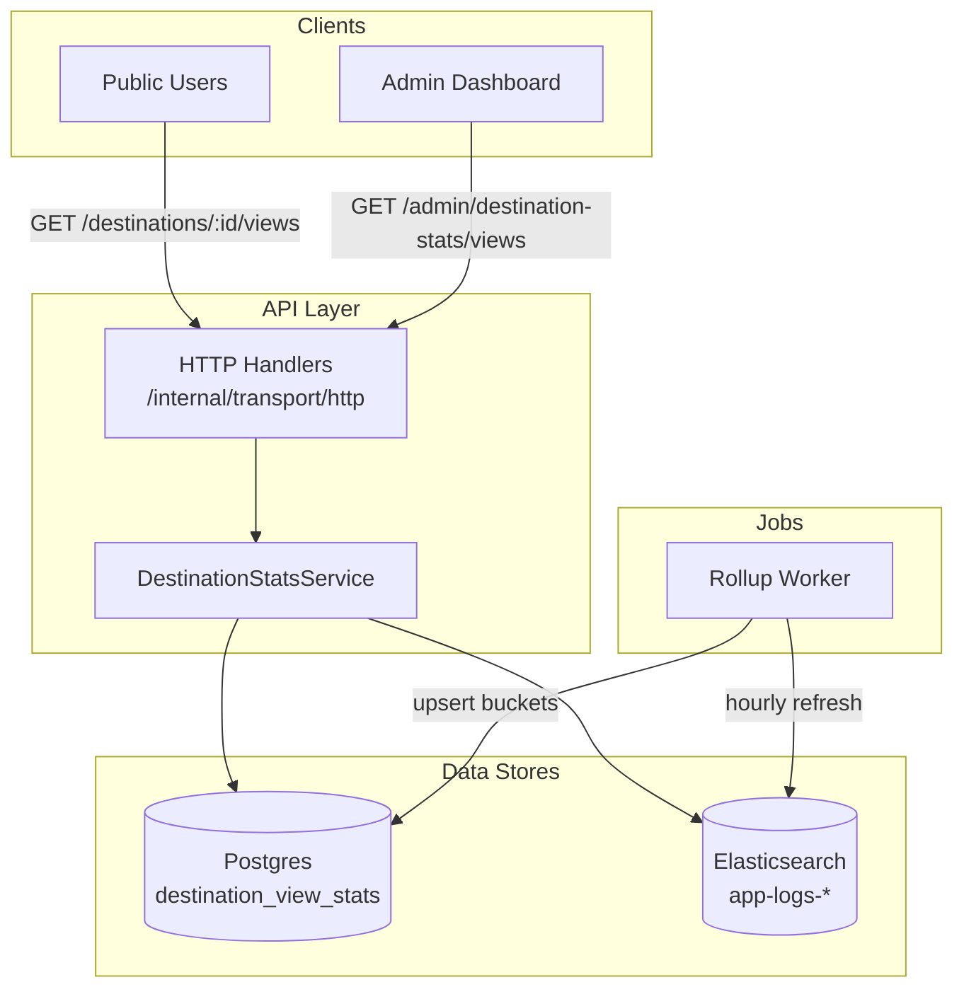
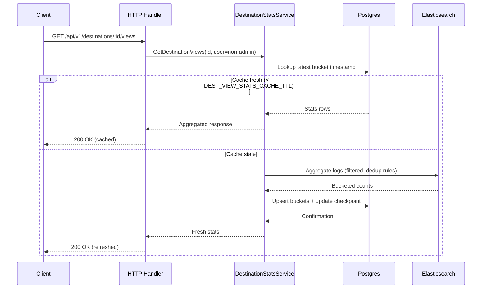

# Destination View Stats – Design

## 1. Overview
Product wants to surface “destination view statistics” (e.g., total views, unique viewers, trending destinations) without adding write load to Postgres. Every API call is already logged via `middleware.RequestLogger` and mirrored to Logstash/Elasticsearch (reachable via the configured `ELASTICSEARCH_BASE_URL`). Those structured access logs contain the HTTP verb, URI, authenticated user UUID (or `anonymous`), client IP, response status, latency, and for detail endpoints the `destination.id`/`slug` inside the serialized response body. This document describes how to reuse that dataset to materialize destination view metrics.

## 2. Goals
- Count destination detail views over sliding time windows (e.g., last 1 h/24 h/7 d) with both total hits and unique viewers.
- Provide an API (initially admin-only) to fetch per-destination stats and “top viewed” leaderboards for dashboards.
- Keep implementation lightweight by querying Elasticsearch directly or via a scheduled aggregation job—no changes required on mobile/web clients.
- Ensure the solution keeps personal data minimized (counts only, no raw IP leakage outside Elasticsearch).

## 3. Existing Data & Feasibility
1. **Structured access logs** – `internal/transport/http/logging.go` emits JSON payloads like:
   ```json
   {
     "time": "2025-11-12T03:35:49Z",
     "user_uuid": "anonymous",
     "ip": "58.11.20.192",
     "request": {
       "method": "GET",
       "uri": "/api/v1/destinations/e3ff134a-bbd0-46f4-9586-2414627acafd"
     },
     "response": {
       "status": 200,
       "body": {
         "destination": {
           "id": "e3ff134a-bbd0-46f4-9586-2414627acafd",
           "slug": "manual-test-1761927934",
           "name": "Manual Test 1761927934",
           "average_rating": 0,
           "review_count": 0
         }
       }
     }
   }
   ```
2. **ELK connectivity** – `docs/api-design/elk-connectivity-design.md` documents the shared stack endpoint configured via `ELASTICSEARCH_BASE_URL`. A quick health check succeeded:
   ```
   curl $ELASTICSEARCH_BASE_URL/_cluster/health  # status: green
   ```
3. **Indices** – Application logs land in daily indices `app-logs-YYYY.MM.DD`. Example aggregation for 2025‑11‑12:
   ```json
   POST app-logs-2025.11.12/_search
   {
     "size": 0,
     "query": {
       "bool": {
         "must": [
           {"term": {"request.method.keyword": "GET"}},
           {"term": {"response.status": 200}},
           {"prefix": {"request.uri.keyword": "/api/v1/destinations/"}}
         ],
         "must_not": [
           {"term": {"request.uri.keyword": "/api/v1/destinations"}}
         ]
       }
     },
     "aggs": {
       "destinations": {
         "terms": {
           "field": "response.body.destination.id.keyword",
           "size": 5
         },
         "aggs": {
           "unique_users": {"cardinality": {"field": "user_uuid.keyword"}},
           "unique_ips": {"cardinality": {"field": "ip.keyword"}},
           "last_view": {"max": {"field": "@timestamp"}}
         }
       }
     }
   }
   ```
   Sample response:
   ```json
   "buckets": [
     {
       "key": "e3ff134a-bbd0-46f4-9586-2414627acafd",
       "doc_count": 6977,
       "unique_users": {"value": 1},
       "unique_ips": {"value": 5},
       "last_view": {"value_as_string": "2025-11-12T17:44:57.442Z"}
     },
     ...
   ]
   ```
   → The existing logs already contain everything needed (destination UUID, timestamps, user/IP identifiers), so no code changes are required on the read path.

## 4. Proposed Architecture

### 4.1 Data Source Query Layer
- Add a thin Elasticsearch client (e.g., [`github.com/elastic/go-elasticsearch/v8`]) configured via new env vars:
  - `ELASTICSEARCH_BASE_URL` (default `http://elk-host:9200`, override per environment)
  - `ELASTICSEARCH_LOG_INDEX` (default `app-logs-*`)
  - `DEST_VIEW_STATS_TIMEOUT` (e.g., `5s`)
- Query filters:
  - `request.method.keyword = "GET"`
  - `response.status = 200`
  - `request.uri.keyword` prefix `/api/v1/destinations/`
  - Exclude the collection route exactly equal to `/api/v1/destinations`.
  - Optional `range` on `@timestamp`. When omitted, the query covers **all time** (no upper/lower bound). When provided, support quick ranges like `1h`, `24h`, `7d`, `30d`.
- Counting rule: **1 request = 1 view**. We still compute `unique_users` / `unique_ips` inside the aggregation so dashboards can visualize deduplicated viewers, but those are side metrics.
- Load-test filter: ignore any request with `ip.keyword` starting with `10.` (internal traffic) by adding a `must_not` clause such as `{ "prefix": { "ip.keyword": "10." } }`.
- Aggregations:
  - `terms` on `response.body.destination.id.keyword`.
  - Child aggs: `cardinality` for `user_uuid.keyword` and `ip.keyword`, `date_histogram` buckets for trend charts, `top_hits` to capture slug/name once per bucket.

### 4.2 Destination Stats Service
- New package `internal/service/destinationstats` that depends on:
  - Elasticsearch client
  - Destination repository (to resolve names/slugs when not present in the latest logs or to enforce ACLs).
- Core methods:
  - `TopViewed(ctx, range, limit) ([]DestinationViewStat, error)`
  - `GetDestinationViews(ctx, destinationID, range, interval) (Histogram, error)`
- `DestinationViewStat` should expose `DestinationID`, optional `Slug/Name`, `TotalViews`, `UniqueUsers`, `UniqueIPs`, `LastViewedAt`.
- Cache policy:
  - Persist the latest aggregation timestamp per destination (e.g., max `bucket_end` in `destination_view_stats`).
  - `DEST_VIEW_STATS_CACHE_TTL` (env, default `10m`) controls how long a cached bucket is considered fresh for non-admin calls.
  - When `GetDestinationViews` is invoked by a **non-admin** and that destination’s cached timestamp is within the TTL, respond solely from Postgres.
  - When the cache is older than the TTL (or missing), query Elasticsearch, upsert the fresh buckets, and return the new result set. The query counts as a “write-through” so subsequent calls can stay on Postgres until the TTL expires again.
  - When an **admin** calls the API, always run the Elasticsearch aggregation first (even if cache is warm), merge with Postgres (for historical buckets), and upsert the refreshed data. This guarantees that admin dashboards see the most recent view counts.

### 4.3 Storage / Materialization Strategy
Two viable paths:
 1. **On-demand queries (Phase 1)** – Directly query Elasticsearch whenever the admin API is called. After the ES aggregation completes, upsert the results into `destination_view_stats` so the table gradually fills even without the rollup job (use `INSERT ... ON CONFLICT (bucket_start, destination_id) DO UPDATE`). Pros: zero extra storage dependency beyond Postgres, near real-time, and guarantees callers always leave behind a cached row. Cons: response latency spikes if ES is slow.
 2. **Incremental rollup (Phase 2)** – Nightly/hourly job writes into `destination_view_stats` table using the same upsert shape as Phase 1. Each run should only query Elasticsearch for windows newer than the latest committed bucket to keep things fast:
   ```sql
   CREATE TABLE destination_view_stats (
       bucket_start timestamptz NOT NULL,
       bucket_end   timestamptz NOT NULL,
       destination_id uuid NOT NULL REFERENCES destination(id),
       total_views bigint NOT NULL,
       unique_users int NOT NULL,
       unique_ips int NOT NULL,
       PRIMARY KEY (bucket_start, destination_id)
   );
   CREATE TABLE destination_view_rollup_checkpoint (
       id int PRIMARY KEY DEFAULT 1,
       last_bucket_end timestamptz NOT NULL
   );
   ```
   - Background job reads `last_bucket_end`, queries Elasticsearch with `@timestamp > last_bucket_end` (capped by a max look-back), folds results into buckets, upserts each bucket, then advances `last_bucket_end` to the newest bucket_end inside the same transaction.
   - API can then read from Postgres for sub-second responses while still allowing a “live” mode that hits Elasticsearch directly.

### 4.4 API Surface
- **API endpoint catalogue**
  1. `GET /api/v1/destinations/:id/views` – public; returns view counts for a single destination with cache-first logic.
  2. `GET /api/v1/destinations/trending` – public; returns top destinations over a window (`range`, `limit` query params) using the same cache/refresh policy. *Future-facing endpoint but included here for completeness.*
  3. `GET /api/v1/admin/destination-stats/views` – admin only; supports per-destination drill-down and leaderboards with forced ES refresh.
  4. `POST /api/v1/admin/destination-stats/export` – admin only; accepts a list of destination IDs and returns a CSV of popularity metrics.
- **Destination view count (public)**:
  - `GET /api/v1/destinations/:id/views`
    - Available to anonymous and authenticated users.
    - Returns total view count + unique viewer metrics for the requested range(s). If the `range` query param is omitted, the API returns all-time stats; clients may optionally request quick ranges (24 h, 7 d, 30 d). Implementation uses the cache policy above: if the cached bucket for that destination is newer than `DEST_VIEW_STATS_CACHE_TTL` and caller isn’t an admin, serve directly from Postgres; otherwise trigger an Elasticsearch refresh, upsert, and then serve (admins always force the refresh path).
    - Response envelope: `{"destination_id": "...", "views": {"last_24h": {...}, "last_7d": {...}, ...}}`.
- **Admin analytics endpoint**:
  - `GET /api/v1/admin/destination-stats/views`
    - Query params: `destination_id` (optional), `range` (defaults to `all`), `interval` (`hour|day`), `limit` (for top list).
    - Always executes the ES+PG merge before responding so dashboard charts are real-time while still warming the cache table.
- **Admin export endpoint**:
  - `POST /api/v1/admin/destination-stats/export`
    - Body: `{"destination_ids": ["uuid1","uuid2", ...]}` (max 500 IDs). When omitted or empty, exports all destinations with published status.
    - Response: `text/csv` attachment containing columns `destination_name`, `city`, `country`, `views_1h`, `views_6h`, `views_12h`, `views_24h`, `views_7d`, `views_30d`, `views_all`.
    - Behaviour: For each requested destination, service pulls the cached stats from Postgres. If any of the required ranges are stale (>TTL) or missing, it performs an ES refresh before writing the row. CSV is streamed to avoid high memory usage; order follows the input list (or alphabetical when exporting all).
    - Security: Requires admin auth + `export_destination_stats` permission (toggle via role check).
- **Public “trending destinations”** (future):
  - `GET /api/v1/destinations/trending?range=24h&limit=10` returning destination summaries enriched with stats (this endpoint uses the same cache policy as the view-count endpoint).
  - If `range` omitted, leaderboard reflects all-time stats.
- Wire handlers under `internal/transport/http`, using `RequireAdmin` only for the admin route; the public endpoints rely on JWT middleware when available but also work for anonymous users.

### 4.5 Architecture Overview

- Admin requests always traverse `H → S → ES → PG`.
- Public requests first check `PG`; when stale they fall through to `ES` and push refreshed rows back to `PG`.
- Rollup worker ensures hourly updates even without traffic.

### 4.6 Request Sequence (Non-Admin)

- Admin flow mirrors the “stale” branch regardless of cache freshness.

### 4.7 Background Job / Cache Warmer (Optional Phase)
- Create `cmd/jobs/destination_view_rollup` (or extend `cmd/api` with a goroutine) that:
  1. Runs every hour by default (`DEST_VIEW_STATS_ROLLUP_INTERVAL`, env; set default `1h` so the Postgres table is refreshed at least hourly, but allow overrides).
  2. Queries Elasticsearch with `@timestamp > last_bucket_end` (reading from checkpoint table) so only unseen windows are processed.
  3. Upserts into `destination_view_stats`.
  4. Publishes metrics (e.g., Prometheus counter) so we can alert if the job stalls.
 - When rollup is active, the API can hit Postgres first and fall back to Elasticsearch for “live refresh”, still upserting any freshly computed buckets so both pathways keep the table current and advance the checkpoint.

## 5. Configuration & Dependencies
- Env additions (all delays configurable via env vars):
  - `DEST_VIEW_STATS_ROLLUP_ENABLED` (`false` by default)
  - `DEST_VIEW_STATS_ROLLUP_INTERVAL` (default `1h`; controls PG refresh cadence)
  - `DEST_VIEW_STATS_MAX_RANGE` (limit to, say, `30d` to keep ES queries bounded)
  - `DEST_VIEW_STATS_CACHE_TTL` (default `10m`; controls when public calls fall back to ES)
- Vendor `go-elasticsearch` client (add to `go.mod`).
- If caching is desired, reuse any existing Redis/client libs; otherwise, add a lightweight in-memory cache.

## 6. Validation & Monitoring
- **Connectivity smoke test**: `curl $ELASTICSEARCH_BASE_URL/_cluster/health` should stay `green`.
- **Unit tests**: mock the Elasticsearch client to verify query body construction and response parsing for both summary and histogram functions.
- **Integration tests**:
  1. Replay fixture logs into a disposable ES index.
  2. Run service queries and assert counts match expected values.
- **Dashboards**: build a Kibana data view on `app-logs-*` filtered by destination endpoints for ad-hoc validation while developing the API.
- **Alerts**: when rollup job enabled, emit metrics for “documents processed” and alert if zero for >15 minutes.

## 7. Open Questions
1. Should we respect `EnableDestinationView` flag in stats API responses (e.g., hide if view feature disabled)?

Once these answers are locked in, we can proceed with the Phase 1 implementation (direct Elasticsearch queries) and layer in rollups/caching if latency or cost becomes an issue.
