# Admin Destination Management – High-Level Design

## 1. Overview
Admin Destination Management introduces a governed content workflow that lets authorized administrators stage, review, and publish destination changes without disrupting what end users currently see. Instead of directly mutating the `travel_destination` table, every create, update, or delete is captured as a change request inside a new Destination Change Handler module. A second eligible admin must approve the pending change before it is promoted to the live destination catalog and versioned for rollback. This design satisfies the product directive in the Week7 Double-C SRS to validate inputs before saving, support draft states, record published version numbers, and surface clear confirmation messaging after successful updates.

## 2. Goals & Success Criteria
- Allow privileged admins to compose new destination content (metadata, hero imagery, galleries, contact info, operating hours, geo coordinates) with server-side validation at every save point.
- Enable draft and “submit for review” behavior so authors can stage work while reviewers control publication.
- Ensure no single admin can unilaterally alter the live destination list—an approval step is required to publish or delete content.
- Persist versioned snapshots of published destinations (`version` numbers + change metadata) to enable rollback and auditability.
- Provide read APIs that return stable published data to end users while exposing administrative views for pending requests.
- Emit a confirmation payload (e.g., `{ "message": "Destination updated successfully" }`) when approvals complete and changes are applied.
- Maintain structured audit trails and metrics covering submissions, approvals, rejections, and publication outcomes.

## 3. Scope
**In scope**
- Backend-only changes: HTTP admin endpoints, service layer orchestration, repository/database updates, MinIO media storage, and change-handler staging tables.
- Data model extensions for destinations, change requests, version history, and audits.
- Validation/business rule enforcement, concurrency management, and instrumentation.
- Feature flags, configuration, and infrastructure scripts needed to run the change workflow.
- Public read endpoints for published destinations and admin endpoints for draft/pending views.

**Out of scope**
- Admin UI front-end pages (assumed to consume the new APIs).
- Bulk import/export tooling, automated moderation, or multi-language localization (future iterations).
- Notification channels beyond optional email/slack hooks—initial confirmation is returned in API response only.
- Real-time collaboration on drafts (single-owner editing per request).

## 4. Assumptions & Dependencies
- Admin accounts already exist and carry the `admin` role (`domain.User.HasRole`). Any admin may author drafts or approve requests; no additional permission flags are required, but approvers must be different admins than the submitter.
- Postgres remains the system of record; new tables will be added via migrations.
- MinIO (or S3-compatible storage) is available; `MINIO_BUCKET_DESTINATIONS` is provisioned for hero assets.
- All draft saves and submissions undergo the same validation pipeline (no empty name, valid media format), per SRS.
- The current public API (`/api/v1/destinations`) should only expose `published` content; draft/pending changes must not leak until approved.
- No caching layer is in place; once a change is published, consumers will observe it immediately.

## 5. Actors, Preconditions, Triggers
- **Actors**  
  - Author Admin (any admin user): creates and edits drafts, submits for approval.  
  - Reviewer Admin (another admin user): reviews pending changes, approves or rejects, triggering publication.  
  - Destination Change Handler (new module): manages change lifecycle and validation.  
  - Destination Service: applies approved changes to the live table and handles versioning.  
  - Destination Repository (Postgres), Destination Change Repository, Destination Version Repository.  
  - Object Storage (MinIO) for hero imagery.
- **Preconditions**  
  - Admin JWT/session is valid.  
  - Required infrastructure (new tables, MinIO bucket) deployed.  
  - At least one other admin is available to approve; submitter cannot approve their own change.
- **Triggers**  
  - Draft Save: author saves partial or complete destination data (`status=draft`).  
  - Submit for Review: author promotes draft to `pending_review`.  
  - Approve/Publish: reviewer approves pending change -> live destination updated & version recorded.  
  - Reject: reviewer rejects with feedback; draft remains editable.  
  - Delete Request: author proposes soft or hard delete; reviewer approval required.  
  - Public View: end user requests published destination list/detail.

## 6. User Journeys

### 6.1 Author Saves Draft (Create/Update)
1. Author opens admin editor, fills destination fields (name, city, contact info, operating hours, hero image, gallery, etc.).
2. Frontend issues `POST /api/v1/admin/destination-changes` (new change) or `PUT /api/v1/admin/destination-changes/{id}` (update draft) with payload and temporary hero image reference.
3. `DestinationChangeHandler.SaveDraft` validates fields (non-empty name, coordinate ranges, allowed file type). On failure returns 400 with field errors.
4. Valid draft persists to `destination_change_request` table with status `draft`, storing payload diff, hero image temp key, author metadata, and incremental draft version.
5. API responds `200 { "change_request": ..., "message": "Draft saved" }`.

### 6.2 Submit Draft for Review
1. Author clicks “Submit for review”.
2. Frontend calls `POST /api/v1/admin/destination-changes/{id}/submit`.
3. Handler ensures draft exists, author matches, and validations rerun.
4. Status transitions to `pending_review`, `submitted_at` timestamp recorded, and reviewer notification (future integration) triggered.
5. Response: `200 { "message": "Destination submitted for review" }`.

### 6.3 Reviewer Approves & Publishes
1. Reviewer lists pending items via `GET /api/v1/admin/destination-changes?status=pending_review`.
2. Reviewer examines payload (including hero image preview) via `GET /api/v1/admin/destination-changes/{id}`.
3. Reviewer calls `POST /api/v1/admin/destination-changes/{id}/approve`.
4. `DestinationChangeHandler.Approve` checks reviewer ≠ submitter, ensures status `pending_review`, and opens transaction:
   - For **create**: inserts new row into `travel_destination`, sets `status` (draft/published) as per payload, assigns `version=1`, persists contact/hours, and materializes gallery media.
   - For **update**: applies diff to existing destination via `DestinationService.ApplyUpdate`, increments `version`, updates `updated_at`, `updated_by`, syncs contact/hours, and upserts gallery ordering/media records.
   - For **delete**: sets `status=archived` (soft) or removes row (hard) per request; hero image and gallery assets removed if flagged.
   - Records snapshot in `destination_version` table for rollback (version number, payload, reviewer).
   - Marks change request `approved`, `reviewed_by`, `reviewed_at`, `published_version`.
5. Transaction commits; system returns `200 { "message": "Destination updated successfully", "destination": { ... } }`.

### 6.4 Reviewer Rejects
1. Reviewer calls `POST /api/v1/admin/destination-changes/{id}/reject` with reason.
2. Status becomes `rejected`, reviewer info recorded, change remains editable.
3. Response: `200 { "message": "Destination change rejected", "reason": "..." }`.

### 6.5 Delete Flow
1. Author selects delete, creating change request type `delete` (soft by default).
2. Reviewer approval triggers `DestinationService.ArchiveDestination` or `PermanentDelete`.
3. Version history captures pre-delete snapshot; `destination_versions` keeps record for rollback.

### 6.6 Public Destination View
1. Public user (or admin preview) calls `GET /api/v1/destinations` or `/api/v1/destinations/{slug}`.
2. `DestinationService.ListPublished` fetches only `status='published'` rows, optionally filtered by a case-insensitive query string.
3. Response includes sanitized fields, hero image URL, and version number for client caching.

### 6.7 Alternate & Error Flows
- Duplicate slug/name -> 409 conflict (applied when submitting or approving).
- Attempt to approve already approved or rejected change -> 409.
- Submitter attempting self-approval -> 403.
- Missing reviewer -> 503 until policy satisfied.
- Stale draft update -> 409 with latest draft version metadata.

## 7. Architecture Overview


### 7.1 Sequence – Draft Save


### 7.2 Sequence – Approve & Publish


### 7.3 Draft State Machine


**State descriptions**

| State | Who owns it | Allowed transitions | Notes | 
| --- | --- | --- | --- |
| `draft` | Author | Save (stay `draft`), Submit → `pending_review` | Editable; hero/gallery uploads append to payload while in this state. |
| `pending_review` | Reviewer queue | Approve → `approved`, Reject → `rejected` | Locked for editing; submitter cannot approve their own change. |
| `approved` | System | — | Change is applied to `travel_destination`, version recorded, request becomes immutable. |
| `rejected` | Author | Update fields → `draft`, Resubmit → `pending_review` | Request stays editable; reviewer message stored for context. |

Additional rules:
- Delete actions follow the same state machine; approval either archives or hard-deletes depending on payload.
- Hero/gallery uploads are only permitted while the change is in `draft` or `rejected`.
- Any attempt to submit or upload when the request is not editable (`pending_review`/`approved`) results in `409` (`ErrChangeNotEditable`).

## 8. Data Model & Storage Updates

### 8.1 `travel_destination`
- Add/Update columns:
  - `slug TEXT UNIQUE`
  - `status TEXT NOT NULL DEFAULT 'draft'` (`draft|published|archived`)
  - `version BIGINT NOT NULL DEFAULT 1`
  - `updated_at TIMESTAMPTZ NOT NULL DEFAULT NOW()`
  - `updated_by UUID NULL REFERENCES users(id)`
  - `deleted_at TIMESTAMPTZ NULL`
  - `contact JSONB` (structured contact details such as phone, email, website, social handles)
  - `opening_time TIME` and `closing_time TIME` (local business hours; nullable for always-open destinations)
  - `timezone TEXT` (optional—determines interpretation of opening/closing times)

### 8.2 `destination_change_request`
| Column | Type | Notes | 
| --- | --- | --- |
| `id` | UUID | Primary key (`uuid_generate_v4`) |
| `destination_id` | UUID | NULL for create, populated for update/delete |
| `action` | TEXT | `create`, `update`, `delete` |
| `payload` | JSONB | Proposed destination fields (including contact, hours, media gallery) |
| `hero_image_temp_key` | TEXT | Object storage key for staged hero asset |
| `gallery_temp_keys` | JSONB | Array of staged gallery asset keys |
| `status` | TEXT | `draft`, `pending_review`, `approved`, `rejected` |
| `draft_version` | INT | Incremented on every save to prevent lost updates |
| `submitted_by` | UUID | Author admin |
| `reviewed_by` | UUID | Reviewer admin |
| `submitted_at` | TIMESTAMPTZ | Null while draft |
| `reviewed_at` | TIMESTAMPTZ | Null until approval/rejection |
| `published_version` | BIGINT | `travel_destination.version` after approval |
| `created_at` / `updated_at` | TIMESTAMPTZ | Audit timestamps |
| `rejection_reason` | TEXT | Optional reviewer feedback | 

### 8.3 `destination_media`
| Column | Type | Notes | 
| --- | --- | --- |
| `id` | UUID | PK |
| `destination_id` | UUID | References `travel_destination` |
| `object_key` | TEXT | Final MinIO/S3 object key |
| `ordering` | INT | Display order within gallery |
| `caption` | TEXT | Optional caption/alt text |
| `created_at` | TIMESTAMPTZ | Audit timestamp | 

### 8.4 `destination_version`
| Column | Type | Notes | 
| --- | --- | --- |
| `id` | BIGSERIAL | PK |
| `destination_id` | UUID | Nullable for create drafts (becomes non-null post-approval) |
| `version` | BIGINT | Monotonic per destination |
| `action` | TEXT | `create`, `update`, `delete` |
| `payload` | JSONB | Snapshot of published destination, including contact, hours, and gallery metadata |
| `approved_by` | UUID | Reviewer admin |
| `change_request_id` | UUID | Link to request |
| `created_at` | TIMESTAMPTZ | Publication timestamp | 

### 8.5 Domain Models
- `domain.DestinationChange` and `domain.DestinationVersion` structs introduced.
- Update `domain.Destination` to include `Slug`, `Status`, `Version`, `DeletedAt`, `Contact`, `OpeningTime`, `ClosingTime`, `Timezone`, `Gallery []DestinationMedia`, and staging helpers (`HeroImageTempKey`, `GalleryTempKeys`).
- Add `domain.DestinationMedia` struct for gallery items.

## 9. API Design

### 9.1 Change Request (Admin) Endpoints

| Endpoint | Method | Description | 
| --- | --- | --- |
| `/api/v1/admin/destination-changes` | `POST` | Create draft change request (create/update/delete). |
| `/api/v1/admin/destination-changes/{id}` | `GET` | View draft/pending change (used by edit page). |
| `/api/v1/admin/destination-changes/{id}` | `PUT` | Update draft data. |
| `/api/v1/admin/destination-changes/{id}/submit` | `POST` | Submit draft for review. |
| `/api/v1/admin/destination-changes/{id}/approve` | `POST` | Reviewer approval and publication. |
| `/api/v1/admin/destination-changes/{id}/reject` | `POST` | Reviewer rejection with reason. |
| `/api/v1/admin/destination-changes` | `GET` | List drafts/pending/approved, filter by status, author, destination. |

**Draft Payload Example**
```json
{
  "action": "update",
  "destination_id": "1da5f07d-7dcf-4aea-b948-7c9daa0a5db7",
  "fields": {
    "name": "Central Park",
    "city": "New York",
    "country": "USA",
    "description": "Iconic urban park...",
    "category": "Nature",
    "latitude": 40.785091,
    "longitude": -73.968285,
    "status": "draft",
    "contact": {
      "phone": "+1-212-310-6600",
      "email": "info@centralparknyc.org",
      "website": "https://www.centralparknyc.org"
    },
    "opening_time": "06:00:00",
    "closing_time": "23:00:00",
    "timezone": "America/New_York",
    "hero_image_upload_id": "temporary-upload-uuid",
    "gallery_upload_ids": [
      "tmp-gallery-001",
      "tmp-gallery-002"
    ]
  }
}
```

**Change View Response (used for edit page)**
```json
{
  "change_request": {
    "id": "a9f4...",
    "action": "update",
    "status": "draft",
    "destination_id": "1da5f07d-7dcf-4aea-b948-7c9daa0a5db7",
    "draft_version": 3,
    "fields": {
      "name": "Central Park",
      "city": "New York",
      "country": "USA",
      "description": "Iconic urban park...",
      "category": "Nature",
      "latitude": 40.785091,
      "longitude": -73.968285,
      "status": "draft",
      "contact": {
        "phone": "+1-212-310-6600",
        "email": "info@centralparknyc.org",
        "website": "https://www.centralparknyc.org"
      },
      "opening_time": "06:00:00",
      "closing_time": "23:00:00",
      "timezone": "America/New_York",
      "hero_image_upload_id": "temporary-upload-uuid",
      "gallery_upload_ids": [
        "tmp-gallery-001",
        "tmp-gallery-002"
      ]
    },
    "submitted_by": {
      "id": "author-uuid",
      "name": "Jamie Admin"
    }
  }
}
```

**Approve Response**
```json
{
  "message": "Destination updated successfully",
  "destination": {
    "id": "1da5f07d-7dcf-4aea-b948-7c9daa0a5db7",
    "name": "Central Park",
    "city": "New York",
    "country": "USA",
    "description": "Iconic urban park...",
    "category": "Nature",
    "latitude": 40.785091,
    "longitude": -73.968285,
    "status": "published",
    "contact": {
      "phone": "+1-212-310-6600",
      "email": "info@centralparknyc.org",
      "website": "https://www.centralparknyc.org"
    },
    "opening_time": "06:00:00",
    "closing_time": "23:00:00",
    "timezone": "America/New_York",
    "hero_image_url": "https://cdn.fitcity/destinations/central-park/hero.jpg",
    "gallery": [
      {
        "url": "https://cdn.fitcity/destinations/central-park/gallery-1.jpg",
        "caption": "Bethesda Fountain"
      },
      {
        "url": "https://cdn.fitcity/destinations/central-park/gallery-2.jpg",
        "caption": "Bow Bridge"
      }
    ],
    "version": 6,
    "updated_at": "2024-06-23T10:14:05Z",
    "updated_by": "reviewer-uuid"
  }
}
```

### 9.2 Media Uploads
- `POST /api/v1/admin/destination-changes/{id}/hero-image`
  - Multipart upload; stored in staging path `destinations/drafts/{id}/hero/...`.
  - On approval, asset promoted to `destinations/published/{destination_id}/hero/...`.
- `POST /api/v1/admin/destination-changes/{id}/gallery`
  - Multipart upload supporting multiple files; each stored as `destinations/drafts/{id}/gallery/{uuid}.ext`.
  - Response returns `gallery_upload_ids` for inclusion in subsequent draft payloads.
  - On approval, assets promoted to `destinations/published/{destination_id}/gallery/{ordering}.ext` and `destination_media` rows created.
  - Deleting or reordering gallery items handled via `DELETE` / `PATCH` endpoints that mutate staged keys before submission (future enhancement).

### 9.3 Public Endpoints
- `GET /api/v1/destinations?status=published` – unchanged, but filter ensures only published versions.
- `GET /api/v1/destinations/{destination_id}` – returns the published destination payload used by both public view and admin preview:
```json
{
"destination": {
    "name": "Central Park",
    "city": "New York",
    "country": "USA",
    "description": "Iconic urban park...",
    "category": "Nature",
    "latitude": 40.785091,
    "longitude": -73.968285,
    "status": "published",
    "contact": {
      "phone": "+1-212-310-6600",
      "email": "info@centralparknyc.org",
      "website": "https://www.centralparknyc.org"
    },
    "opening_time": "06:00:00",
    "closing_time": "23:00:00",
    "timezone": "America/New_York",
    "hero_image_url": "https://cdn.fitcity/destinations/central-park/hero.jpg",
    "gallery": [
      {
        "url": "https://cdn.fitcity/destinations/central-park/gallery-1.jpg",
        "caption": "Bethesda Fountain"
      }
    ]
  }
}
```
- UI may render the same schema for edit mode (draft + upload id) or published mode (with `status="published"` and `hero_image_url` instead of `hero_image_upload_id` when present).

### 9.4 Error Contract
- `400 validation_failed`: field-level errors (`{"fields":{"name":"required"}}`).
- `401 unauthorized`: missing/invalid JWT.
- `403 forbidden`: insufficient role, submitter trying to approve own request.
- `404 not_found`: change or destination absent.
- `409 conflict`: draft version mismatch, duplicate slug, action already processed.
- `422 invalid_state`: attempting to submit/approve incorrect status.
- `502 media_error`: storage failure.

## 10. Business Rules & Validation
- Validate required fields (name, status, coordinates, contact channels as configured) **before** saving drafts and submissions.
- Enforce hero image and gallery media MIME types/size limits; store sanitized metadata.
- Ensure contact payload contains at least one reachable channel (phone, email, or website) and normalize formats.
- Validate `opening_time`/`closing_time` (closing must be after opening within the configured timezone; overnight support via flag).
- Maintain `status` transitions: drafts -> pending_review -> approved/rejected; only approved requests alter live table.
- All create, update, and delete operations are staged as change requests and require approval before updating the live destination table.
- Submitter cannot approve their own change; approval requires a different admin account.
- Allow authors to “Save Draft” multiple times; each save increments `draft_version`.
- Publication increments `destination.version` and appends to `destination_version`.
- Gallery must contain between 1 and 10 images when published (configurable); alt text/captions recommended for accessibility.
- Soft delete is default; hard delete requires feature flag and additional confirmation comment.
- Approval triggers success confirmation message returned in API.
- Rejection must include `rejection_reason` (min length 10 characters) to guide author revisions.

## 11. Authorization & Security
- All admin endpoints reuse the existing `requireAdmin` middleware; any authenticated admin can create, update, or delete drafts and any other admin can approve.
- Submit endpoints enforce author ownership; approval endpoints ensure reviewer ≠ submitter to provide dual control.
- Feature flags:  
  - `ENABLE_DESTINATION_VIEW`, `ENABLE_DESTINATION_DRAFT`, `ENABLE_DESTINATION_APPROVAL`, `ENABLE_DESTINATION_DELETE`.
- Audit logs capture actor, request id, action, status, timestamps, version numbers.
- Consider adding webhooks/notifications (future) after approval.

## 12. Error Handling & Response Strategy
- Validation errors return `validation_failed` with field map.
- Concurrency conflicts (stale drafts) return `409 conflict` with latest `draft_version` and `updated_at`.
- Storage/DB failures return `service_unavailable` and log correlation ID.
- Approval success always returns human-readable message plus destination snapshot.
- Rejection responses include reviewer message for UI display.

## 13. Configuration & Deployment
- New environment variables:
  - `MINIO_BUCKET_DESTINATIONS`
  - `DESTINATION_IMAGE_MAX_BYTES` (default 5MB)
  - `DESTINATION_allowed_CATEGORIES`
  - `DESTINATION_GALLERY_MAX_ITEMS` (default 10)
  - `DESTINATION_OPERATING_HOURS_REQUIRED` (boolean)
  - `ENABLE_DESTINATION_VIEW`, `ENABLE_DESTINATION_DRAFT`, `ENABLE_DESTINATION_APPROVAL`, `ENABLE_DESTINATION_DELETE`
  - `DESTINATION_HARD_DELETE_ALLOWED`
  - `DESTINATION_APPROVAL_REQUIRED` (default true; controls whether approval step is enforced in non-prod)
- Migrations:
  - `0006_destination_updates.sql` adding new columns, `destination_change_request`, `destination_version`.
  - Seed script to backfill `version=1` for existing destinations.
- Infra updates:
  - Update `infra/env/api.*.env` with new variables.
  - Ensure MinIO bucket/folder structure aligns with staging/published paths.

## 14. Non-Functional Requirements
| ID | Requirement | Description | 
| --- | --- | --- |
| NFR-DEST-01 | Performance | Draft save and submit ≤ 500 ms p95; approval ≤ 750 ms p95. |
| NFR-DEST-02 | Availability | Admin workflow endpoints ≥ 99.5% uptime. |
| NFR-DEST-03 | Auditability | Every change request, approval, rejection, and publication captured with actor metadata. |
| NFR-DEST-04 | Security | Strict RBAC, secure media uploads, and sanitized payloads. |
| NFR-DEST-05 | Usability | API responses include clear confirmation/error messages to power UI alerts. |

## 15. Testing Strategy
- **Unit Tests**
  - Draft validation, save, submit, approve, reject logic in `DestinationChangeService`.
  - DestinationService apply operations (create/update/delete) with version increments.
  - Permission checks (author vs reviewer).
- **Integration Tests**
  - End-to-end draft->submit->approve pipeline with Postgres & MinIO test fixtures.
  - Conflict scenarios (stale drafts, self-approval).
  - Version history creation and rollback readiness.
- **Contract/API Tests**
  - Schema validation for admin and public endpoints.
  - Error responses (validation, conflict, forbidden).
- **Manual QA**
  - Admin UI workflows: save draft, submit, edit draft after rejection, approve, confirm public view updates.
  - Verify confirmation messages display as expected.
- **Performance Tests**
  - Simulate concurrent draft saves and approvals to ensure locking/transactions hold.

## 16. Monitoring & Observability
- Metrics:
  - `destination_changes_total{action, status, result}`
  - `destination_change_latency_ms{step=save|submit|approve}`
  - `destination_approvals_total{result=success|rejected}`
  - `destination_versions_total`
- Logs:
  - Structured entries for each state transition (draft saved, submitted, approved, rejected) containing actor IDs, destination IDs, version numbers.
- Alerts:
  - Approval error rate >5% over 5 minutes.
  - Draft queue backlog (pending_review > threshold).
  - Media upload failures from MinIO.

## 17. Rollout Plan
1. Ship migrations adding new columns and tables; backfill `version=1`.
2. Deploy backend with feature flags disabled; run smoke tests (draft save, list).
3. Enable `ENABLE_DESTINATION_DRAFT` in staging; exercise draft->submit->approve flows.
4. Enable approval flag with reviewer accounts; verify role permutations and confirmation messaging.
5. Gradually enable in production (view first, then draft, then approval). Monitor metrics/logs.
6. Coordinate with frontend to roll out new admin UI; ensure user guidance for draft and approval states.

## 18. Risks & Open Questions
- **Reviewer Availability**: Need policy when only one admin on duty; feature flag may bypass approval in emergencies.
- **Hero Image Lifecycle**: Process for deleting staged assets on rejection or abandoned drafts.
- **Rollback UX**: How will admins trigger rollback using `destination_version` history (future UI/endpoint).
- **Permissions Granularity**: Do we need separate roles for delete approvals?
- **Notification Needs**: Should approvals notify authors via email/slack immediately?

## 19. Next Steps
1. Finalize migration script `0006_destination_updates.sql` with new tables and indexes.
2. Implement `DestinationChangeService` (staging, submit, approve, reject) and repositories.
3. Update domain structs and repositories for new fields and versioning.
4. Build admin HTTP handlers and middleware for new endpoints & permissions.
5. Update configuration structs/env files, plus hook up feature flags.
6. Implement unit/integration tests; document API usage for frontend team.
7. Plan notifications (future) and rollback endpoints based on product feedback.

This staged approval workflow satisfies the SRS requirements by validating inputs prior to persistence, supporting drafts, numbering published versions, and confirming successful updates—all while protecting end-user data from unreviewed changes.

---

# Destination Listing Filters

Endpoint: `GET /api/v1/destinations`

## Query Parameters
- `query`: Full-text search across name, city, country, category, and description.
- `categories` or repeated `category`: Limit results to the provided categories.
- `min_rating` / `max_rating`: Restrict by average review rating (0–5 range).
- `sort`: Ordering strategy – `rating_desc` (default for "rating"), `rating_asc`, `alpha_asc` (`alphabetical`/`alpha`), `alpha_desc`, or `updated_at_desc`.
- `limit` and `offset`: Pagination controls (existing behaviour).

## Behaviour Notes
- Ratings are aggregated from published reviews; destinations without reviews have an average rating of `0` and appear in rating-desc sort after rated destinations.
- Sorting defaults to most recently updated when no `sort` value is supplied.
- Invalid rating ranges or sort values return `400 Bad Request`.

---

# Favorites API Design

This document describes the REST endpoints and expected client behaviour required to support saving and unsaving destinations as user favorites. All endpoints are versioned under `api/v1` and require an authenticated user session.

## Authentication & Authorization
- Requests must include `Authorization: Bearer <token>` (or an equivalent session cookie) mapped to a `user_account`.
- Anonymous requests receive `401 Unauthorized` and clients must redirect to the login flow before retrying.
- Each action operates on the caller's own favorites; `403 Forbidden` is returned if a user attempts to mutate another account.

## Data Model
- Table `favorite_list` stores one row per `(user_account_id, destination_id)` pair; a unique index on these columns prevents duplicates.
- `created_at` represents the time the user saved the destination and is used for ordering within the Favorites list.
- Activity logging records every save/unsave with `user_account_id`, `destination_id`, `action` (`saved`, `unsaved`), and the event timestamp.

## Endpoints

### Save Destination
- **Method & Path:** `POST /api/v1/users/me/favorites`
- **Purpose:** Persist a destination in the caller's favorites and immediately reflect the Saved state across detail, search, recommendation, and favorites views.
- **Request Body:**
  ```json
  {
    "destination_id": "5b7a8702-b2c5-4de4-93c9-99322bd49ee2"
  }
  ```
- **Success (201 Created):**
  ```json
  {
    "favorite_id": "11edaf11-0c18-43fd-b42d-0cd36b7c178b",
    "destination_id": "5b7a8702-b2c5-4de4-93c9-99322bd49ee2",
    "message": "Destination saved to Favorites",
    "saved_at": "2024-06-23T10:12:07Z"
  }
  ```
- **Business Rules:**
  - Duplicate saves return `409 Conflict` with `{ "error": "already_saved" }` and the front-end must switch the button to the Saved/Unsave state without inserting a new row.
  - A background job or inline call records the action in the Activity Log.
  - The API returns the canonical Saved state so clients can keep search results, destination detail, and favorites list in sync.
- **Failure Handling:** Roll back any database changes; respond with `503 Service Unavailable` or `500 Internal Server Error` and `{ "message": "Could not update Favorites. Please try again." }`.


### Unsave Destination
- **Method & Path:** `DELETE /api/v1/users/me/favorites/{destinationId}`
- **Purpose:** Remove a destination from the caller's favorites while keeping UI surfaces consistent.
- **Success (200 OK):**
  ```json
  {
    "destination_id": "5b7a8702-b2c5-4de4-93c9-99322bd49ee2",
    "message": "Destination removed from Favorites"
  }
  ```
- **Business Rules:**
  - Missing rows produce `404 Not Found` with `{ "error": "not_saved" }` so clients can reconcile their state.
  - After a successful delete the API emits an Activity Log entry with action `unsaved`.
  - The response confirms the new state; the UI must immediately toggle the button and refresh any in-memory favorites.
- **Failure Handling:** If the delete fails, restart state by leaving the record untouched and respond with `{ "message": "Could not update Favorites. Please try again." }`.


### List Favorites
- **Method & Path:** `GET /api/v1/users/me/favorites`
- **Purpose:** Provide the caller's saved destinations for display in the Favorites list, ordered by `created_at DESC`.
- **Query Parameters:**
  - `limit` (default 20, max 100) and `offset` for pagination.
  - `include` optional expansions such as `destination_summary` or `images` to avoid N+1 lookups.
- **Success (200 OK):**
  ```json
  {
    "items": [
      {
        "favorite_id": "11edaf11-0c18-43fd-b42d-0cd36b7c178b",
        "destination_id": "5b7a8702-b2c5-4de4-93c9-99322bd49ee2",
        "destination_name": "Mount Bromo",
        "city": "Probolinggo",
        "country": "Indonesia",
        "thumbnail_url": "https://cdn.fitcity.app/destinations/5b7a.../thumb.jpg",
        "saved_at": "2024-06-23T10:12:07Z"
      }
    ],
    "pagination": {
      "limit": 20,
      "offset": 0,
      "total": 57
    }
  }
  ```
- **Business Rules:**
  - The API must return fully enriched metadata needed for list cards to avoid extra client calls.
  - Clicking a row navigates to `/destinations/{destinationId}`, so include the identifier in every item.
  - Changes from save/unsave operations should be reflected immediately; clients may refresh the list after receiving save/unsave responses or subscribe to websocket updates if available.

### Count Destination Favorites
- **Method & Path:** `GET /api/v1/destinations/{destinationId}/favorites/count`
- **Purpose:** Let clients display the aggregate number of users who saved a destination (e.g., badges on detail or search cards).
- **Success (200 OK):**
  ```json
  {
    "destination_id": "5b7a8702-b2c5-4de4-93c9-99322bd49ee2",
    "favorites_count": 1342,
    "last_updated": "2024-06-23T10:12:07Z"
  }
  ```
- **Implementation Notes:**
  - Retrieve counts with `SELECT COUNT(*) FROM favorite_list WHERE destination_id = $1;`.
  - Optionally maintain a cached projection or materialized view if counts are requested frequently.
  - Anonymous access is allowed if counts are public; otherwise require authentication.

## Error Handling Strategy
- Return consistent JSON error envelopes:
  ```json
  {
    "error": "not_saved",
    "message": "Destination is not in your Favorites."
  }
  ```
- Retryable server issues respond with HTTP 5xx and the UI must revert the button to its last known state with an error toast.
- Validation misses return `422 Unprocessable Entity` (e.g., malformed UUID).
- All failures should be logged (including request ID, user ID, destination ID, endpoint, and error code) for observability.

## Activity Logging & Auditing
- Every successful save/unsave triggers an `activity_log` insert or event:
  ```json
  {
    "user_id": "815dd4d9-3a3c-4b76-9a29-86cf35e96f7e",
    "destination_id": "5b7a8702-b2c5-4de4-93c9-99322bd49ee2",
    "action": "saved",
    "occurred_at": "2024-06-23T10:12:07Z",
    "source": "favorites_api"
  }
  ```
- Logs support audit trails, analytics (e.g., most saved destinations), and troubleshooting.

---

# Reviews & Ratings Feature – High-Level Design

## 1. Overview
The reviews & ratings feature lets authenticated users submit qualitative feedback and star ratings for travel destinations, attach multiple photos to support their review, and provides public read endpoints that return individual reviews alongside aggregate rating insights. Review owners and administrators can delete reviews (including their media) to keep content accurate and policy-compliant. Uploaded review media is stored in a dedicated MinIO bucket so the assets can be served publicly.

## 2. Goals
- Enable signed-in users to publish one review per destination containing a numeric rating (0–5), optional title, optional content (content requires a title), and up to N supporting images.
- Expose a public read API that lists reviews for a destination with pagination, rating/time filters, title/content, reviewer display name, and uploaded media URLs, while returning aggregate metrics such as average rating, total review count, and per-rating distribution.
- Allow review owners and admins to delete a review, including the associated media objects and metadata.

## 3. Non-Goals
- Editing reviews in-place (future work; only create/delete covered here).
- Moderation workflow (flagging, approval queues).
- Client-side upload helpers (pre-signed URLs); server handles uploads directly.
- Frontend UI work.

## 4. Assumptions
- The `review` table from migration `0003_init_reviews_favorites.sql` is present; we can extend it and add supporting tables/migrations.
- MinIO is already configured; adding an extra bucket only requires configuration updates.
- Authentication system provides `RequireAuth` and `RequireAdmin` middleware (already available in `internal/transport/http`).
- Review images should be publically accessible via the MinIO public base URL.
- Maximum image size and supported MIME types should align with existing image handling (e.g., JPEG/PNG, 5 MB cap); exact values will be enforced at service level.

## 5. Data Model

### 5.1 `review` Table Updates
- Alter `rating` constraint to allow zero: `CHECK (rating BETWEEN 0 AND 5)`.
- Ensure `updated_at` is maintained on insert/update triggers (service layer will set).
- Replace the original unique index with `CREATE UNIQUE INDEX review_user_destination_active_idx ON review(user_id, destination_id) WHERE deleted_at IS NULL` so each user can have at most one *active* review per destination while still permitting a new review after soft deletion.
- Add soft-delete metadata: `deleted_at TIMESTAMPTZ NULL`, `deleted_by UUID NULL REFERENCES user_account(id)`. Queries must filter on `deleted_at IS NULL` for public data.

### 5.2 New `review_media` Table
```
CREATE TABLE review_media (
    id UUID PRIMARY KEY DEFAULT uuid_generate_v4(),
    review_id UUID NOT NULL REFERENCES review(id) ON DELETE CASCADE,
    object_key TEXT NOT NULL,
    url TEXT NOT NULL,
    ordering INT NOT NULL DEFAULT 0,
    created_at TIMESTAMPTZ NOT NULL DEFAULT NOW()
);

CREATE INDEX review_media_review_id_idx ON review_media(review_id);
```
- `object_key` stores the MinIO key; `url` stores the public URL returned by the storage adapter.
- `ordering` preserves the chosen sequence from the client.

### 5.3 Domain Layer
- Extend `domain.Review` with:
  - `AverageRating float64` (for aggregated responses only; nullable in DB layer).
  - Embed reviewer display info (`ReviewerName`, `ReviewerUsername`, `ReviewerAvatar`) for read models.
- Introduce `domain.ReviewMedia` struct with `ID`, `ReviewID`, `URL`, `Ordering`.
- Add aggregate result struct (`domain.ReviewListResult`) containing metrics + slice of reviews.
- Extend `domain.Review` with `DeletedAt *time.Time` and `DeletedBy *uuid.UUID` so services and handlers can omit soft-deleted records.

## 6. Object Storage
- Introduce new config entry/env var `MINIO_BUCKET_REVIEWS` (default `fitcity-reviews`).
- `internal/config.Config` gains `MinIOBucketReviews string`.
- `service.ReviewService` accepts an `ObjectStorage` dependency along with the bucket name.
- Review image object key format: `reviews/{destinationID}/{reviewID}/{timestamp}_{rand}.{ext}`.
- Enforce allowed MIME types (`image/jpeg`, `image/png`, `image/webp`) and max size (e.g., 5 MB).
- On soft delete, retain media objects in MinIO (no delete) but stop exposing their URLs once the parent review is flagged.

## 7. API Design

### 7.1 Create Review
- **Route**: `POST /api/v1/destinations/:destination_id/reviews`
- **Auth**: Required (`RequireAuth`).
- **Request**: `multipart/form-data`
  - `rating` (int, required, 0–5 inclusive).
  - `title` (string, optional; trimmed).
  - `content` (string, optional; if provided, `title` must also be provided).
  - `images[]` (0–N files; each validated as allowed MIME/size).
  - Future extension: `images[][ordering]` hidden form field if UI can send ordering, otherwise infer by upload order.
- **Validation Rules**:
  - Destination must exist and be published.
  - User cannot submit more than one review for the same destination (enforced via unique index; return 409 on conflict).
  - At least one of title/content required? Requirement: title optional, content optional but requires title. Implementation: allow standalone rating or rating+title, rating+title+content, but reject content without title, and forbid empty strings.
- **Processing**:
  1. Create DB row in `review` with `rating`, trimmed title/content, `user_id`, `destination_id`.
  2. Upload each image to MinIO bucket `fitcity-reviews`, collecting `object_key` + public `url`.
  3. Insert `review_media` rows referencing the review.
  4. Return created review with media URLs.
- **Response (201)**:
  ```
  {
    "review": {
      "id": "uuid",
      "destination_id": "...",
      "user": {
        "id": "...",
        "display_name": "Full Name or Username",
        "avatar_url": "..."
      },
      "rating": 4,
      "title": "...",
      "content": "...",
      "created_at": "2024-05-13T12:00:00Z",
      "media": [
        {"id":"...", "url":"https://...", "ordering":0}
      ]
    },
    "average_rating": 4.3,
    "total_reviews": 12
  }
  ```
  - Optionally include updated aggregate metrics so clients can refresh without another GET.

### 7.2 List Reviews
- **Route**: `GET /api/v1/destinations/:destination_id/reviews`
- **Auth**: Public.
- **Query Parameters**:
  - `limit` (int, default 20, max 100).
  - `offset` (int, default 0).
  - `rating` (int, optional exact match).
  - `min_rating` / `max_rating` (ints 0–5).
  - `posted_after`, `posted_before` (RFC3339 timestamps).
  - `sort` (`created_at` default, `rating`).
  - `order` (`desc` default, `asc`).
- **Response (200)**:
  ```
  {
    "destination_id": "...",
    "average_rating": 4.3,
    "total_reviews": 27,
    "rating_counts": {
      "5": 12,
      "4": 8,
      "3": 4,
      "2": 2,
      "1": 1,
      "0": 0
    },
    "reviews": [
      {
        "id": "...",
        "rating": 5,
        "title": "...",
        "content": "...",
        "created_at": "...",
        "updated_at": "...",
        "reviewer": {
          "id": "...",
          "display_name": "Jane Doe",
          "username": "janed",
          "avatar_url": "..."
        },
        "media": [
          {"id":"...", "url":"https://...", "ordering":0}
        ]
      }
    ],
    "limit": 20,
    "offset": 0
  }
  ```
- **Repository Behaviour**:
  - Join `user_account` to fetch display name: prefer `full_name`, fallback to `username`, else use obfuscated email local part.
  - Join `review_media` to fetch media (ordered by `ordering`, `created_at`).
  - Aggregate average/counts using window functions or separate query; return as part of `ReviewListResult`.
  - Exclude soft-deleted reviews (`deleted_at IS NULL`) from both the paginated list and aggregates.

### 7.3 Delete Review
- **Route**: `DELETE /api/v1/reviews/:id`
- **Auth**: Required.
- **Permissions**:
  - Requester must own the review OR have admin role (`RequireAdmin` check inside handler).
- **Processing**:
  - Fetch review (must not already be soft deleted) and associated ownership metadata.
  - Authorize requester (owner or admin); record `deleted_by`.
  - Soft delete by setting `deleted_at = now()` and `deleted_by = requesterID` inside the review table. Keep `review_media` rows untouched so restoration is possible later.
- **Postconditions**:
  - Soft-deleted reviews are excluded from read APIs and aggregates.
  - Media objects remain in MinIO for potential future restoration; they are no longer referenced in responses.
- **Response (200)**:
  ```
  {"success": true}
  ```
- **Error Cases**:
  - 404 if review not found or already soft deleted.
  - 403 if requester lacks permission.

## 8. Authorization & Roles
- Creation: `RequireAuth`.
- Listing: public, no auth.
- Deletion: `RequireAuth`; if requester is owner, allow; otherwise require admin role using existing `AuthService.IsAdmin`.

## 9. Validation Rules
- `rating` integer; enforce range in handler/service and DB constraint.
- `title`/`content` trimmed; reject if both empty and no rating? (Rating always provided).
- If `content` provided but `title` missing, return 400 with message.
- `images[]`:
  - Limit number of images (e.g., max 5) to control storage.
  - Check MIME from multipart header and file signature (if feasible).
  - Reject zero-byte files.
- Destination must exist and be published; fetch via `DestinationService`.

## 10. Service Layer
- Implement `ReviewService` with methods:
  - `CreateReview(ctx, userID, destinationID, input ReviewCreateInput) (*domain.Review, *domain.ReviewAggregate, error)`
  - `ListDestinationReviews(ctx, destinationID uuid.UUID, filter ReviewListFilter) (*domain.ReviewListResult, error)`
  - `DeleteReview(ctx, reviewID, requesterID uuid.UUID) error`
- `ReviewCreateInput` includes rating/title/content and slice of `ReviewImageUpload` (struct holds reader, filename, size, content type, ordering).
- `ReviewAggregate` returns counts/average (used by POST + GET response).
- Service handles transaction boundaries: create review row, upload media, insert `review_media`. On failure, roll back and best-effort delete uploaded objects.
- Delete path performs soft delete (set `deleted_at`, `deleted_by`), skips MinIO removal, and refreshes aggregates accordingly.
- Utilize existing `AuthService.IsAdmin` for permission checks during delete (service consumes `AuthService` or a narrower `RoleChecker` interface).

## 11. Repository Layer
- Extend `internal/repository/ports.ReviewRepository`:
  - Add `ListByDestination(ctx, destinationID uuid.UUID, filter domain.ReviewListFilter) ([]domain.Review, error)` to handle filters + ordering.
  - Add `AggregateByDestination(ctx, destinationID uuid.UUID, filter domain.ReviewAggregateFilter) (domain.ReviewAggregate, error)`.
- Add `SoftDelete(ctx, reviewID uuid.UUID, deletedBy uuid.UUID) error` to set soft-delete metadata.
- Create `ReviewMediaRepository` interface with `CreateMany` and `ListByReviewIDs` (deletions retained for now).
- Implement Postgres adapters in `internal/repository/postgres/review_repo_pg.go` and new `review_media_repo_pg.go` using SQLx.
- Ensure list queries join `user_account` (for reviewer info) and optionally `review_media`.

## 12. HTTP Transport
- Flesh out `internal/transport/http/review_handler.go`:
  - `RegisterReviews(e *echo.Echo, auth *service.AuthService, reviews *service.ReviewService, destService *service.DestinationService, bucketCfg ReviewFeatures)` to wire routes.
  - Use `RequireAuth` for POST/DELETE; GET is public.
  - Parse multipart in POST; map to service inputs.
  - Build response envelopes consistent with existing helpers (`util.Envelope`).
- Update router registration in `cmd/api/main.go` to initialize repositories/services/handlers, similar to `RegisterDestinations`.

## 13. Sequences

### 13.1 Create Review Flow
1. Client sends multipart POST with rating, optional title/content, and images.
2. Handler authenticates user, parses payload, validates destination.
3. Service starts transaction, inserts review, uploads images to MinIO bucket `fitcity-reviews`, inserts `review_media`, commits.
4. Service retrieves aggregate stats (either via the same transaction or after commit), returns result.
5. Handler responds with created review + aggregates.


### 13.2 List Reviews Flow
1. Client sends GET with filters.
2. Handler parses query params into filter struct.
3. Service executes aggregated query (count, average, rating distribution) and fetches paginated reviews + media.
4. Handler assembles response, ensuring reviewer name preference order (full name -> username -> masked email).


### 13.3 Delete Review Flow
1. Authenticated client calls DELETE with review ID.
2. Handler fetches review via service; service verifies ownership or admin status.
3. Service marks the review as soft deleted (`deleted_at`, `deleted_by`), excluding it from future listings.
4. Respond with success; data (and media) remains stored for potential restoration.

```mermaid
sequenceDiagram
    participant U as Owner/Admin
    participant H as ReviewHandler
    participant RS as ReviewService
    participant RR as ReviewRepo

    U->>H: DELETE /api/v1/reviews/{id}
    H->>RS: DeleteReview(reviewID, requesterID)
    RS->>RR: GetReview(reviewID)
    RS->>RS: Authorize(requester)
    RS->>RR: SoftDelete(reviewID, requesterID)
    RS-->>H: Success
    H-->>U: 200 {"success": true}
```



## 14. Implementation Checklist
1. Add new config field/env var for `MINIO_BUCKET_REVIEWS`; propagate through `cmd/api/main.go`.
2. Create SQL migration to adjust `review.rating` constraint and add `review_media` table.
3. Update domain models (`domain.Review`, add `domain.ReviewMedia`, aggregate structs).
4. Implement repository interfaces and Postgres adapters for reviews & media, including aggregation helpers and soft-delete support.
5. Build `ReviewService` with create/list/delete (soft delete) logic and storage integration.
6. Implement HTTP handler with routing, request parsing, validation, and response marshaling.
7. Wire new handler in router initialization.
8. Add unit tests for service logic (create/list/delete) and repository SQL (using pgx test harness if available).
9. Document new environment variable in `docs`/`README`.
10. Update Swagger spec if maintained.
