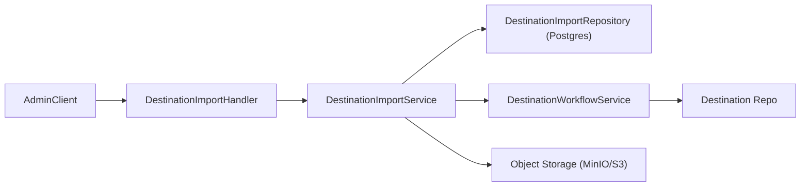
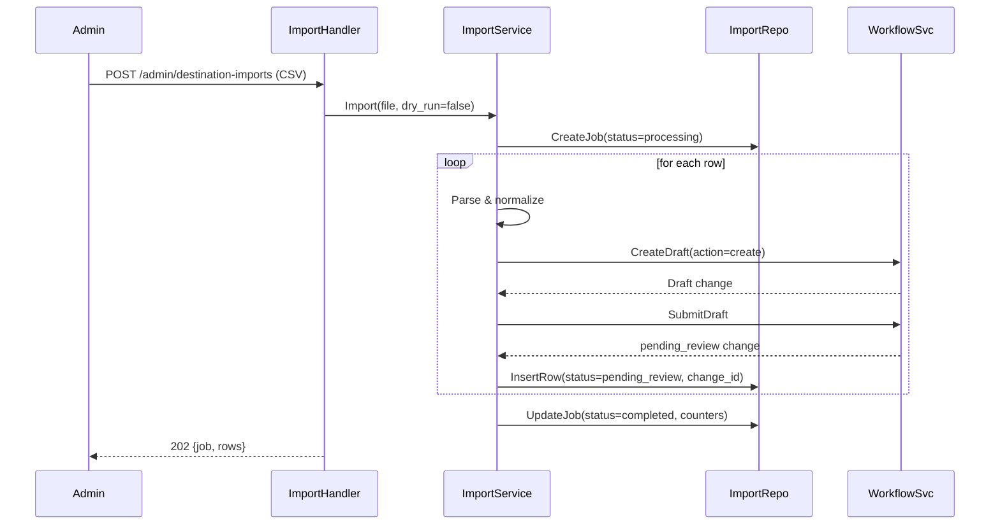
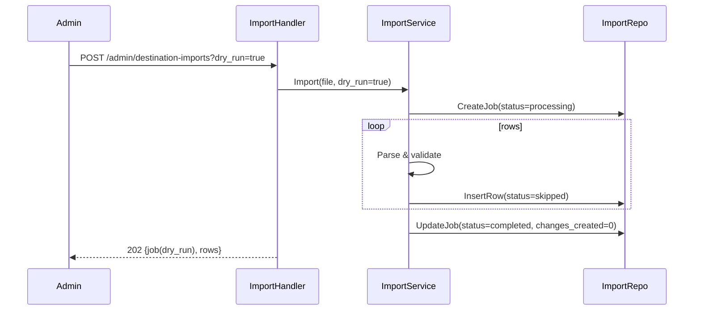
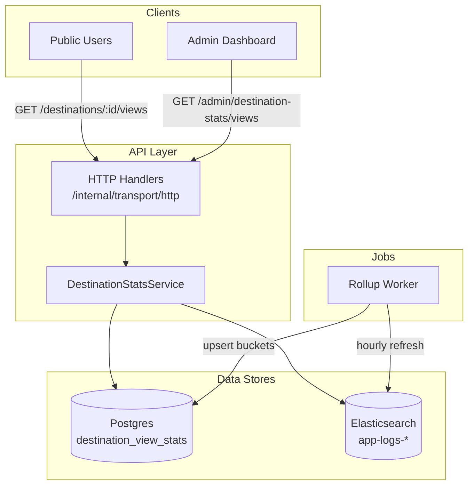
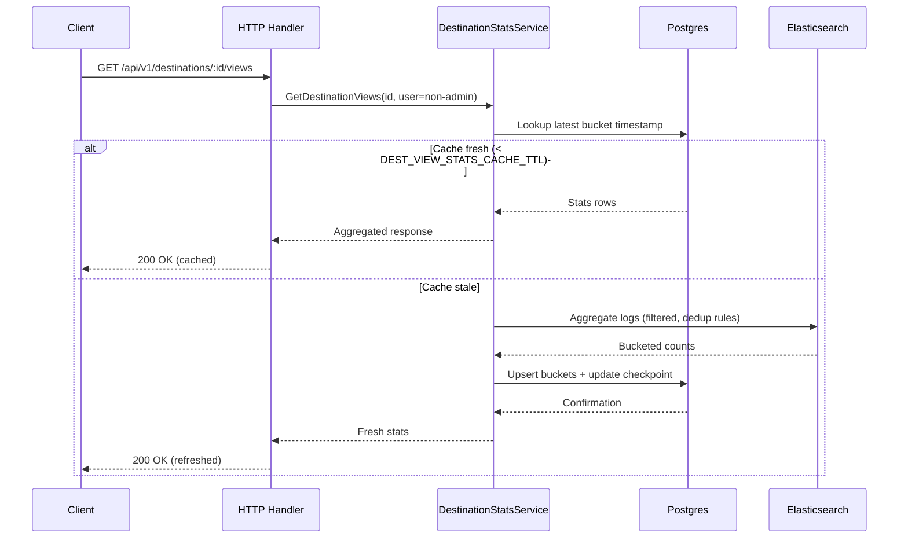
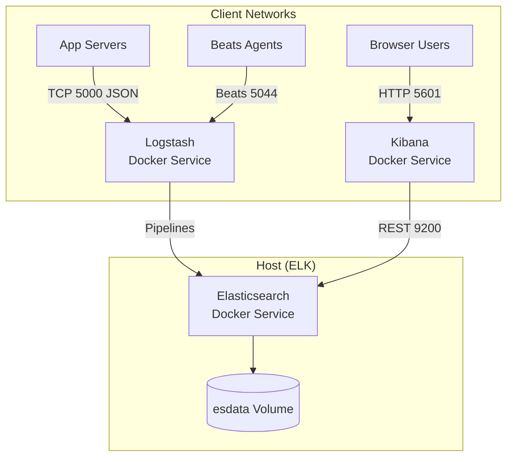
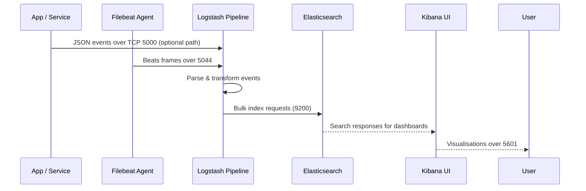

# Destination Bulk Import – API Design

## 1. Overview

Admin teams occasionally need to onboard dozens of destinations sourced from partner spreadsheets. The current workflow forces each record to be entered manually as a draft, submitted, and later reviewed. This document introduces a CSV-driven bulk import pipeline that reuses the existing Destination Change Handler but automates draft creation/submission so every row lands in `pending_review` without an author touching the UI. Reviewers continue using the standard approve/reject endpoints, ensuring governance rules remain intact.

## 2. Goals & Non-Goals

- **Goals**
  - Accept a UTF-8 CSV containing destination metadata aligned with `DestinationChangeFields`.
  - Validate each row with the same business rules enforced during manual draft creation (name, coordinates, contact channel, hero image/gallery limits, opening/closing time format, etc.).
  - Create a change request per valid row, immediately mark it `pending_review`, and associate it with the uploading admin.
  - Provide feedback for every failed row plus a job-level summary so admins can fix issues offline.
  - Focus solely on create operations; every row describes a new destination seeded directly into the review queue.
  - Flatten gallery media (max three images) into single-row columns per the requirement.
- **Non-Goals**
  - No automatic approval/publishing.
  - No binary/media uploads through CSV (all media must already exist at a reachable URL).

## 3. Actors & Flow

1. **Importing Admin** obtains a template, fills it with destinations, and hits the new `POST /api/v1/admin/destination-imports`.
2. **Destination Import Service** stores the raw CSV, registers a job (`queued`), and enqueues processing.
3. **Import Worker** streams the file, validates each row, and for valid rows calls the workflow service to:
   - Create a draft (`DestinationWorkflowService.CreateDraft`).
   - Immediately call `SubmitDraft` so the change becomes `pending_review` with `submitted_at` timestamped to the job time.
4. **Reviewer Admins** approve/reject via existing `/admin/destination-changes` endpoints.
5. Admins poll `GET /api/v1/admin/destination-imports/:id` or download the error report to fix rejected rows and re-upload.

## 4. CSV Contract

- Encoding: UTF-8, comma-delimited, header row required.
- Max rows: 500 per file (configurable).
- Empty rows are skipped; comments are not allowed.
- Gallery flattened into six columns (URL + caption per slot) to satisfy the “single-row gallery” requirement.

| Column                                              | Required? | Description                                                                                                                          |
| --------------------------------------------------- | --------- | ------------------------------------------------------------------------------------------------------------------------------------ |
| `name`                                            | Required  | Public name (same validation as drafts).                                                                                             |
| `slug`                                            | Optional  | Must be unique for creates.                                                                                                          |
| `status`                                          | Optional  | Desired publication status for the destination (`draft`, `published`, `archived`). Defaults to `published` when omitted.     |
| `category`                                        | Required  | Free-form label; validated against `DESTINATION_ALLOWED_CATEGORIES` when configured.                                               |
| `city`                                            | Required  | Location metadata.                                                                                                                   |
| `country`                                         | Required  | Location metadata.                                                                                                                   |
| `description`                                     | Required  | Marketing copy.                                                                                                                      |
| `latitude`                                        | Required  | Decimal degrees; validated within ±90/±180.                                                                                        |
| `longitude`                                       | Required  | Decimal degrees; validated within ±90/±180.                                                                                        |
| `contact`                                         | Required  | Free-form contact string (phone/email/book URL); must contain at least one reachable channel per existing rule.                      |
| `opening_time`                                    | Optional  | `HH:MM` 24h strings; closing must be >= opening unless                                                                             |
| `closing_time`                                    | Optional  | `HH:MM` 24h strings; closing must be >= opening unless overnight flag toggled.                                                     |
| `hero_image_url`                                  | Required  | Publicly accessible hero image. CSV importer cannot upload binaries, so `hero_image_upload_id` is ignored.                         |
| `gallery_1_url`..`gallery_3_url`                | Optional  | Up to three gallery image URLs; blank columns trimmed. Ordering derives from suffix number (starting at 1 but stored as zero-based). |
| `gallery_1_caption`..`gallery_3_caption`        | Optional  | Captions paired with the URL column; empty strings removed.                                                                          |
| `hero_image_upload_id` / `published_hero_image` | Optional  | Included for schema parity with manual drafts; both columns are ignored during import.                                               |

### 4.1 Gallery flattening

- Each `gallery_n_url` is mapped to `DestinationMedia{url, ordering=n-1}`.
- Missing intermediate slots are skipped.
- More than three populated URLs triggers a row-level validation error.

### 4.2 Sample row

```csv
slug,name,status,category,city,country,description,latitude,longitude,contact,opening_time,closing_time,hero_image_url,gallery_1_url,gallery_1_caption,gallery_2_url,gallery_2_caption,gallery_3_url,gallery_3_caption,hero_image_upload_id,published_hero_image
central-park,Central Park,published,Nature,New York,USA,"Iconic urban park with year-round programming.",40.785091,-73.968285,"+1 212-310-6600",06:00,22:00,https://cdn.fitcity/destinations/central-park/hero.jpg,https://cdn.fitcity/destinations/central-park/gallery-1.jpg,"Bethesda Fountain",https://cdn.fitcity/destinations/central-park/gallery-2.jpg,"Bow Bridge",,,,
```

## 5. API Surface

| Endpoint                                         | Method           | Description                                                                                                                                       |
| ------------------------------------------------ | ---------------- | ------------------------------------------------------------------------------------------------------------------------------------------------- |
| `/api/v1/admin/destination-imports/template`   | GET              | Returns the latest CSV header and a single sample row.                                                                                            |
| `/api/v1/admin/destination-imports`            | POST (multipart) | Upload a CSV. Optional query params:`dry_run=true` (validate only), `submit=true` (default) to control auto-submission. Returns a job record. |
| `/api/v1/admin/destination-imports/:id`        | GET              | Job status, counts, timestamps, and per-row summary (first N errors inline).                                                                      |
| `/api/v1/admin/destination-imports/:id/errors` | GET              | Streams a CSV of rows that failed validation with `row_number` + `errors[]`.                                                                  |

### 5.1 POST `/api/v1/admin/destination-imports`

- **Auth**: `RequireAdmin`.
- **Body**: multipart with `file` (CSV) and optional `notes`.
- **Responses**:
  - `202 Accepted` with `{ "job": { "id", "status":"queued", "total_rows": null, "dry_run": false } }`.
  - `400` for malformed CSV or missing file.
  - `413` if row/file limits exceeded.
  - `422` when CSV headers are invalid/missing required columns.

### 5.2 GET `/api/v1/admin/destination-imports/:id`

- Returns job metadata plus derived stats:

```json
{
  "job": {
    "id": "c5f3...",
    "status": "completed",
    "dry_run": false,
    "total_rows": 125,
    "processed_rows": 125,
    "changes_created": 110,
    "rows_failed": 15,
    "pending_review_change_ids": ["..."],
    "submitted_at": "2024-07-03T12:05:00Z",
    "completed_at": "2024-07-03T12:05:12Z",
    "uploaded_by": "admin-uuid"
  }
}
```

## 6. Architecture Overview

Bulk import extends the existing destination workflow stack with one new handler/service path:

- `DestinationImportHandler` (HTTP) provides the `/admin/destination-imports` routes, enforces feature flags, and streams uploads into bounded memory buffers before invoking the service.
- `DestinationImportService` orchestrates CSV parsing, validation, job persistence, and draft submission. It reuses `DestinationWorkflowService` to guarantee the same business rules and approval lifecycle as manual drafts.
- `DestinationImportRepository` (Postgres) stores job metadata and row-level results, enabling admins to poll status or download error CSVs.
- `DestinationWorkflowService`, `DestinationRepository`, and object storage (MinIO/S3) remain unchanged but are reused for hero/gallery verification, draft creation, and CSV/error archival.



### 6.1 Sequence – Successful Import (submit=true)



### 6.2 Sequence – Dry-Run Import



## 7. Import Processing

1. **Persist job** in `destination_import_jobs` with `status=queued`, `uploaded_by`, and object storage key for the raw CSV.
2. **Worker fetches CSV** (streaming to avoid loading >5MB in memory) and validates headers.
3. **Per row**:
   - Normalize strings (trim whitespace, convert blank to `null`).
   - Map gallery columns into `DestinationGallery`.
   - Build a `DestinationChangeFields` struct.
   - Invoke `CreateDraft` with `action=create` and no existing `destination_id`.
   - Run `validateFields` + extra CSV-only checks (row limit, gallery limit, hero URL required, etc.).
   - If valid and `dry_run=false`, call `CreateDraft`, then `SubmitDraft` immediately. Capture resulting `change_id`.
   - Errors are appended to `destination_import_rows` with message(s); job counters increment.
4. **Finalize job**: update status to `completed` (or `failed`), store metrics, and emit audit log.

## 8. Validation & Required Fields

The importer reuses `DestinationWorkflowService.validateFields`, so any validation updates automatically apply here. Key requirements matching the “normal draft method”:

- **Name**: non-empty UTF-8 string.
- **Destination status** (`fields.status`): must be `draft`, `published`, or `archived`; importer defaults to `published` when the column is blank.
- **Coordinates**: `latitude` in [-90,90], `longitude` in [-180,180]; both required for new destinations that provide map placement.
- **Contact**: at least one reachable channel (phone/email/URL) represented in the `contact` string; blank contact fails.
- **Hero image**: create rows must provide `hero_image_url`.
- **Gallery**: up to three images; ordering non-negative; URLs required when column populated.
- **Opening/closing time**: validate `HH:MM` and ensure closing ≥ opening unless an overnight flag is configured.
- **Slug uniqueness**: duplicates within the file or vs. existing destinations trigger errors.

Any row failing validation is recorded with a concatenated error message (e.g., `name is required; latitude must be between -90 and 90`). Successful rows inherit all other validations (duplicate slug, stale versions, etc.) from the workflow service when the reviewer ultimately approves.

## 9. Data Model Changes

### 9.1 `destination_import_jobs`

| Column                                                                      | Type                                                     | Notes                                   |
| --------------------------------------------------------------------------- | -------------------------------------------------------- | --------------------------------------- |
| `id`                                                                      | UUID PK                                                  |                                         |
| `uploaded_by`                                                             | UUID                                                     | Admin user.                             |
| `status`                                                                  | enum(`queued`,`processing`,`completed`,`failed`) |                                         |
| `dry_run`                                                                 | bool                                                     |                                         |
| `file_key`                                                                | text                                                     | Object storage path for raw CSV.        |
| `notes`                                                                   | text                                                     | Optional admin-supplied comment.        |
| `total_rows` / `processed_rows` / `rows_failed` / `changes_created` | int                                                      | Aggregated counters.                    |
| `error_csv_key`                                                           | text                                                     | Pointer to generated error report file. |
| `submitted_at`, `completed_at`, timestamps                              |                                                          |                                         |

Pending change identifiers are derived at query time by scanning the associated row table and capturing the first N pending-review change IDs.

### 9.2 `destination_import_rows`

| Column             | Type                                            | Notes                                                                                  |
| ------------------ | ----------------------------------------------- | -------------------------------------------------------------------------------------- |
| `id`             | UUID                                            |                                                                                        |
| `job_id`         | FK → import jobs                               |                                                                                        |
| `row_number`     | int                                             | 1-based line number in CSV (excluding header).                                         |
| `action`         | text                                            | Currently always `create`; retained for compatibility if other actions return later. |
| `destination_id` | UUID nullable                                   | Reserved for future use; null for create imports.                                      |
| `change_id`      | UUID nullable                                   |                                                                                        |
| `status`         | enum(`pending_review`,`skipped`,`failed`) |                                                                                        |
| `error`          | text                                            | Serialized message string (comma-separated list).                                      |
| `payload`        | JSONB                                           | Raw row as parsed fields to help debugging.                                            |

Raw CSV files live under `destinations/imports/{job_id}/source.csv`; generated error reports live alongside them for download.

## 10. Security & Permissions

- All endpoints protected by `RequireAuth` + `RequireAdmin`.
- Import jobs inherit auditing: job records log `uploaded_by`; change requests leverage existing audit columns.
- Error CSVs stored in object storage should be private; downloads are proxied through the API handler to enforce RBAC.

## 11. Observability & Limits

- Metrics:
  - `destination_import_jobs_total{status}`
  - `destination_import_rows_total{result}`
  - `destination_import_latency_ms`
- Structured logs for each job with counts of created/failed rows and generated change IDs.
- Feature flags:
  - `ENABLE_DESTINATION_BULK_IMPORT` (handshake gating handler registration).
- Limits:
  - Max 500 rows / 5 MB file (configurable).
  - Max three gallery images by contract.

## 12. Testing Strategy

- **Unit tests** for CSV parsing (happy path, malformed headers, gallery flattening), validation mapping, and job state transitions.
- **Service tests** covering create rows, slug uniqueness, and `dry_run` (should not create change requests).
- **Integration tests** to ensure a successful job yields `pending_review` change requests ready for reviewer approval.
- **Load tests** verifying streaming parser handles 500-row files under 2 seconds.
- **Manual QA**: upload template through admin console, confirm job summary, approve resulting changes, and spot-check published destinations.

## 13. Open Questions

1. Should we require slugs in CSV, or continue to auto-generate them when blank?
2. Do we need per-row external reference IDs to help vendors reconcile imports?
3. Should we expose webhook/notification when a job finishes, or is polling sufficient for MVP?

---

# Destination View Stats – Design

## 1. Overview

Product wants to surface “destination view statistics” (e.g., total views, unique viewers, trending destinations) without adding write load to Postgres. Every API call is already logged via `middleware.RequestLogger` and mirrored to Logstash/Elasticsearch (reachable via the configured `ELASTICSEARCH_BASE_URL`). Those structured access logs contain the HTTP verb, URI, authenticated user UUID (or `anonymous`), client IP, response status, latency, and for detail endpoints the `destination.id`/`slug` inside the serialized response body. This document describes how to reuse that dataset to materialize destination view metrics.

## 2. Goals

- Count destination detail views over sliding time windows (e.g., last 1 h/24 h/7 d) with both total hits and unique viewers.
- Provide an API (initially admin-only) to fetch per-destination stats and “top viewed” leaderboards for dashboards.
- Keep implementation lightweight by querying Elasticsearch directly or via a scheduled aggregation job—no changes required on mobile/web clients.
- Ensure the solution keeps personal data minimized (counts only, no raw IP leakage outside Elasticsearch).

## 3. Existing Data & Feasibility

1. **Structured access logs** – `internal/transport/http/logging.go` emits JSON payloads like:

   ```json
   {
     "time": "2025-11-12T03:35:49Z",
     "user_uuid": "anonymous",
     "ip": "58.11.20.192",
     "request": {
       "method": "GET",
       "uri": "/api/v1/destinations/e3ff134a-bbd0-46f4-9586-2414627acafd"
     },
     "response": {
       "status": 200,
       "body": {
         "destination": {
           "id": "e3ff134a-bbd0-46f4-9586-2414627acafd",
           "slug": "manual-test-1761927934",
           "name": "Manual Test 1761927934",
           "average_rating": 0,
           "review_count": 0
         }
       }
     }
   }
   ```
2. **ELK connectivity** – `docs/api-design/elk-connectivity-design.md` documents the shared stack endpoint configured via `ELASTICSEARCH_BASE_URL`. A quick health check succeeded:

   ```
   curl $ELASTICSEARCH_BASE_URL/_cluster/health  # status: green
   ```
3. **Indices** – Application logs land in daily indices `app-logs-YYYY.MM.DD`. Example aggregation for 2025‑11‑12:

   ```json
   POST app-logs-2025.11.12/_search
   {
     "size": 0,
     "query": {
       "bool": {
         "must": [
           {"term": {"request.method.keyword": "GET"}},
           {"term": {"response.status": 200}},
           {"prefix": {"request.uri.keyword": "/api/v1/destinations/"}}
         ],
         "must_not": [
           {"term": {"request.uri.keyword": "/api/v1/destinations"}}
         ]
       }
     },
     "aggs": {
       "destinations": {
         "terms": {
           "field": "response.body.destination.id.keyword",
           "size": 5
         },
         "aggs": {
           "unique_users": {"cardinality": {"field": "user_uuid.keyword"}},
           "unique_ips": {"cardinality": {"field": "ip.keyword"}},
           "last_view": {"max": {"field": "@timestamp"}}
         }
       }
     }
   }
   ```

   Sample response:
   ```json
   "buckets": [
     {
       "key": "e3ff134a-bbd0-46f4-9586-2414627acafd",
       "doc_count": 6977,
       "unique_users": {"value": 1},
       "unique_ips": {"value": 5},
       "last_view": {"value_as_string": "2025-11-12T17:44:57.442Z"}
     },
     ...
   ]
   ```

   → The existing logs already contain everything needed (destination UUID, timestamps, user/IP identifiers), so no code changes are required on the read path.

## 4. Proposed Architecture

### 4.1 Data Source Query Layer

- Add a thin Elasticsearch client (e.g., [`github.com/elastic/go-elasticsearch/v8`](http://github.com/elastic/go-elasticsearch/v8)) configured via new env vars:
  - `ELASTICSEARCH_BASE_URL` (default `http://elk-host:9200`, override per environment)
  - `ELASTICSEARCH_LOG_INDEX` (default `app-logs-*`)
  - `DEST_VIEW_STATS_TIMEOUT` (e.g., `5s`)
- Query filters:
  - `request.method.keyword = "GET"`
  - `response.status = 200`
  - `request.uri.keyword` prefix `/api/v1/destinations/`
  - Exclude the collection route exactly equal to `/api/v1/destinations`.
  - Optional `range` on `@timestamp`. When omitted, the query covers **all time** (no upper/lower bound). When provided, support quick ranges like `1h`, `24h`, `7d`, `30d`.
- Counting rule: **1 request = 1 view**. We still compute `unique_users` / `unique_ips` inside the aggregation so dashboards can visualize deduplicated viewers, but those are side metrics.
- Load-test filter: ignore any request with `ip.keyword` starting with `10.` (internal traffic) by adding a `must_not` clause such as `{ "prefix": { "ip.keyword": "10." } }`.
- Aggregations:
  - `terms` on `response.body.destination.id.keyword`.
  - Child aggs: `cardinality` for `user_uuid.keyword` and `ip.keyword`, `date_histogram` buckets for trend charts, `top_hits` to capture slug/name once per bucket.

### 4.2 Destination Stats Service

- New package `internal/service/destinationstats` that depends on:
  - Elasticsearch client
  - Destination repository (to resolve names/slugs when not present in the latest logs or to enforce ACLs).
- Core methods:
  - `TopViewed(ctx, range, limit) ([]DestinationViewStat, error)`
  - `GetDestinationViews(ctx, destinationID, range, interval) (Histogram, error)`
- `DestinationViewStat` should expose `DestinationID`, optional `Slug/Name`, `TotalViews`, `UniqueUsers`, `UniqueIPs`, `LastViewedAt`.
- Cache policy:
  - Persist the latest aggregation timestamp per destination (e.g., max `bucket_end` in `destination_view_stats`).
  - `DEST_VIEW_STATS_CACHE_TTL` (env, default `10m`) controls how long a cached bucket is considered fresh for non-admin calls.
  - When `GetDestinationViews` is invoked by a **non-admin** and that destination’s cached timestamp is within the TTL, respond solely from Postgres.
  - When the cache is older than the TTL (or missing), query Elasticsearch, upsert the fresh buckets, and return the new result set. The query counts as a “write-through” so subsequent calls can stay on Postgres until the TTL expires again.
  - When an **admin** calls the API, always run the Elasticsearch aggregation first (even if cache is warm), merge with Postgres (for historical buckets), and upsert the refreshed data.

### 4.3 Storage / Materialization Strategy

Two viable paths:

1. **On-demand queries (Phase 1)** – Directly query Elasticsearch whenever the admin API is called. After the ES aggregation completes, upsert the results into `destination_view_stats` so the table gradually fills even without the rollup job (use `INSERT ... ON CONFLICT (bucket_start, destination_id) DO UPDATE`). Pros: zero extra storage dependency beyond Postgres, near real-time, and guarantees callers always leave behind a cached row. Cons: response latency spikes if ES is slow.
2. **Incremental rollup (Phase 2)** – Nightly/hourly job writes into `destination_view_stats` table using the same upsert shape as Phase 1. Each run should only query Elasticsearch for windows newer than the latest committed bucket to keep things fast:

```sql
   CREATE TABLE destination_view_stats (
       bucket_start timestamptz NOT NULL,
       bucket_end   timestamptz NOT NULL,
       destination_id uuid NOT NULL REFERENCES destination(id),
       total_views bigint NOT NULL,
       unique_users int NOT NULL,
       unique_ips int NOT NULL,
       PRIMARY KEY (bucket_start, destination_id)
   );
   CREATE TABLE destination_view_rollup_checkpoint (
       id int PRIMARY KEY DEFAULT 1,
       last_bucket_end timestamptz NOT NULL
   );
```

- Background job reads `last_bucket_end`, queries Elasticsearch with `@timestamp > last_bucket_end` (capped by a max look-back), folds results into buckets, upserts each bucket, then advances `last_bucket_end` to the newest bucket_end inside the same transaction.
- API can then read from Postgres for sub-second responses while still allowing a “live” mode that hits Elasticsearch directly.

### 4.4 API Surface

- **API endpoint catalogue**
  1. `GET /api/v1/destinations/:id/views` – public; returns view counts for a single destination with cache-first logic.
  2. `GET /api/v1/destinations/trending` – public; returns top destinations over a window (`range`, `limit` query params) using the same cache/refresh policy. *Future-facing endpoint but included here for completeness.*
  3. `GET /api/v1/admin/destination-stats/views` – admin only; supports per-destination drill-down and leaderboards with forced ES refresh.
  4. `POST /api/v1/admin/destination-stats/export` – admin only; accepts a list of destination IDs and returns a CSV of popularity metrics.
- **Destination view count (public)**:
  - `GET /api/v1/destinations/:id/views`
    - Available to anonymous and authenticated users.
    - Returns total view count + unique viewer metrics for the requested range(s). If the `range` query param is omitted, the API returns all-time stats; clients may optionally request quick ranges (24 h, 7 d, 30 d). Implementation uses the cache policy above: if the cached bucket for that destination is newer than `DEST_VIEW_STATS_CACHE_TTL` and caller isn’t an admin, serve directly from Postgres; otherwise trigger an Elasticsearch refresh, upsert, and then serve (admins always force the refresh path).
    - Response envelope: `{"destination_id": "...", "views": {"last_24h": {...}, "last_7d": {...}, ...}}`.
- **Admin analytics endpoint**:
  - `GET /api/v1/admin/destination-stats/views`
    - Query params: `destination_id` (optional), `range` (defaults to `all`), `interval` (`hour|day`), `limit` (for top list).
    - Always executes the ES+PG merge before responding so dashboard charts are real-time while still warming the cache table.
- **Admin export endpoint**:
  - `POST /api/v1/admin/destination-stats/export`
    - Body: `{"destination_ids": ["uuid1","uuid2", ...]}` (max 500 IDs). When omitted or empty, exports all destinations with published status.
    - Response: `text/csv` attachment containing columns `destination_name`, `city`, `country`, `views_1h`, `views_6h`, `views_12h`, `views_24h`, `views_7d`, `views_30d`, `views_all`.
    - Behaviour: For each requested destination, service pulls the cached stats from Postgres. If any of the required ranges are stale (>TTL) or missing, it performs an ES refresh before writing the row. CSV is streamed to avoid high memory usage; order follows the input list (or alphabetical when exporting all).
    - Security: Requires admin auth + `export_destination_stats` permission (toggle via role check).
- **Public “trending destinations”** (future):
  - `GET /api/v1/destinations/trending?range=24h&limit=10` returning destination summaries enriched with stats (this endpoint uses the same cache policy as the view-count endpoint).
  - If `range` omitted, leaderboard reflects all-time stats.
- Wire handlers under `internal/transport/http`, using `RequireAdmin` only for the admin route; the public endpoints rely on JWT middleware when available but also work for anonymous users.

### 4.5 Architecture Overview



- Admin requests always traverse `H → S → ES → PG`.
- Public requests first check `PG`; when stale they fall through to `ES` and push refreshed rows back to `PG`.
- Rollup worker ensures hourly updates even without traffic.

### 4.6 Request Sequence (Non-Admin)



- Admin flow mirrors the “stale” branch regardless of cache freshness.

### 4.7 Background Job / Cache Warmer (Optional Phase)

- Create `cmd/jobs/destination_view_rollup` (or extend `cmd/api` with a goroutine) that:
  1. Runs every hour by default (`DEST_VIEW_STATS_ROLLUP_INTERVAL`, env; set default `1h` so the Postgres table is refreshed at least hourly, but allow overrides).
  2. Queries Elasticsearch with `@timestamp > last_bucket_end` (reading from checkpoint table) so only unseen windows are processed.
  3. Upserts into `destination_view_stats`.
  4. Publishes metrics (e.g., Prometheus counter) so we can alert if the job stalls.
- When rollup is active, the API can hit Postgres first and fall back to Elasticsearch for “live refresh”, still upserting any freshly computed buckets so both pathways keep the table current and advance the checkpoint.

## 5. Configuration & Dependencies

- Env additions (all delays configurable via env vars):
  - `DEST_VIEW_STATS_ROLLUP_ENABLED` (`false` by default)
  - `DEST_VIEW_STATS_ROLLUP_INTERVAL` (default `1h`; controls PG refresh cadence)
  - `DEST_VIEW_STATS_MAX_RANGE` (limit to, say, `30d` to keep ES queries bounded)
  - `DEST_VIEW_STATS_CACHE_TTL` (default `10m`; controls when public calls fall back to ES)
- Vendor `go-elasticsearch` client (add to `go.mod`).
- If caching is desired, reuse any existing Redis/client libs; otherwise, add a lightweight in-memory cache.

## 6. Validation & Monitoring

- **Connectivity smoke test**: `curl $ELASTICSEARCH_BASE_URL/_cluster/health` should stay `green`.
- **Unit tests**: mock the Elasticsearch client to verify query body construction and response parsing for both summary and histogram functions.
- **Integration tests**:
  1. Replay fixture logs into a disposable ES index.
  2. Run service queries and assert counts match expected values.
- **Dashboards**: build a Kibana data view on `app-logs-*` filtered by destination endpoints for ad-hoc validation while developing the API.
- **Alerts**: when rollup job enabled, emit metrics for “documents processed” and alert if zero for >15 minutes.

## 7. Open Questions

1. Should we respect `EnableDestinationView` flag in stats API responses (e.g., hide if view feature disabled)?

Once these answers are locked in, we can proceed with the Phase 1 implementation (direct Elasticsearch queries) and layer in rollups/caching if latency or cost becomes an issue.

---

# Elasticsearch Stack Connectivity Design

## Overview

- ELK stack nodes run on a dedicated host defined by infrastructure configuration (referenced as `ELK_HOST`) in single-node mode (no clustering).
- Stack components (Elasticsearch, Logstash, Kibana) are Docker-managed services exposed to LAN clients.
- Primary use cases: shipping application logs into Logstash, querying/storing data in Elasticsearch, and visualising in Kibana.

## Network Layout

- **Host placement:** `ELK_HOST` must be reachable over TCP from client networks; ensure routing/firewall rules allow access to ports `9200`, `5000`, `5044`, and `5601`.
- **Container DNS:** Docker service names (`elasticsearch`, `logstash`, `kibana`) are internal to the host; remote clients must use the externally routable `ELK_HOST` value (IP or DNS).
- **Persistence:** Elasticsearch data volume `esdata` is bound locally; no shared storage is exposed externally.

## Topology Diagram



## Service Endpoints

- **Elasticsearch API (`9200/tcp`):**
  - REST interface for index management, querying, and cluster health checks.
  - Example health check: `curl $ELASTICSEARCH_BASE_URL/_cluster/health`.
  - Security is disabled (`xpack.security.enabled=false`); endpoints are open to any reachable host. Enforce network-level restrictions.
- **Logstash Inputs (`5000/tcp` JSON, `5044/tcp` Beats):**
  - `5000/tcp`: accept JSON events via TCP; configure application log shippers to send newline-delimited JSON to `$LOGSTASH_TCP_ADDR` (generally `${ELK_HOST}:5000`).
  - `5044/tcp`: Beats protocol endpoint suited for Filebeat/Metricbeat; point Beats `hosts` setting to `["${ELK_HOST}:5044"]`.
  - Logstash pipelines reside in `./logstash/pipeline` on host; update to match expected event formats.
- **Kibana UI (`5601/tcp`):**
  - Access via browser using the configured host, e.g., `http://${ELK_HOST}:5601`.
  - Default configuration points Kibana to Elasticsearch at `http://elasticsearch:9200`; this resolves inside Docker network. No external authentication layer exists.

## Client Integration Guidance

- **Application logging:**
  - For direct JSON TCP shipping, use libraries supporting framed TCP (e.g., Logback TCP appender, Winston TCP transport) targeting the configured `$LOGSTASH_TCP_ADDR` (typically `${ELK_HOST}:5000`).
  - For Beats-based workflows, install Filebeat on each source host, set `output.logstash.hosts: ["${ELK_HOST}:5044"]`, and map log paths through Filebeat inputs.
  - For Go services in this repo, set `LOGSTASH_TCP_ADDR=${ELK_HOST}:5000` (or equivalent DNS entry) to enable the built-in async Logstash writer that mirrors console logs to the stack.
- **Index lifecycle:**
  - Before pushing structured data, create index templates/mappings through Elasticsearch API to ensure mapping stability.
- **Discoverability:**
  - After data arrival, configure Kibana index patterns and dashboards by navigating to Stack Management → Index patterns.

## Log Flow Diagram



## Operational Considerations

- **Firewall:** Restrict access to trusted networks while security is disabled; consider SSH tunnelling or VPN for remote access.
- **TLS & Auth (future):** Enable Elasticsearch/Kibana security (`xpack.security.enabled=true`) when ready; update clients to use HTTPS and credentials.
- **Resource Monitoring:** Track JVM heap usage (`ES_JAVA_OPTS` set to 1 GB); adjust if heap pressure occurs.
- **Reliability:** `restart: unless-stopped` ensures containers restart on host reboot; monitor disk usage in `esdata` to avoid write failures.

## Validation Checklist

- Ping/trace route to `${ELK_HOST}` from client host.
- `curl $ELASTICSEARCH_BASE_URL` returns cluster info JSON.
- Beats/Filebeat `test output` succeeds against Logstash endpoint.
- Kibana UI loads in browser and lists expected index patterns.
