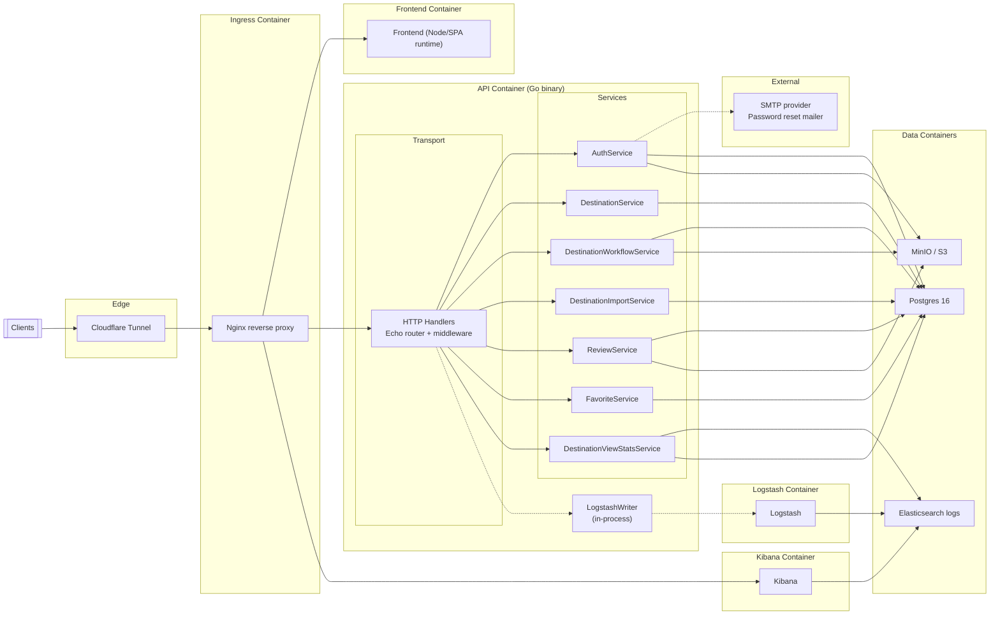
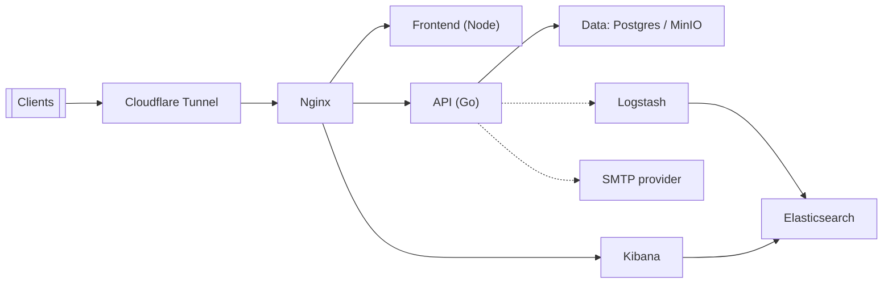

# Fit City Backend – Architecture Overview

## Purpose & Scope
- Single Go service that powers Fit City authentication, destination content management, reviews/favorites, and read-side analytics for production.
- Describes how the monolith is structured, what backing services it depends on, and how major flows traverse storage/infra.
- Complements feature-specific docs in `docs/api-design` (e.g., Admin Destination Management, Bulk Import, View Stats).

## Runtime Topology
```mermaid
graph TD
    Clients[Mobile/Web/Admin Clients] -->|"HTTPS :8080 /api/v1"| API[Go API (Echo)]
    API --> PG[(Postgres 16<br/>Primary datastore)]
    API --> MINIO[(MinIO / S3-compatible<br/>Object storage)]
    API --> ES[(Elasticsearch<br/>app-logs-*)]
    API -.-> LOGSTASH[(Logstash TCP 5000<br/>Optional log shipper)]
    API -.-> SMTP[(SMTP / Mail provider<br/>Password reset OTPs)]
    API -.-> Google[Google ID Token verify]
    API --> FFMPEG[(FFmpeg binary<br/>Image resize/encode)]
```
- API runs as a single container (`infra/docker/api.Dockerfile`), exposing HTTP on `:8080` and shipping structured logs to stdout plus optional Logstash.
- Postgres is the system of record for users, roles, sessions, destinations, change requests, reviews, favorites, imports, and cached view stats.
- MinIO/S3 stores profile images, destination hero/gallery assets, and review media; URLs are exposed via the configured public base.
- Elasticsearch is queried for destination view stats; rollups can hydrate Postgres caches for fast reads.

## Application Layers
- **Transport (`internal/transport/http`)** – Echo router with CORS, secure headers, panic recovery, `/health` endpoint, Swagger docs, and request logging that redacts sensitive fields. Auth middleware attaches user to the context for downstream handlers.
- **Services (`internal/service`)**  
  - `AuthService` issues JWTs/sessions for email+password and Google sign-in, handles password resets (OTP via mailer), and processes profile image uploads with size/crop enforcement.  
  - `DestinationWorkflowService` implements the governed admin workflow (draft → pending_review → approved/rejected) plus media validation and optional approval/hard-delete flags.  
  - `DestinationService` powers public destination reads and admin listing.  
  - `DestinationImportService` ingests CSVs and reuses the workflow service to create pending review changes automatically.  
  - `ReviewService` stores reviews with optional media, enforces image limits, and surfaces aggregates for destinations.  
  - `FavoriteService` manages user favorites.  
  - `DestinationViewStatsService` queries Elasticsearch for access-log derived view counts, caches rollups in Postgres, and optionally runs a background rollup goroutine.
- **Persistence adapters (`internal/repository`)** – Postgres repositories for each aggregate (users, roles, sessions, destinations, versions, change requests, imports, reviews, favorites, view stats) and MinIO object storage adapter used by auth/destination/review services.
- **Utilities & media** – JWT manager (HMAC), password hashing/validation, CSV helpers, and FFmpeg-based image processor that clamps dimensions/bytes before upload.

## Data & Storage
- **Postgres** – Primary tables include `users`, `roles`, `sessions`, `password_resets`, `travel_destination`, `destination_change_request`, `destination_version`, `destination_import_jobs`, `reviews`, `review_media`, `favorites`, and `destination_view_stats` (rollup cache). Migrations live under `/migrations`.
- **Object storage** – Buckets are split by concern: profiles (`MINIO_BUCKET_PROFILE`), destinations (`MINIO_BUCKET_DESTINATIONS`), and reviews (`MINIO_BUCKET_REVIEWS`). Public URLs are built from `MINIO_PUBLIC_URL` so clients can render media directly.
- **Elasticsearch** – Reads access logs from indices matching `ELASTICSEARCH_LOG_INDEX` (default `app-logs-*`) to compute view metrics; no destination content is persisted in ES.
- **Logging** – Structured JSON request logs written via Echo middleware; optional Logstash TCP writer (`LOGSTASH_TCP_ADDR`) mirrors stderr output into the ELK stack documented in `elk-connectivity-design.md`.

## Component Overview


**Service coverage** – Captures all business services instantiated in `cmd/api/main.go`: `AuthService`, `DestinationWorkflowService`, `DestinationService`, `DestinationImportService`, `ReviewService`, `FavoriteService`, and `DestinationViewStatsService`. Supporting components include the JWT manager, password-reset mailer, FFmpeg-based image processor, MinIO object storage adapter, and Postgres/Elasticsearch repositories used by those services.

**Log shipping path** – Request/response logs are emitted by Echo middleware. When `LOGSTASH_TCP_ADDR` is set, the `LogstashWriter` mirrors stdout/stderr logs to the Logstash/ELK stack; otherwise logs stay local.

**SMTP usage** – `AuthService` uses the configured SMTP provider (`SMTP_HOST`, `SMTP_PORT`, credentials, `SMTP_FROM`, `SMTP_USE_TLS`) to send password-reset OTP emails. If these values are empty, the mailer stays disabled and password reset will not send email.

**Container placement** – Traffic enters via the Cloudflare Tunnel, then Nginx fronts the stack and forwards to the Node-based frontend container, the API container (transport/services/LogstashWriter), and the Kibana container (for embedded dashboards). Postgres, MinIO, Elasticsearch, and Logstash each run in their own containers (see `infra/compose.local.yml` for local stacks). SMTP remains an external provider.

### Component Overview (Minimal)


### Container Responsibilities
- **Cloudflare Tunnel** – Edge entry; forwards public traffic to Nginx with zero-trust/DNS controls.
- **Nginx** – Reverse proxy/terminator routing to the frontend (Node/Vite/React), API (`:8080`), Kibana, and Swagger (dev-only exposure recommended). Can layer auth on Kibana in non-prod.
- **Frontend (Node)** – Hosts the SPA, talks to API via Nginx, and can embed Kibana dashboards through the Nginx route.
- **API (Go)** – Single binary with Echo router, all services (auth, destination workflow/read, bulk import, reviews, favorites, view stats), JWT/session issuance, FFmpeg-based media processing, Swagger, and the in-process LogstashWriter.
- **Postgres** – System of record: users/roles/sessions/password_resets, destinations + versions/change requests/import jobs, reviews/review_media, favorites, destination_view_stats cache, and audit/version history.
- **MinIO** – Object storage for compressed/processed media (profiles, destination hero/gallery, review images) exposed via `MINIO_PUBLIC_URL`.
- **Logstash** – TCP input receiving structured logs from the API’s LogstashWriter; forwards into Elasticsearch.
- **Elasticsearch** – Stores application logs (`app-logs-*`) used by view-stats service and Kibana dashboards.
- **Kibana** – Visualizes Elasticsearch data; embedded by the frontend via Nginx routing.
- **External SMTP** – Sends password-reset OTP emails when SMTP env vars are configured; disabled if unset.

## Key Flows (Production)
- **Auth & sessions** – `/api/v1/auth` handlers call `AuthService`; JWT/session TTLs are driven by `SESSION_TTL`. Password reset uses OTP codes stored in Postgres and delivered via SMTP when configured. Google login validates ID tokens against `GOOGLE_AUDIENCE`.
- **Destination governance** – Admin routes (`/api/v1/admin/destination-changes`) create drafts, submit for review, and approve/reject. Approved changes update the published destination table and version history, ensuring end-user reads only see published rows. Feature flags gate create/update/delete and approval/hard-delete behaviors.
- **Bulk imports** – `/api/v1/admin/destination-imports` accepts CSV uploads (size/row limits configurable) and converts rows into pending review change requests while persisting job + per-row status in Postgres.
- **Reviews & favorites** – `/api/v1/reviews` and `/api/v1/favorites` endpoints write to Postgres; review media streams through the MinIO adapter with FFmpeg resizing before storage.
- **Destination view stats** – Public/admin endpoints query `DestinationViewStatsService`. For admins, requests always hit Elasticsearch then upsert cached buckets; public calls are cache-first with optional refresh. An optional rollup goroutine (`DEST_VIEW_STATS_ROLLUP_ENABLED`) aggregates on an interval into Postgres.

## Deployment & Configuration
- Single container built from Go 1.24-alpine; ships with docs and FFmpeg installed. Health check available at `/health`.
- Environment-driven config (`internal/config/config.go`): database URL, JWT secret, Google audience, allowed CORS origins, MinIO endpoint/keys/buckets/public URL, SMTP settings, feature flags (`ENABLE_DESTINATION_*`, `ENABLE_DESTINATION_BULK_IMPORT`), media size/dimension limits, destination categories, Elasticsearch endpoints/credentials, view-stats TTLs/rollup intervals, and log shipping address.
- Default port `8080`; CORS allows credentials unless `ALLOW_ORIGINS=*`.

## Observability & Operations
- Logs: structured JSON to stdout; optional Logstash TCP sink for centralization and Kibana dashboards. Request bodies/responses are sanitized and truncated to avoid PII leakage.
- Metrics via Elasticsearch queries: destination view stats reuse access logs; rollup job runs in-process when enabled.
- Resilience: Echo recover middleware protects against panics; FFmpeg binary required for media handling; MinIO/DB/ES reachability is validated during startup (fatal on DB/MinIO errors, best-effort on ES).
- Health: `/health` returns `{ "ok": true }` for uptime probes; Swagger served via `httpx.RegisterSwagger`.
